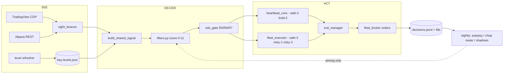

# 🗺️ Gamma — SYSTEM MAP

> Auto-generated `2026-09-05 01:53:47 Saturday EDT`. Every path is existence-checked at build time, so this map cannot silently describe a system we no longer have. `⛔MISSING` = the spec claims a file that is gone.

## For a fresh Claude session — read only the branch you need

| If the question is… | Read |
|---|---|
| Why did/didn't we trade? | journal/<date> → automation/overnight/STATUS.md |
| What is armed / what changes? | analysis/deep-research/WEEK-ORDER-2026-08-10.md + SHADOW.md |
| Is X already tested / dead? | the GRAVEYARD section of the latest EOD, then markdown/doctrine/LESSONS-LEARNED.md |
| How does a decision get made? | MAP.md §SEE → §DECIDE → §ACT (this file), then filters.py |
| What broke before? | markdown/doctrine/LESSONS-LEARNED.md (L-numbered, themed C1-C36) |
| What are the rules? | CLAUDE.md — the 10 rules + OP-0/3/11/16/22/25/31/32/33 |
| Is the futures lane alive / why didn't it trade? | automation/state/futures/health.json + analysis/futures-eod/<date>.md |
| Are we go-live yet? | HOME.md §The gate (rendered from analysis/go-live-gate.json — one number, never re-derived) |
| Anything non-SPY — the tickers lane, other names, did it trade / why not? | markdown/planning/TICKERS-LANE.md (pipeline, clamps, revoke) → automation/state/tickers/<arm>/ledger.jsonl → automation/state/goals/GOAL-TICKERS-LANE-2026-09-04.md (the day-check's own verdict lines) |

**Do not read the whole repo.** 6,777 markdown files exist; ~479 are human-written and the rest is machine output. This map plus the four ORIENT docs is the whole system at the level most questions need.

## The flow, one picture

## 🔭 SEE — what the engine perceives

- **Level refresher** → `setup/scripts/refresh_levels_intraday.py` — writes key-levels.json every 5m; IEX tail keeps it ahead of the window
- **Key levels (state)** → `automation/state/key-levels.json` — the level set every entry decision is tied to
- **Sight beacon** → `setup/scripts/sight_beacon.py` — never-blind price feed; REST + fallback
- **Market structure** → `crypto/lib/market_structure.py` — HH/HL/BOS/CHoCH — the structure-shift detector. NOTE the path: it lives under crypto/lib but is instrument-agnostic and used by the SPY engine
- **Structure watcher** → `backtest/lib/watchers/market_structure_watcher.py` — the watcher wrapper the engine actually calls
- **Trendlines** → `automation/state/trendlines.json` — SHADOW only, zero consumers by design; manual (J-drawn) lines now refresh intraday every 5m RTH via trendline_manual.py, piggybacked on Gamma_Trendlines (08-18)

## 🧠 DECIDE — scoring and gates

- **Shared signal builder** → `automation/state/fleet/build_shared_signal.py` — one signal, all arms consume it — this is why arms correlate
- **Filters + scoring** → `backtest/lib/filters.py` — bull/bear score 0-11; ANY blocker vetoes (entry is binary, not laddered)
- **Strategies** → `automation/state/fleet/strategies.py` — the 4 live setups + their exit shapes
- **Risk gate** → `backtest/lib/risk_gate.py` — Rules 5/6/7 — kill switch, per-trade cap, cash settlement
- **Settlement ledger** → `setup/scripts/settlement_ledger.py` — cash-account T+1 model; feeds the gate for BOTH core accounts

## ⚡ ACT — placement and exits

- **Heartbeat core** → `setup/scripts/heartbeat_core.py` — THE live engine, 1/min RTH — core arms (safe-2, bold-2)
- **Fleet executor** → `automation/state/fleet/fleet_executor.py` — fleet arms (safe-3, risky-1, risky-3); sizing + admission
- **Exit manager** → `automation/state/fleet/exit_manager.py` — TP1 / runner / trail / structure stop / -50% catastrophe cap
- **Fleet broker** → `automation/state/fleet/fleet_broker.py` — the ONLY broker surface; load_creds() takes no args

## 📚 LEARN — research and instruments

- **Winner autopsy** → `setup/scripts/winner_autopsy.py` — EXIT question — capture rate over the winner population, nightly
- **Winner signature** → `setup/scripts/winner_signature.py` — ENTRY/REGIME question — 'what does our money look like'; writes analysis/winner-autopsies/SIGNATURE.md. The edge is exits >=1.3x entry premium; the day cannot be pre-selected (every pre-open range proxy r~0)
- **Chop meter** — Gamma_ChopMeter 16:08 — ordinal>=4, consec runs, would-trip flags
- **Entry-quality ledger** → `setup/scripts/entry_quality_ledger.py` — the pay-vs-bleed entry signature; V-d1/V-e3 shadow counters
- **Ladder shadow** — Gamma_LadderRungShadow 16:40 — logs what the score ladder WOULD admit
- **Trade autopsy** → `setup/scripts/trade_autopsy.py` — emits hypotheses nightly; its hold_to_time counterfactual is a known artifact

## 🗺️ ORIENT — read these, in this order

- **CLAUDE.md** → [[CLAUDE\|CLAUDE.md]] — the soul file. doctrine, the 10 rules, operating principles
- **THE WEEK ORDER** → [[analysis/deep-research/WEEK-ORDER-2026-08-10\|THE WEEK ORDER]] — what is armed right now + Monday state
- **STATUS** → [[automation/overnight/STATUS\|STATUS]] — REVOKE surface + known-broken
- **SHADOW** → [[SHADOW\|SHADOW]] — every shadow clock + frozen prereg
- **Lessons** → [[markdown/doctrine/LESSONS-LEARNED\|Lessons]] — 294 anti-patterns, indexed by theme
- **Architecture** → [[markdown/specs/ARCHITECTURE\|Architecture]] — cold-start wiring snapshot
- **markdown index** → [[markdown/README\|markdown index]] — the doc taxonomy

## 🩺 Vault link health

- visible notes: **972** · broken wikilinks: **41** · orphans (no links either way): **6**
  - ⛔ `memory-mirror/feedback_adhd_output_style_2026_07_09.md` → `concise-responses` unresolved
  - ⛔ `memory-mirror/feedback_dashboard_visuals_chat_ideas.md` → `STRATEGY-SPACE-MAP` unresolved
  - ⛔ `memory-mirror/feedback_design_starts_at_external_reference_2026_08_30.md` → `app-design-dossier` unresolved
  - ⛔ `memory-mirror/feedback_design_starts_at_external_reference_2026_08_30.md` → `gamma-presence-not-prompting` unresolved
  - ⛔ `memory-mirror/feedback_dynamic_market_recency_over_aggregate_2026_07_31.md` → `project_gate_expiry_instrument` unresolved
  - ⛔ `memory-mirror/feedback_fable_judgment_only_no_oversell_2026_07_09.md` → `feedback-concise-responses` unresolved
  - ⛔ `memory-mirror/feedback_fable_judgment_only_no_oversell_2026_07_09.md` → `ceo-free-agent-first` unresolved
  - ⛔ `memory-mirror/feedback_fable_judgment_only_no_oversell_2026_07_09.md` → `default-act-never-ask` unresolved
  - ⛔ `memory-mirror/feedback_free_model_audit_harness_2026_07_11.md` → `free-model-audit-harness-design` unresolved
  - ⛔ `memory-mirror/feedback_free_swarm_only.md` → `project_groq_paid_tier_2026_07_06` unresolved
  - … +31 more

## ⏰ The daily loop (live task state)

| ET | Task | Role | State |
|---|---|---|---|
| 08:00 | `Gamma_LaunchTV` | TV + CDP up (no TV = no trades) | Ready (last=0) |
| 08:05/5m | `Gamma_TvWatchdog` | keeps CDP alive; heals in ~67s | Ready (last=0) |
| 08:30 | `Gamma_Premarket` | levels, bias, hypothesis → journal note | Ready (last=0) |
| 09:30–15:55 | `Gamma_HeartbeatCore` | THE engine, 1/min | Ready (last=0) |
| /5m RTH | `Gamma_LevelRefresh` | key-levels.json freshness | Ready (last=0) |
| 15:55 | `Gamma_EodFlatten` | nothing 0DTE survives the close | Ready (last=0) |
| 16:08 | `Gamma_ChopMeter` | did we trade chop today | Ready (last=0) |
| 16:25 | `Gamma_WinnerAutopsy` | capture rate + entry-quality fold | Ready (last=0) |
| 16:40 | `Gamma_LadderRungShadow` | score-ladder shadow clock | Ready (last=0) |
| 16:45 | `Gamma_ObsidianSync` | HOME + daily note + this map | Ready (last=0) |
| 17:45 | `Gamma_RegimeAttribution` | was that us or the tape | Ready (last=0) |

## 💰 The arms — risk profiles, NOT strategies

All arms trade the SAME shared signal. They differ only in sizing, gates and exit shape. That is also why they lose together: on 08-07 all four bought the same contract within 15 seconds.

| Arm | Class | Distinguishing config |
|---|---|---|
| **safe-2** | core safe | cash_settlement · ATM · strict |
| **bold-2** | core bold | cash_settlement (parity fix 08-09) · was PDT-dark 4 sessions |
| **safe-3** | fleet safe | bold tier table · min_triggers=2 |
| **risky-1** | fleet full-send | ATM · TP1 +50% exit_patch · L246 floor-rescue |
| **risky-3** | fleet loose | OTM-2 (kill-criterion revert 08-06) · qty10 <$0.50 boost |
| **crypto twin** | arm #6 | 24/7 mechanism validation; P&L NEVER SPY evidence |

---

[[HOME]] · [[SHADOW]] · [[CLAUDE|CLAUDE.md]] · [[markdown/README|doc index]]
