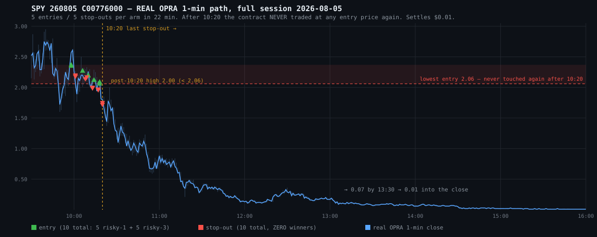

# EOD 2026-08-05 — LENS 1: WERE THEY GOOD TRADES, AND WOULD A WIDER STOP HAVE SAVED THEM?

> Written 2026-08-06 pre-dawn. `et_clock.py` → **2026-08-06 03:39 ET, market_hours=False.**
> All P&L from BROKER FILLS (Alpaca `/v2/account/activities/FILL`). All counterfactuals from
> REAL OPRA 1-min bars (`/v1beta1/options/bars`) plus the engine's own recorded quote series.
> Every cell is live-executable — **no ORACLE columns anywhere in this document.**
>
> Companion JSON: `analysis/deep-research/EOD-2026-08-05-STOPS.json`
> Chart: `analysis/deep-research/EOD-2026-08-05-STOPS-776c-path.svg`

---

## VERDICT — do we need larger stops?

# NO.

Not "no, probably." **No, and the data says the opposite of the intuition.**

| The question | The number |
|---|---|
| Did 776C ever recover to ANY of the 5 entry prices after 10:20? | **No.** Post-10:20 high = **$2.00**, six cents under the *cheapest* entry ($2.06). It settled **$0.01**. |
| Best 776C cell in the whole grid | **tightest stop × one entry** (−6% × cap1) = **−$205** |
| Worst 776C cell in the whole grid | **widest stop** (−50%) = **−$1,643** |
| What the day actually did | −6% × 5 entries = **−$1,279** (broker truth) |
| 391-day, 08-05's own archetype (gap-fade, n=30) | −6% **−$120** → −50% **−$2,704**. Monotone. Widening is **22× worse.** |

**A wider stop does not save these trades. It loses more, in every cell, at every re-entry
count.** The reason is not subtle: the contract went to zero and never looked back. There was
nothing on the other side of a wider stop to wait for.

**And the real finding is that this was never a stop-width problem.** Holding the stop at −6%
and capping the wave at one entry recovers **$991 of the $1,196**. Holding entries at five and
widening to −15% *costs* **$44**. **84% of the loss was the re-entry count.**

---

## §1 — THE CONTRACT NEVER CAME BACK



Real OPRA, 380,345 contracts / 50,969 prints across the session — this is trade data, not a
synthetic curve.

| Entry price | Arm | Recovered after 10:20? |
|---|---|---|
| 2.37 / 2.35 | r1 / r3 | **NO** |
| 2.27 | both | **NO** |
| 2.20 / 2.19 | r1 / r3 | **NO** |
| 2.12 | both | **NO** |
| 2.09 / 2.06 | r3 / r1 | **NO** |

Post-10:20: max **close $1.78** (10:24), max **intrabar high $2.00** (10:25), then
`0.88 @ 11:00 → 0.35 @ 11:30 → 0.13 @ 12:00 → 0.07 @ 13:30 → 0.01 into the close`.

**Bluntly: "we need bigger stops" is FALSE for this day.** Every extra minute held on 776C
after 09:58 cost money. The five stop-outs were the *only* thing that limited the damage.

**Context the entry side owns (LENS 6), but it explains everything here:** SPY's session high
was **776.81 at t=0.013 of the session** — the first minute. The day is classified **gap-fade**:
gapped up 0.60%, topped immediately, closed on the low (`close_loc` 0.034). The bull
VWAP_CONTINUATION signal fired at **09:58–10:19**, i.e. it bought the high of the day, five
times, on a day that had already turned. No exit knob fixes that.

---

## §2 — SEQUENTIAL STOP-WIDTH GRID (both arms, every cell)

**Sequential, never recombined.** A wider stop keeps you holding, which *suppresses* the later
re-entries. The simulation walks one position at a time and re-enters only when (a) flat and
(b) the engine's **own** signal was live that minute.

**Re-entry minutes come from the engine's own ledger, not from me.** `decisions.jsonl` records
`risk_code=NOT_FLAT` whenever the strategy fired but a position was already open. The
vwap_continuation signal was live on **12 minutes** (09:58, 09:59, 10:00, 10:01, 10:06, 10:10,
10:11, 10:14, 10:15, 10:16, 10:18, 10:19) and **stopped firing entirely after 10:19** — so a
wide stop that held past 10:20 gets no re-entry at all, it just holds the bag down.

**Model validated against the real fills:** prices are the engine's own recorded
`worst_premium` bids where they exist, real OPRA where they don't (fitted bias −$0.026,
sd $0.058, n=14 overlap minutes). The −6% calibration cell reproduces **5/5 entries** and lands
within **5.2% (risky-1)** and **7.3% (risky-3)** of broker truth.

### risky-1 (qty 5) — broker truth −$485

| cell | entries | P&L | MC p05…p95 |
|---|---:|---:|---|
| **−6% (LIVE)** | 5 | **−535** | −535 … −535 |
| −10% | 4 | −573 | −625 … −532 |
| −12% | 3 | −493 | −585 … −468 |
| −15% | 2 | −488 | −528 … −411 |
| −20% | 2 | −488 | −536 … −295 |
| −25% | 1 | −295 | **−611** … −295 |
| **−50% catastrophe-only** | 1 | **−643** | −687 … −588 |
| chart/structure *(RECONSTRUCTED)* | 2 | −348 | — |

### risky-3 (qty 8) — broker truth −$794

| cell | entries | P&L | MC p05…p95 |
|---|---:|---:|---|
| **−6% (LIVE)** | 5 | **−856** | −856 … −856 |
| −10% | 4 | −917 | −1000 … −851 |
| −12% | 3 | −789 | −936 … −750 |
| −15% | 2 | −781 | −846 … −658 |
| −20% | 2 | −781 | −858 … −472 |
| −25% | 1 | −472 | **−977** … −472 |
| **−50% catastrophe-only** | 1 | **−1,029** | −1100 … −942 |
| chart/structure *(RECONSTRUCTED)* | 2 | −557 | — |

**Do not be seduced by the −25% cell.** Its point estimate is the best number on the page and
it is **a coin flip**: MC p05 is −$611 / −$977, *worse than the −6% cell it appears to beat*.
It wins only because the 10:20 bid landed a hair under its stop; nudge the price 3¢ and it
holds into the collapse. Reported, not recommended.

The **−50% catastrophe-only** cell — the "give it room" answer — is the **worst cell in both
arms.** Combined it is **$281 worse** than what actually happened.

*The chart/structure row is a RECONSTRUCTION and must be read as one: the live setup carried
`trigger_level=None`, so no such level existed in production. Defined before running as "first
closed 5m bar on the wrong side of session VWAP", modelled as a market STATE (exits AND blocks
re-entry while true).*

### The joint grid — this is the whole answer

Combined both arms, 776C wave only:

| stop \ max entries | **1** | 2 | 3 | 5 |
|---|---:|---:|---:|---:|
| **−6%** | **−205** | −374 | −613 | −1,196 |
| −10% | −395 | −733 | −1,162 | −1,162 |
| −15% | −616 | −1,240 | −1,240 | −1,240 |
| −25% | −839 | −839 | −839 | −839 |
| −50% | −1,643 | −1,643 | −1,643 | −1,643 |

*(broker truth = −6% × 5 entries = −$1,279)*

**Read down any column: widening the stop loses more. Read across any row: more entries loses
more.** The grid is monotone toward *tight stop, one entry* in both directions. There is no
configuration of stop width alone that rescues this day.

---

## §3 — THE HONEST GENERALIZATION (a fix that only works on one day is not a fix)

### 3a. Full real-fill book — 205 positions, 146 waves, 25 days (2026-06-26 → 08-05)

Live `plan_exit_actions` core, only `premium_stop_pct` varied, sequential within waves.
**43% of this population sits inside a multi-entry wave** — recombining independently would
misprice nearly half of it.

| cell | ALL | single-entry (n=116) | multi-entry (n=30) | trend (n=57) | chop (n=89) |
|---|---:|---:|---:|---:|---:|
| −6% | +815 | +1,468 | −653 | +1,231 | **−416** |
| −10% | +767 | +2,148 | −1,381 | +1,052 | **−285** |
| −12% | +921 | +1,838 | −918 | +1,203 | **−282** |
| −15% | +3,502 | +3,495 | +7 | +3,810 | −307 |
| −20% | +5,953 | +6,559 | −606 | +6,776 | −824 |
| −25% | +7,558 | +8,865 | −1,307 | +8,841 | −1,283 |
| −50% | +7,652 | +8,390 | −738 | +9,555 | **−1,903** |

*(broker truth +$317; this model does not reconstruct chart-stop/ribbon-flip invalidation, so
absolute dollars overstate — the −6% cell reads +815. **Rankings are the deliverable.**)*

### 3b. Full-history 391-day replay — 191 trades

**Model fidelity, proven not asserted:** the −20% cell **IS** the live `ribbon_ride`
`premium_stop_pct`. The repo's frozen baseline
(`analysis/recommendations/engine-fullhist-replay-2026-07-23.json`) is **4808.75 on 191
trades**. This harness returns **+4,809 on 191 trades. Exact match.**

| stop | total | trend | chop | WR |
|---|---:|---:|---:|---:|
| **−6%** | **+8,036** | +3,466 | **+4,504** | 0.25 |
| −10% | +6,948 | +3,423 | +3,459 | 0.26 |
| −12% | +6,107 | +3,201 | +2,840 | 0.26 |
| −15% | +6,153 | +4,001 | +2,087 | 0.28 |
| **−20% (LIVE)** | +4,809 | +3,903 | +840 | 0.29 |
| −25% | +4,060 | +3,444 | +550 | 0.30 |
| **−50%** | **+2,176** | +4,534 | **−2,423** | 0.36 |

Per-archetype — **gap-fade is 08-05's own archetype:**

| archetype | n | −6% | −10% | −12% | −15% | −20% | −25% | −50% |
|---|---:|---:|---:|---:|---:|---:|---:|---:|
| **gap-fade** | 30 | **−120** | −367 | −423 | −596 | −884 | −1,173 | **−2,704** |
| range-chop | 86 | +3,859 | +3,073 | +2,636 | +2,172 | +1,396 | +1,651 | +1,026 |
| pin-day | 6 | −120 | −200 | −271 | −365 | −431 | −496 | −837 |
| V-reversal | 11 | +718 | +796 | +745 | +719 | +602 | +412 | −65 |
| gap-go | 37 | +2,871 | +3,082 | +2,966 | +2,791 | +2,911 | +2,670 | +3,686 |
| trend-up | 5 | +424 | +321 | +293 | +251 | +181 | +110 | −51 |
| trend-down | 13 | +172 | +19 | −58 | +959 | +811 | +663 | +899 |

*Only 124 of 191 trades move: the 67 structure-mode trades take the −50% catastrophe cap
regardless of `premium_stop_pct`. That is production's own behaviour, disclosed not averaged away.*

### 3c. Why I am NOT recommending "tighten to −6%" either

The 391-day aggregate says tightening from the live −20% to −6% is worth **+$3,227**, it is
robust (**drop-best-5 still +$2,543**), and it is lopsided (**94 trades improved, 9 worsened**,
paired t = 2.72). That looks shippable. It is not:

| sub-window | delta | n |
|---|---:|---:|
| 2025 H1 | +$1,443 | 39 |
| 2025 H2 | +$1,641 | 72 |
| 2026 Q1 | +$128 | 31 |
| **2026 May →** | **+$15** | **49** |

**The entire edge is pre-2026.** In the regime we are actually trading, tightening is worth
fifteen dollars over forty-nine trades. Per J's recency-over-aggregate directive (2026-07-31),
**a 390-day aggregate is the wrong bar** — this fails it.

---

## §4 — IS IT REGIME-CONDITIONAL? YES. IS THAT USABLE? NO.

**The effect is real and mechanistically coherent.** All three populations agree on the chop
side: *widening the stop is harmful on chop-like days.* On a trend day a tight stop shakes you
out of a winner; on a chop day a wide stop just means you eat the whole round trip down.

So the honest technical answer is **REGIME-CONDITIONAL**. But J's brief demands the next step,
and the next step kills it:

> *you must show the regime is classifiable AT ENTRY TIME from data the engine already has live
> — otherwise it is hindsight and must be labeled as such.*

**It is not. This repo already pre-registered that exact classifier and it FAILED every gate**
(`analysis/deep-research/REGIME-EARLY-CLASSIFIER-2026-08-02.md`, four days ago):

- 8-way accuracy at 09:45 ET: **20.9%** — *worse than always guessing the majority class (39.1%)*.
- Binary "skip pin-day/gap-fade" precision: **26.8%** (09:45) / **26.9%** (10:00). Three of
  every four flags are wrong.
- **The killer, in its own confusion matrix:** of days truly gap-fade, 16/44 were predicted
  gap-fade. Of days truly **gap-go**, **18**/71 were *also* predicted gap-fade. **More of the
  "gap-fade" flags were actually gap-go than were actually gap-fade.**

**Tuesday 2026-08-04 was gap-go. Wednesday 2026-08-05 was gap-fade.** The two days whose lessons
J asked me to reconcile are *precisely the pair the classifier provably cannot separate* — and
the 776C entries landed at **09:58–10:19**, squarely inside the blind window. Waiting to 11:00
plateaus, not improves; the doc establishes this is an **informational** limit (does the gap
fill? — that fact does not exist yet), not a tuning shortfall.

**Therefore: a regime-conditional stop is NOT shippable, and calling one "the answer" would be
hindsight wearing a plan's clothes.**

---

## §5 — WHAT SURVIVES BOTH DAYS

**On the stop axis: nothing.** No single static stop width improves both 08-04 and 08-05, and
the two wide populations point in opposite aggregate directions. I am not proposing a stop change.

**Off the stop axis, one candidate survives — and I am pre-registering it, not shipping it.**

### MAX-3-ENTRIES-PER-WAVE

Broker truth, P&L by entry ordinal within an (arm, date, symbol) wave, 25-day book:

| ordinal | n | total | per-trade | WR | trend | chop |
|---|---:|---:|---:|---:|---:|---:|
| 1st | 146 | −$140 | −1.0 | 0.18 | +2,274 | −2,414 |
| **2nd** | 30 | **+$1,070** | +35.7 | 0.13 | +1,552 | −482 |
| 3rd | 17 | +$107 | +6.3 | 0.24 | +454 | −347 |
| **4th** | 9 | **−$257** | −28.6 | 0.11 | −55 | −202 |
| **5th+** | 3 | **−$463** | −154.3 | **0.00** | −12 | −451 |

**This refutes the obvious reading of §2.** Re-entries book-wide are **net +$457**, and 2nd
entries are the single best cohort in the book. **A cap of 1 would have destroyed $1,070.**
The sign flips between the 3rd and the 4th entry — and *that* is where cap=3 sits.

| | waves touched | effect |
|---|---:|---|
| **08-04** (gap-go, +$3,624 day) | **0** | **$0 — literal no-op.** Largest 08-04 wave was n=3. |
| **08-05** (gap-fade, −$1,935 day) | 2 | **+$653** |
| **25-day book** | 9 | **+$720** (12 trades removed) |

It never removes a profitable ordinal cohort and it is a **no-op on the best day on record.**

**Now the honesty that decides it:** 91% of that $720 is 08-05 itself. **Excluding the day that
motivated it, cap=3 is worth +$67 across 7 waves — noise.** n=12 removed trades. That is the
textbook re-pick-after-seeing-results hazard.

**Verdict: PRE-REGISTER as a frozen A/B with forward paper evidence. DO NOT SHIP tonight.**
It clears a *does-no-harm* bar, not an *evidence* bar.

---

## §6 — MECHANISM CORRECTION TO THE HANDOFF (load-bearing)

The brief carried forward from the 08-04 audit:

> *"Continuation setups have trigger_level=None ALWAYS, so their stop_mode='structure' patch is
> a guaranteed NO-OP and they silently fall back to the raw −6% premium stop."*

**For `vwap_continuation` this is wrong in the way that matters.** There is no structure patch
on it to be a no-op:

```python
# automation/state/fleet/strategies.py
VWAP_CONTINUATION = Strategy(
    name="vwap_continuation",
    exit=ExitShape(premium_stop_pct=-0.06, tp1_premium_pct=0.40,
                   tp1_qty_fraction=0.8, profit_lock_mode="fixed"),   # <- no stop_mode at all
)
# ExitShape.stop_mode default:
stop_mode: str = "premium"
```

**−6% is the DECLARED PRIMARY stop, by design.** It was deliberately ported 2026-07-09 (commit
`b1250556`, "STOP-B ship 2") as *the full validated core cell* — validated 2026-07-07 with
**all 5 OP-22 gates PASS on n=149 real OPRA fills** (OOS $75.47/tr vs $66.83, WF 1.62, anchor
82.04 vs 44.52). The 08-05 ledger confirms it live on all five entries:
`stop_mode:"premium"`, `trigger_level:null`, `runner_stop == fill × 0.94`.

**Why this matters: there is no bug to fix here.** This is a properly validated knob meeting an
adversarial day. The no-op-structure story is real, but it applies to strategies that *do*
declare `stop_mode="structure"` while lacking a `trigger_level` — `ribbon_ride` is one.
`vwap_continuation` is not.

**The 08-04 prediction, scored:** that audit wrote *"the −6% stop on a chop day — that is the
treadmill, and it is the day we have not seen yet."* 2026-08-05 was gap-fade. The −6% stop fired
ten times for −$1,279. **Prediction correct.**

**Put-side note (LENS 2 owns it):** the 11:48 put *did* resolve `stop_mode:"structure"`
(`trigger_level` 772.33), so its stop was the −50% catastrophe cap — `runner_stop 0.825 =
1.65 × 0.50`, and risky-3 exited at 0.82. Its TP1 is **+100%** (`ribbon_ride`
`tp1_premium_pct=1.0` → 3.30), which the put's +59% peak never came close to. That is the
mechanical reason TP1 never fired.

---

## §7 — CAVEATS

- **n=1 day, n=1 contract** for §2. The −25% cell's apparent win is inside its own MC noise band.
- The chart/structure cell is a **reconstruction**; that level did not exist in production.
- §3a does not model chart-stop/ribbon-flip invalidation, so its absolute dollars overstate
  (−6% cell +815 vs broker truth +317). Rankings only.
- §3b moves only **124 of 191** trades; 67 structure-mode trades are invariant to the sweep.
- cap=3 rests on **n=12** removed trades, 91% concentrated in the motivating day.
- **Artifact caught and killed, recorded so it is not re-made:** the first draft of
  `stop_width_population_grid.py` hand-rolled the exit loop with no TP1 and no runner. Every
  winner rode to the 15:50 flatten and the "−6% LIVE" cell printed **+$12,115** against broker
  truth **+$317** — a **38×** artifact. Rebuilt on the live `plan_exit_actions` core.

---

## SHIPPED / PRE-REGISTERED

| item | status |
|---|---|
| `backtest/tools/stop_width_grid_20260805.py` | **SHIPPED** — sequential n=1 grid + MC bands |
| `backtest/tools/stop_width_population_grid.py` | **SHIPPED** — 25-day real-fill sequential grid |
| `backtest/tools/stop_width_fullhist_sweep.py` | **SHIPPED** — 391-day sweep, reproduces frozen baseline exactly |
| Real 1-min OPRA cache for 08-05 (776C/777C/772P/SPY) | **SHIPPED** |
| Stop-width change of any kind | **NOT SHIPPED — rejected on evidence** |
| MAX-3-ENTRIES-PER-WAVE | **PRE-REG ONLY** — benefit is 91% the motivating day |

**Nothing in the live trading path was modified by this lens.** Read-only broker calls, new
analysis tools, new data cache, two documents.
