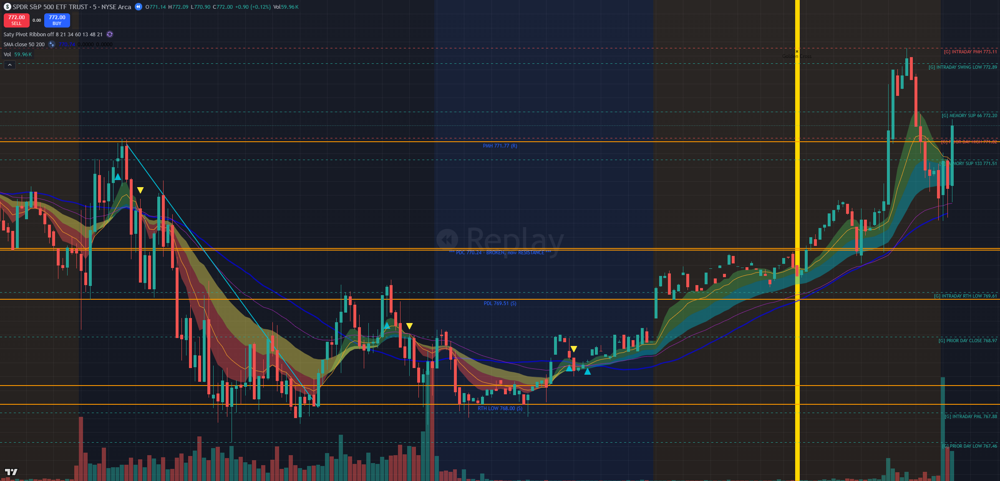
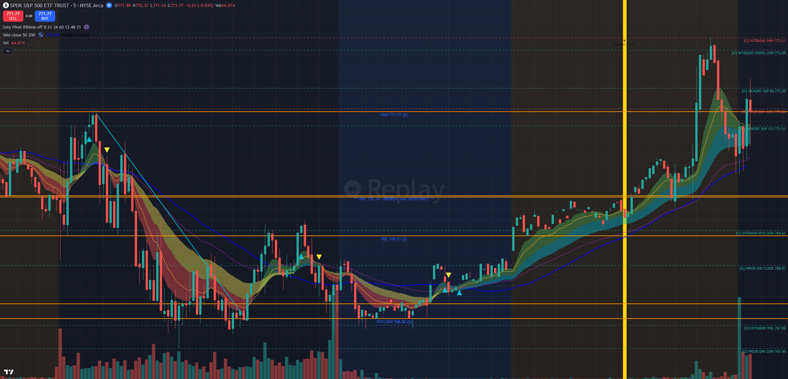
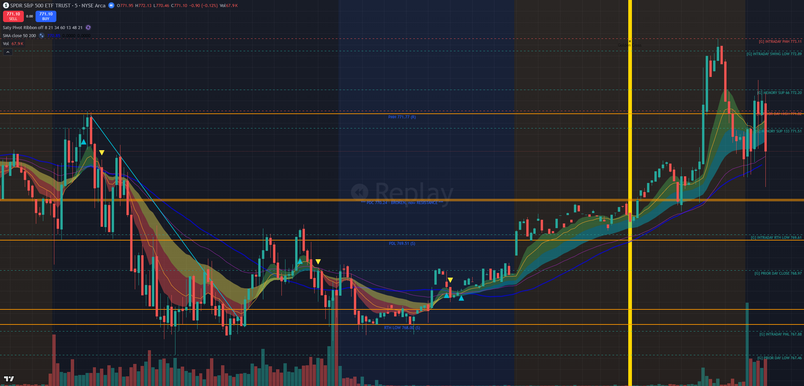
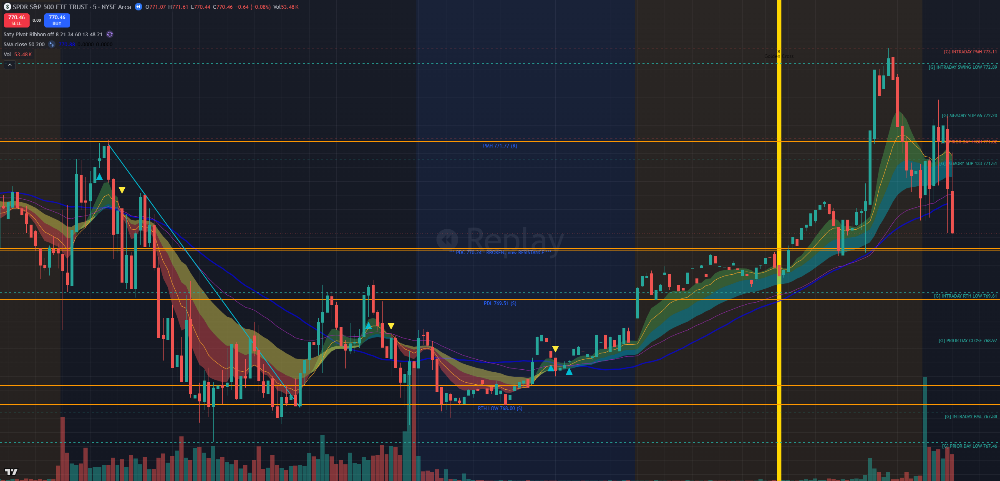
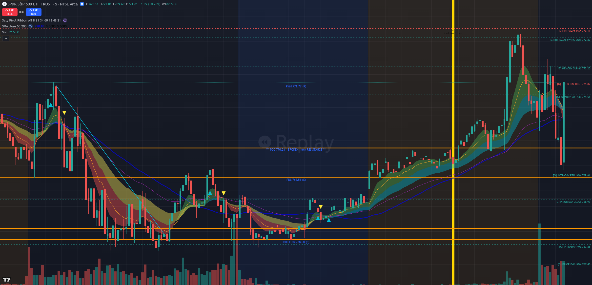
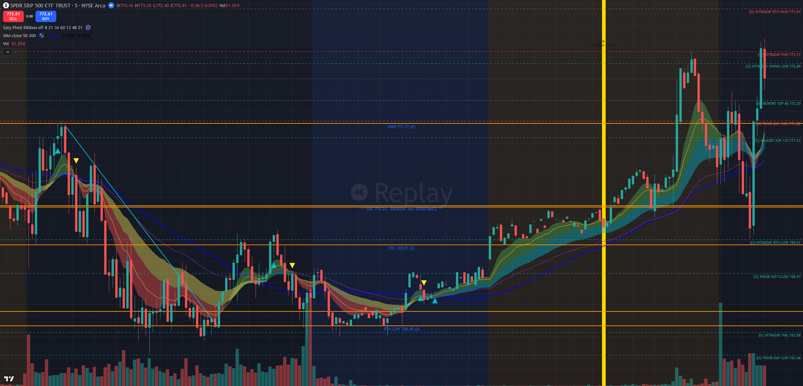
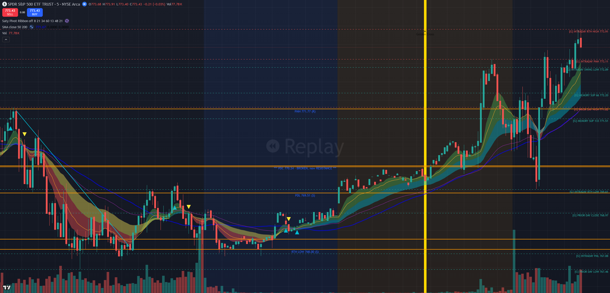
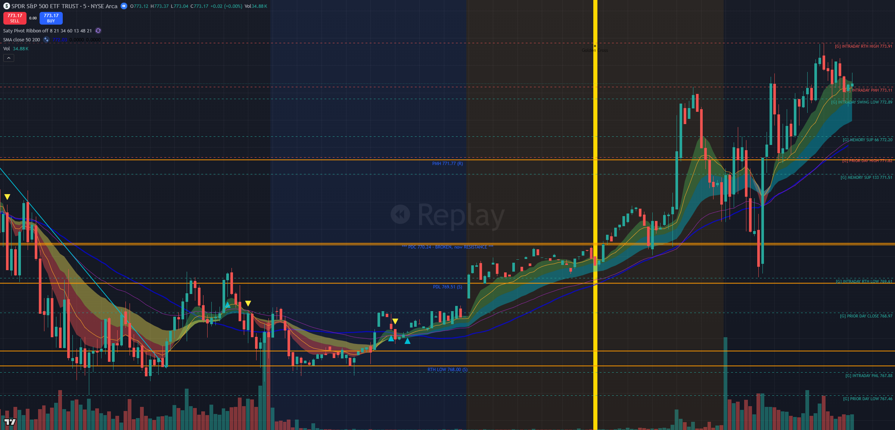
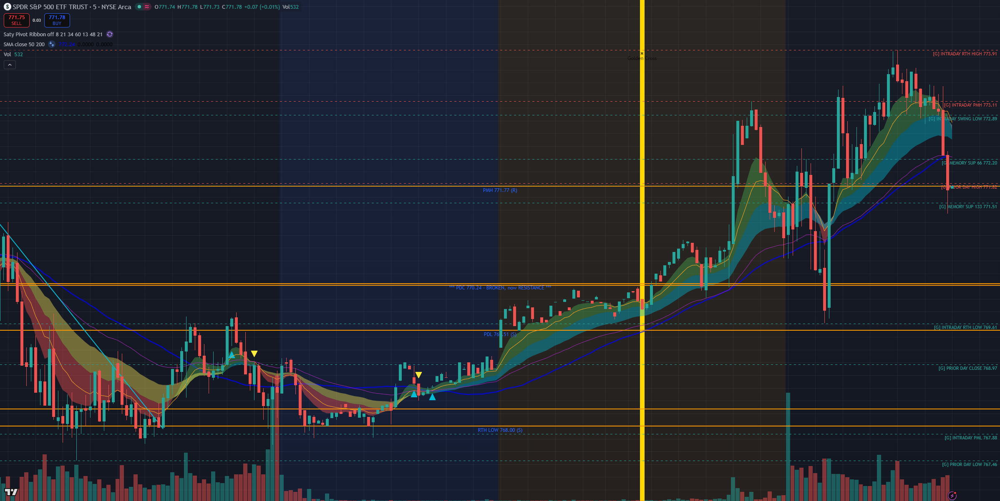

# FRIDAY ON THE TAPE — TV Bar Replay Walkthrough, 2026-08-07 (Lane 3)

> J's ask: "use TradingView replay and play back today." Done — TV MCP bar replay, SPY 5m,
> stepped bar-by-bar from the open to now, screenshot at every decision point.
> Produced 12:07–12:30 ET while the market was open. **No trading-path file touched.**

## THE VERDICT IN THREE LINES

1. **The morning loss (−$629.46) is NOT a ladder question.** At 09:46 the signal scored **11/11, zero blockers** — binary engine and ladder engine make the IDENTICAL trade and take the identical stop-out. The ladder does not dodge this cell; anyone claiming otherwise is overselling it.
2. **The 10:15–11:45 refusal IS the ladder question.** 70 ledger ticks were sole-blocked by demotable filters (F10/F7) at bull_score 9–10 while SPY ran 770.50 → 773.91. **Binary: 70× HOLD. Ladder: both risky arms (rung 8 and rung 7) enter at the FIRST tick — 10:15:03, spy 770.495.** Safe arms stay binary = built-in control group.
3. **Filter 11 earns its absolute status on this same tape.** 112 of the 182 window HOLDs had F11 (level-tied requirement) active — the measured −$103/entry, 0%-WR bare-confirmation cohort. The ladder admits **none** of them, on any rung. This is what separates the ladder from the dead "delete a filter" graveyard entries.

**How to read the frames:** each screenshot is the replay state at that decision moment — the top-left OHLC readout shows the current replay bar, and the **yellow vertical line is the replay cursor ("you are here")**. TV Desktop's API-driven replay keeps painting the live day's bars to the RIGHT of the cursor line — treat everything right of the yellow line as *not yet happened* when reading a frame (tooling quirk, disclosed fully in the appendix). Chart feed is BATS; the engine trades off IEX ticks — bar values differ by cents, both quoted where they matter. Today's same-day OPRA is 403 until ~16:21, so every option value for today is the engine's own track or delta-approx, **labeled EST**; fills are real broker paper fills.

---

## 09:40 — The signal bar (both engines say GO)

- 09:40 bar (TV/BATS): **O 771.14 H 772.09 L 770.90 C 772.00** — closes above PDH 771.82 / PMH 771.77 (orange + red dashed lines on chart).
- Ledger 09:46:03: `PLACED — BULLISH_RECLAIM_RIDE_THE_RIBBON, bull_score 11, blockers [], tier SUPER, spy 772.045`.
- **BINARY: ENTER. LADDER: ENTER (score 11 ≥ every rung, no vetoes). No difference.**

## 09:45–09:47 — The fill bar (28 contracts into a pullback)

- 09:45 bar: **O 771.98 H 772.37 L 771.14 C 771.77** — the engine filled INTO this pullback bar.
- Real fills (fills-ledger, 09:46:34–09:47:09): safe-2 **3× 772C @ 1.67**, safe-3 **8× 772C @ 1.33**, risky-1 **5× 772C @ 1.33**, risky-3 **12× 774C @ 0.62** (OTM-2 tier). 28 contracts total.
- **Honest cell: the ladder buys this exact same loss.** Its case must be made NET of this — that walk is Lane 2 / LADDER lane's job, not this doc's.

## 09:55 — The dump

- 09:55 bar: **O 771.95 H 772.13 L 770.46 C 771.10** (engine view: 772.08 → 770.47). One bar erases the breakout.
- Position underwater; chart-stop-primary doctrine = wait for the CLOSED-bar confirm, no panic exit.

## 10:00–10:02 — Closed-bar stop confirm, all four arms out

- 10:00 bar closes **770.459** — below the reclaim level. Chart stops fire on the close.
- Real exits 10:01:05–10:02:09: 772C sold **@ 1.16 / 1.11 / 1.14**, 774C **@ 0.45**.
- Arithmetic: safe-2 −$153, safe-3 −$176, risky-1 −$95, risky-3 −$204 = **−$628 gross ≈ −$629.46 book** (fees). Per-contract ≈ −$22.50; the book number is a 28-contract sizing story, not a bad-stop story.
- **Exit path is walk_exit_manager for both engines — the ladder changes admission only, never exits.**

## 10:15 — THE REFUSAL (the frame that answers J's question)

- Ledger tick `10:15:03`: **spy 770.495, bull_score 10/11, raw triggers [level_reclaim, confluence] @ 770.46, VIX 15.04, sole blocker: filter 10** (buyer pressure). The 10:15 bar then closes **771.81, +1.99 on the bar**.
- **BINARY: HOLD.** One blocker = veto, regardless of score. It held through 182 consecutive window ticks.
- **LADDER: ENTER, both risky arms.** F10 is demotable; score is already blocker-netted (bull_score = 11 − #blockers, harness-frozen semantics), so 10 ≥ rung 8 (risky-1) and ≥ rung 7 (risky-3). Level-tied trigger present → F11 satisfied. VIX 15.04 under the hard cap. Not a bare-confirmation entry.
- **Safe arms: HOLD (binary by design — they ARE the experiment's control).**
- EST what an ATM call cost here: the day's two live comparables — 772C @ 1.33–1.67 with spy ≈ 772 (09:46), 773C @ 1.09–1.11 with spy ≈ 773.1 (12:06) — put a 770/771C with spy 770.50 in the **~$1.2–1.6 EST** range.

## 10:30 — The refused entry is already green

- 10:30 bar: **O 773.16 H 773.35 L 772.40 C 772.61** — the tape is already through the morning entry price (772.045) 15 minutes after the refusal.
- Ledger at 10:30: still HOLD — score 10, sole blocker F10 again.

## 11:30 — Rally top: what 70 refused ticks look like

- 11:30 bar closes **773.43**; day high **773.91** prints in the 11:35–11:45 stretch (chart label INTRADAY RTH HIGH 773.91).
- From the 10:15 refusal read (770.495): **+2.9 to +3.4 points (+0.38% to +0.44%) with essentially no adverse excursion below the 769.69 bar low.**
- EST on the refused 10:15 ATM call: delta-approx (0.5 rising toward 0.7 as it goes ~3 pts ITM) on +2.9 ≈ **+$1.5–1.9/contract ≈ +100–150% EST** from a ~$1.2–1.6 entry. At the risky arms' morning sizes (5 and 12 lots): **order-of +$750–$2,000 EST combined.** LABEL: EST, delta-approx — the LADDER lane's sequential walk on the engine's own premium track is the number that counts; this is the chart-scale sanity check, not the claim.

### The full refusal-window census (ledger, 182 HOLD ticks, 10:15–11:45, 2 ticks/min)

| Cell (bull_score, blockers) | Ticks | Binary | Ladder risky-1 (rung 8) | Ladder risky-3 (rung 7) | Why |
|---|---|---|---|---|---|
| (10, [10]) | 54 | HOLD | **ENTER** | **ENTER** | F10 demotable, 10 ≥ 8 |
| (10, [7]) | 10 | HOLD | **ENTER** | **ENTER** | F7 demotable, 10 ≥ 8 |
| (9, [7,10]) | 6 | HOLD | **ENTER** | **ENTER** | both demotable, 9 ≥ 8 |
| (10, [11]) | 10 | HOLD | HOLD | HOLD | **F11 absolute — bare-confirmation, never admitted** |
| (9, [10,11]) | 28 | HOLD | HOLD | HOLD | F11 absolute |
| (8, [7,10,11]) | 74 | HOLD | HOLD | HOLD | F11 absolute |

- **70 ladder-admissible ticks (35 minutes), first at 10:15:03** — matches the directive's "70 ELITE ticks" exactly, and the census shows where it comes from.
- Sequential-walk honesty: a real arm enters ONCE at 10:15 and is then NOT_FLAT — 70 admissible ticks ≠ 70 trades. Rule 5/6/PDT (risk_gate) stays absolute on every rung.

## 12:05–12:06 — The engine re-enters on its own terms

- After 20+ minutes consolidating above the PDH zone, tick `12:06:03`: **score 11, blockers [], tier ELITE → PLACED** (spy 773.145).
- Real fills 12:06:35–12:07:10: safe-2 **3× 773C @ 1.11**, safe-3 **8× 773C @ 1.10**, risky-1 **5× 773C @ 1.09**, risky-3 **12× 775C @ 0.31**.
- Binary and ladder identical again (zero blockers). The engine did not need the ladder here — it needed the market to hand it a perfect score. **That is exactly J's complaint in one sentence: the binary engine trades only 11/11.**

## NOW (~12:25 ET, live) — honesty about the open position

- Live 12:25 bar: **771.52** after a sharp pullback from 773.2 — the 12:06 entry (773C @ ~1.10) is **underwater right now** (EST value ~0.45–0.60 with spy 771.5). Closed-bar chart stops govern; day still red (−$629 realized + open position at risk).
- No oversell: if this re-entry stops out, the binary engine will have entered twice today, both on 11/11 signals, both into pullbacks after extended moves — while refusing the one entry (10:15) that ran 3+ points. That asymmetry — not today's P&L — is the evidence the ladder A/B exists to test.

---

## What this walkthrough does and does not license

- **DOES:** show, on J's own chart, that the binary veto sat out a 10/11 level_reclaim+confluence setup for 91 minutes of trend, exactly as he said (4th ask); show the ladder's per-arm decisions at every decision point under the frozen partition (demotable {5,7,8,10} / absolute {risk_gate, 9, 6, window, 11}); show that safe arms are untouched.
- **DOES NOT:** prove the ladder is net-positive. The morning cell (−$629 style losses) is bought by BOTH engines, and lower rungs will buy MORE such cells on other days. That verdict belongs to the LADDER lane's sequential replay (today + Mon–Thu on real OPRA + 391-day battery, BH-corrected) against the prereg frozen and committed BEFORE the run. Ship-to-risky-arms authority tonight = that evidence, not this narrative.
- **GRAVEYARD guard restated:** this is NOT filter deletion and NOT filter-8 relax (both dead — they removed a gate for ALL arms unconditionally). The ladder is per-arm, score-conditional admission with binary safe arms as the control.

## Tooling appendix — what failed, what was verified (OP-33)

- **Pass 1 failed visually:** a leftover "Continue your last replay?" modal (from the WS49 smoke test) intercepted TV's visual replay mode — the API stepped the data correctly (every step's OHLCV quoted and matched) but the chart pane stayed on the full day with the modal occluding center. Those 8 frames were discarded, the modal dismissed via `ui_click(close)`, and the full pass re-run clean. Lesson for the dojo: **dismiss/clear any saved-replay dialog before `replay_start`** — worth a guard in `dojo_session.py`.
- **`replay_autoplay` speed is not honored:** "1000 ms/bar" ran ≈3 bars/s; "143 ms" blew through ~98 bars in <6.5 s and auto-exited replay at the live edge. Usable only coarse-grained with polling; fine control = `replay_step` (verified 1 bar/call, batchable).
- **API replay paints future bars right of the yellow cursor** (main series stays live). Every frame's authority is the yellow cursor + top-left OHLC readout; framing disclosed above.
- **Exit state verified fresh:** `replay_stop` → `replay_status` `is_replay_started: false`; live bar forming (12:25 bar, 771.52); no `warning-dialog` element present; `tv_health_check`: `cdp_connected: true, chart_symbol: BATS:SPY, chart_resolution: 5, api_available: true` — same state as at session start. Watchdog/heartbeat surface restored.
- Times: ET verified via `setup/scripts/et_clock.py` (12:07:14 EDT at start). All ledger quotes from `automation/state/core-decisions.jsonl` (315 rows today) and `automation/state/fills-ledger.jsonl`; no state file written.
