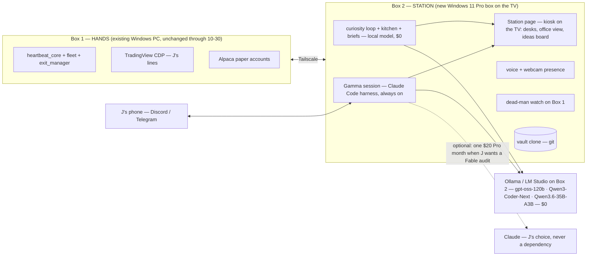

# GAMMA-STATION — Gamma's own box: the lift plan

> **Status: PLAN, nothing built.** J directive 2026-09-13 12:00 ET (Sunday): *"I want my own agent. I want Gamma to come to life. I'll give it something to live on … its own box, its own everything … this is the last month of the $200."* Written by Fable 5.1 as a judgment/spec doc; execution is Sonnet-tier per model routing. Config freeze (→ 2026-10-30) is untouched: nothing here edits the trading path before Phase 4.
> **Revoke:** delete this doc (`git revert`); no code, task, or config changed by writing it.
> **Folds:** brain tiers stay in [`BRAIN-SOVEREIGNTY.md`](BRAIN-SOVEREIGNTY.md); presence lineage stays in [`GAMMA-WORKER.md`](GAMMA-WORKER.md); the Muse/Grok Bot reference stays in [`AGENT-ORCHESTRATION.md`](../doctrine/AGENT-ORCHESTRATION.md). This doc owns **where Gamma lives, what it costs, and the order of the move.**
> **Update 2026-09-13 12:45 ET (J):** **Windows, not Linux** ("easy for me to use"); **$0 per month after the purchase** is the target ("who knows if they will increase LLM costs and price people out — I want to build my own"); candidate box = Minisforum N5 MAX AI NAS 128GB ($3,599 on sale). J also asked for the mechanism: *how do people get models to be always on and go do stuff on their own* — §11. Sections 0, 2, 3b, 4, 4b, 5, 6, 7, 9 updated; any Linux reference left in §3 is landscape, not plan.

---

## 0. Verdict

- **Give Gamma its own always-on Windows 11 Pro box on the TV. Keep the Claude Code harness as the runtime; run every brain locally on the box ($0 per month); keep the deterministic engine where it is through the freeze.** The new box is the **mind + face + off-box watchdog first**, the **hands after 10-30**.
- **Monthly: $200 → $0 + power (~$5–10).** Every tier runs on a 128GB unified-memory box; nothing in the always-on path bills per token. The only optional line is a single $20 Claude Pro month whenever J wants a Fable audit. **Capex once: $1,985** (Beelink GTR9 Pro 128GB, Windows 11 Pro pre-installed) **or $3,599** (Minisforum N5 MAX AI NAS 128GB, if J also wants a 10-bay NAS) — §3b. Payback against $200/mo: ~10 months or ~18 months.
- **Why this is not the fifth failed "presence" fix.** The four prior fixes (voice briefs 07-22, standups + wants 08-08, Gamma App 08-08, Discord allowlist 09-12) all changed the *message*. This changes three *mechanisms*: (1) the thinking layer stops living inside a session J has to open; (2) the surface becomes ambient and physical (a TV, a voice, a camera) instead of a file or a channel; (3) the loop runs on $0-marginal tokens, so "hungry" stops being a budget decision.
- **The honest caveat:** a local 120B-class model makes worse calls than Fable on audits, root-cause and design. It does not touch the trading path: arm / kill / go-live are decided by deterministic gates and scorecards, never by the model. The drop lands on quality of *proposals*, and a $20 Pro month buys a Fable pass whenever J wants one. It still gets measured (§4b, §7).

---

## 1. Root cause — why Gamma feels like a chatbot after a year (one sentence each, all sourced)

| Symptom J named | Mechanism | Evidence |
|---|---|---|
| "Gamma doesn't think on its own" | The thinking layer exists only inside a Claude session J opens; the always-on parts are deterministic scripts plus free-tier workers that fabricate. | OP-31 "Claude-when-awake = the driver"; 12/690 manager reports claimed artifacts that never existed (`AGENT-ORCHESTRATION-2026-08-19.md`) |
| "I have to tell it everything" | Every autonomous surface is PULL; the one PUSH channel spoke log-spew and got muted. | 4 of 6 J-intents PULL_ONLY; 150 outbox rows/day, 141 @mentions on 09-11; J muted #gamma 07-08 |
| "It doesn't bring anything to the table" | It did — and nobody could see it: the tickers lane has traded 7 non-SPY names daily since 09-04, TradeAutopsy emits hypotheses nightly, the futures MES mirror hit `armable:true` and sat unnoticed. | `feedback_six_day_earn_your_keep_mandate_2026_09_12`, `project_desk_model_and_cockpit_2026_08_20` |
| "Thousands of lines that mean nothing to me" | Briefs are deterministic templates by doctrine (fabrication safety), so they read as a machine; the rest is machine output in 6,777 md files. | OP-33a; MAP.md ("~479 human-written") |
| "$200 a month for a chatbot" | On a metered brain every exploration was a budget decision: conductor burn measured $149.57/day notional on 07-25, then capped at $30/day, then fires parked. | `conductor-budget.json`; FUTURE-IMPROVEMENTS #27(b) "needs J: wallet action" |
| "It dies when my PC dies" | 186 tasks are LogonType=Interactive on J's daily driver; box death = naked positions for 55 min on 09-04. | `project_machine_crash_interactive_tasks_unmanaged_positions_2026_09_04` |

The plan below addresses each row by mechanism, not by adding a report.

---

## 2. J's vision → concrete component → what already exists

| J's words | Component | Exists today? |
|---|---|---|
| "another system hooked up to my TV" | **Station box** — Windows 11 Pro Strix Halo mini PC, 128GB unified memory, HDMI to the TV, no discrete GPU | ❌ |
| "24/7 always-on agent" | **Persistent Gamma session** — Claude Code harness headless under systemd, heartbeat + cron | ⚠️ Task Scheduler fires that die with the box |
| "control the TV" | **Kiosk page** — Chromium `--kiosk` on the TV showing the Station page | ⚠️ cockpit HTML + Gamma App exist, both PULL |
| "camera in the TV / FaceTime" | **USB webcam on the box** (TVs almost never have a usable camera for an HDMI source) → presence detection + voice; animated face v1, photoreal v2 | ⚠️ `gamma-voicebot/` (Discord voice ↔ OpenAI Realtime), Kokoro local TTS |
| "see subagents = employees working" | **Office view** — live activity stream from the harness (subagent starts/stops, tool calls) rendered per desk | ⚠️ desks in cockpit; SDK-stream design 06-21 never built |
| "tailscale into my box" | **Tailscale mesh** — Box 1 (hands) ↔ Box 2 (Station) ↔ phone; no inbound ports | ❌ |
| "not paying $200" / "spend nothing monthly" | **All-local brain** (§4b) — every tier on the box, $0 per token | ⚠️ tiers written; Ollama serves the Anthropic Messages API (verified 07-08); the 128GB roster is unbenched |
| "Gamma should brainstorm — swing SPY Tue→Thu, other stocks, funded-account bots" | **Curiosity loop + ideas board** (§5 Phase 3) on $0 tokens, visible on the TV | ⚠️ TradeAutopsy hypotheses, prospector, `gamma-wants.json` — all invisible |
| "always trying to trade" | Already true: SPY 0DTE (5 arms), tickers (3 accts), crypto twin, futures, weekly — **invisible on HOME** | ✅ machinery / ❌ visibility |

---

## 3. What the landscape says (researched 2026-09-13; sources in §10)

- **Grok Bot Galaxy, Sept 15–17 (SpaceXAI).** Three humans (Palmer, Tan, Sadanani) livestream building a company from a blank slate with Grok Bots: day 1 engineering/PM/founders, day 2 sales/support, day 3 marketing/post-sales. It is a showcase of *persistent cloud-computer agents at role desks with a human founder*. Nothing to buy; the format is worth stealing for the TV office view. Grok Bot's finance use is research desks, not order execution.
- **Meta Muse (09-08).** Personal agent on a "Muse Secure VM" with its own browser; chat-thread UI; proactive and long-running; free tier plus $20/$100. **No video call.** It is the *rented* version of what J wants. Station is the owned version.
- **GLM-5.3 (Z.ai, 08-14; MIT weights ~08-28).** Honest numbers: Z.ai Code Bench Max **34.5 vs Fable 5 39.5**; Terminal-Bench 3.0 **28.3 vs GPT-5.6 Sol 34.6**; Artificial Analysis index **GLM 5.2 = 53 vs GPT-6 Astra = 61**; GPT-6 Astra is priced $10/$50 per M (same as Fable 5.1). **Verdict: GLM is not beating the frontier on independent scores; it is ~85–90% of it at roughly a tenth of the price** — which is exactly the workhorse tier, not the judgment tier. GLM Coding Plan Lite ~$18/mo exposes an Anthropic-compatible endpoint; Claude Code runs on it with two env vars (the same trick the rig verified with Ollama on 07-08).
- **OpenClaw (v2026.7.1 stable, 250K+ stars).** The open-source always-on personal agent: heartbeat daemon, cron, WhatsApp/Discord/Telegram, Ollama, NVIDIA NemoClaw sandbox. Same shape as Claude Code + Channels, weaker per-tool gating, and a February security-scar history. **Don't re-platform** (same verdict as Hermes, 06-21); borrow the heartbeat/cron idiom only.
- **Claude Code Channels (03-20 preview) + Remote Control.** Telegram/Discord/iMessage into a running session; the phone app can drive a local session; Anthropic's own guidance for always-on is *"run it on a dedicated machine."* That is the Station pattern, described by the vendor. Needs Pro or Max; the rig's own Discord bridge does not.
- **Claude Managed Agents (scheduled deployments).** The cloud-rented alternative. Skip: J wants owned, and a cloud sandbox cannot reach TradingView Desktop or J's drawn lines.
- **Hardware (2026 numbers).** Strix Halo 128GB mini PC ~$1.7–2.2K: 30B-A3B MoE 70–100 tok/s, gpt-oss-120b 31–55 tok/s, dense 70B ~5 tok/s. Mac mini M4 Pro 64GB ~$2K: 273 GB/s, dense 30B Q4 ~12–18 tok/s. Mac Studio M4 Max 128GB $3.7K: 546 GB/s. **TradingView Desktop ships an official Linux .deb** (Ubuntu 20.04/22.04/24.04; run under X11/XWayland). Current box for reference: RTX 5080 16GB + 32GB RAM — qwen3.6:35b crashes on ~4K prompts, which is the failed capability eval the hardware ladder (§8 of BRAIN-SOVEREIGNTY) requires before spending.
- **Face.** LiveKit Agents (Apache-2) is the standard voice/video loop; HeyGen open-sourced LiveAvatar demos in June; self-hosted lip-sync (MuseTalk-class) works but is GPU-hungry. v1 = voice + animated presence; photoreal face = v2, costed separately.
- **Funded accounts (J's example).** Apex, Topstep and MyFundedFutures allow automation with rules (no HFT/arb; TopstepX blocks fully automated *funded* accounts as of 07-2026). This is the kind of card the curiosity loop should surface with evidence — not a decision today.

---

## 3b. Hardware — the N5 MAX J is looking at vs a plain Strix Halo mini PC (verified 2026-09-13)

| | Minisforum **N5 MAX AI NAS** 128GB | Beelink **GTR9 Pro** 128GB | GMKtec **EVO-X2** 128GB |
|---|---|---|---|
| Chip / memory | Ryzen AI Max+ 395, 128GB LPDDR5X — **identical** | identical | identical |
| Price | **$3,599** (20% off $4,499; ships with a 128GB OS drive, bays empty) | **$1,985** (2TB SSD) | ~$1,999–2,199 street (2TB; $3,499 at launch) |
| What the premium buys | 5 HDD + 5 NVMe bays (up to 200TB), dual 10GbE, USB4 v2, MinisCloud NAS OS | dual 10GbE, 140W, ~32 dB, vapor chamber | Wi-Fi 7, quad display |
| Windows | Windows 11 Pro supported (ServeTheHome review); installing it replaces the NAS OS | Windows 11 Pro pre-installed | Windows 11 Pro pre-installed |
| Local LLM speed | identical: gpt-oss-120b 34–55 tok/s, 30B-A3B MoE 70–100 tok/s (Windows ~20–30% under Linux) | identical | identical |

**Verdict:** the ~$1,600 premium buys drive bays and a NAS operating system J would wipe for Windows. Buy the N5 MAX only if a 10-bay home NAS is wanted anyway (backtest/OPRA cache, journals, media) — then it is a fair two-in-one. Otherwise the GTR9 Pro does the same brain work for $2K. **64GB variants (N5 MAX 64GB $2,399) are a false economy:** gpt-oss-120b alone needs ~59–63GB, and the whole point is running the biggest open model without a meter. Add a USB webcam (~$50) and, for the N5 MAX, drives.

---

## 4. Target architecture

**Brain ladder (updates BRAIN-SOVEREIGNTY §2; tiers unchanged, every vehicle is now local):**

| Tier | Runs on | Cost | Workloads |
|---|---|---|---|
| 0 Reflex | deterministic Python (Box 1 now, Box 2 after 10-30) | $0 | engine, risk_gate, exits, beacon, briefs' fact blocks |
| 1 Instinct | **Box 2 local — Qwen3.6-35B-A3B** (benched on this rig 07-08) | $0 | vetoes, summaries, log triage, voice brain, memory consolidation |
| 2 Workhorse | **Box 2 local — Qwen3-Coder-Next 80B-A3B / GLM-4.7-Flash** | $0 | builder sessions, doc updates, skill/validator authoring, conductor fires |
| 3 Judgment | **Box 2 local — gpt-oss-120b (high reasoning)** + the deterministic scorecards that actually decide | $0 | weekly audit drafts, idea ranking, constraint-provenance audits |
| J | **none required** — a $20 Claude Pro month when J wants a Fable audit | $0–20 | J talks to Fable when he chooses; never routed, never gatewayed |

**Rules carried forward:** J's interactive tools hit Anthropic directly, no shared gateway (twice-scarred; `feedback_interactive_surfaces_never_gatewayed_2026_07_14`). No LLM on the live tick. Briefs narrate deterministic facts only (OP-33a) — but the narrator is now allowed an opinion line ("I want to test X because Y") sourced from the ideas board, which is what a colleague sounds like.

## 4b. What runs on it — the model roster (Windows, 128GB, $0 per token)

**Runtime:** Ollama for Windows — it serves the Anthropic Messages API natively, so the real `claude` binary runs on it with two env vars (verified on this rig 07-08, `setup/launch_claude_local.ps1`) — or LM Studio 0.3.x (Vulkan/ROCm runtimes, OpenAI-compatible server). Windows runs ~20–30% below the Linux path; acceptable, and it is J's call.

| Role | Model | Footprint | Speed on Strix Halo | Status |
|---|---|---|---|---|
| Planner / audit / judgment | **gpt-oss-120b** (OpenAI, Apache-2.0, 117B-A5B, MXFP4) | ~59–63GB | 34–55 tok/s | to bench, scorecard-gated |
| Builder / tools / agentic coding | **Qwen3-Coder-Next 80B-A3B** (or GLM-4.7-Flash 30B-A3B) | ~45GB Q4 / ~18GB | 60–100 tok/s | to bench |
| Fast worker / veto / summaries | **Qwen3.6-35B-A3B** | ~23GB | 70–100 tok/s | benched 07-08 on the 5080: 78 tok/s, veto battery correct both directions |
| Ears / mouth | Whisper (STT) + Kokoro-82M (TTS) | <2GB | real time | Kokoro already in the rig (`gamma_speak.py`) |
| Eyes (webcam) | OpenCV face/presence detector — no LLM | ~0 | real time | deterministic; "is J in the room" needs no model |

Two resident models (planner + worker) fit in 128GB with context to spare; that bounds the Station to ~2–3 live "employees" at once, more in sequence. Every model enters a role through `shadow_model_eval` (≥85% over ≥15 days) — never vibes. Model names dated 2026-09-13; the roster is re-checked quarterly by the scout ($0).

---

## 5. Cost — the only table that changes J's decision

| Line | Today | After the purchase |
|---|---|---|
| Claude subscription | Max 20x **$200** | **$0** (optional: one Pro month, $20, when J wants a Fable audit) |
| Workhorse + judgment brains | inside Max | **$0** — local on Box 2 |
| Loop / kitchen / briefs / research | free tier + the 5080 | **$0** — local on Box 2, unlimited |
| Electricity, Box 2 | — | **~$5–10** (10–15W idle, ~140W under load) |
| Already paying, unchanged | TradingView plan, internet | same |
| **Monthly** | **$200** | **$0 + ~$5–10 power** |
| Capex, once | — | **$1,985** GTR9 Pro 128GB · or **$3,599** N5 MAX 128GB · + ~$50 webcam · + drives if NAS |

Payback against the $200/mo being cancelled: GTR9 Pro in ~10 months, N5 MAX in ~18. After that the marginal cost of an idea, a backtest, or an overnight research crawl is electricity — which is what makes "hungry" affordable and what a metered brain can never give.

---

## 6. Phases — each with a done-check and a revoke line

**Phase 0 — survive Max ending (this week, before the 09-18 renewal). No box needed.**
1. Inventory every `claude` fire in `SCHEDULED-TASKS.md` (27 registry mentions; conductor family = 93.3% of automation burn). Each one gets a fate: **re-point** to local Ollama on the 5080 (the `setup/launch_claude_local.ps1` pattern — per-fire, never global; qwen3:14b floor until the Station exists), **park**, or **delete**.
2. Let Max lapse (J's click). No replacement subscription and no API key are required; Pro is a month-at-a-time option for Fable audits.
3. Blackout drill (BRAIN-SOVEREIGNTY §7): run one full day with `ANTHROPIC_*` for automation pointed at local and confirm the engine, briefs and EOD still land. **Done-check:** `core-decisions.jsonl` has no RTH gap >3 min and the EOD brief fires, with zero Max-billed automation calls that day. **Revoke:** re-point the env back.

**Phase 1 — the box exists (week the hardware arrives).**
Windows 11 Pro · auto-logon into a dedicated `gamma` account (the TV needs a live desktop for TradingView and the kiosk) · Tailscale · Ollama for Windows (or LM Studio) with the §4b roster pulled · Node + Claude Code · clone the vault · Edge `--kiosk` on the TV showing HOME/cockpit · the Gamma session as a Windows service (WinSW/NSSM) or a Task Scheduler task set to *run whether user is logged on or not* — never a hidden-window chain · Windows Update active hours set so reboots never land in RTH · read-only reach into Box 1 state over Tailscale. **Done-check:** the TV shows a HOME that updates without J touching anything for 24 h, and `gamma_status` runs from Box 2. **Revoke:** power the box off; Box 1 is unchanged.

**Phase 2 — the face (next week).**
USB webcam → presence detection (J walks in → one spoken line + the day's number, from the existing brief pipeline) · voice loop (local Whisper + Kokoro, reusing `GAMMA-VOICE.md`'s spoken register; the OpenAI Realtime voice bot stays as the paid fallback) · Station page office view fed by the harness activity stream (subagents = desks) · ideas board panel. **Done-check:** J gets a brief without opening anything, and can ask "what did you learn today" by voice and get a ≤2-sentence answer. **Revoke:** unplug the webcam / stop the voice unit.

**Phase 3 — the hungry loop (week 3+).**
A standing job on Box 2's local model, every few hours: read yesterday's fills/autopsies/hypothesis-queue + the goal ladder + a bounded web scan (algo-trading practice, funded-account rules, new instruments) → emit **one ranked idea card** with evidence, a proposed *shadow* test, and a cost line, into the ideas board on the TV and the EOD brief's "I want" line. Weekly, the capped Opus judgment pass ranks/kills the board. The arm path is the existing one: shadow → real-fills → scorecard → arm. **J's three examples become cards 1–3:** non-0DTE SPY swing lane (Tue→Thu/Fri), other names (already trading — surface it), funded-account bots (evidence in §3). **Done-check:** 5 consecutive days with a new card J did not prompt. **Revoke:** disable the job.

**Phase 4 — move the hands (after 2026-10-30, freeze end, only if Phases 1–3 held).**
Lift-and-shift, same OS: the engine, its scripts and its Task Scheduler entries move to Box 2 as-is over one weekend (Python and PowerShell run unchanged), then **subtract** — keep the trading-critical tasks (LaunchTV/TvWatchdog, Premarket, HeartbeatCore, DeadMansSwitch, EodFlatten, the briefs) under one supervisor and delete the rest of the ~186. TradingView Desktop for Windows on the TV with J's lines; CDP on 9222 stays the read path. Box 1 retires from trading duty. **Done-check:** a full RTH day traded from Box 2 with Box 1 powered off, broker-verified. **Revoke:** Box 1's task set is still registered and can be re-enabled in one command.

---

## 7. Risks and honest caveats

- **Judgment drop.** gpt-oss-120b will make worse calls than Fable on audits and root-cause. Mitigation is structural: arm / kill / go-live are deterministic gates; every model promotion goes through the existing scorecard (`shadow_model_eval`, ≥85% over ≥15 days), never vibes; and a $20 Pro month buys a Fable audit whenever J wants one.
- **Windows on the Station must not inherit the Windows scars.** The current rig's pain (console pop-ups, the `wmic` removal, LogonType=Interactive tasks, the 5-minute python reaper) came from an ad-hoc runner layer, not from Windows. The Station starts clean: services or *run-whether-logged-on* tasks for headless work, auto-logon only for the TV session, Update active hours outside RTH, and the reaper never installed. The 09-11 subtraction (195 registered tasks) happens at Phase 4 by deleting, not translating.
- **Broker keys on the box.** Paper keys only, forever, until the go-live gate says otherwise; Tailscale only, zero inbound ports; web-scan content is data, never instructions (the fabrication gate `worker_output_verify.py` extends to it). OpenClaw's February exposure wave is the cautionary tale.
- **Presence has failed four times.** All four were PULL surfaces or a templated PUSH. A TV in the room is ambient; a voice is interruptive; a camera greeting is initiated by Gamma. If this fails too, the next diagnosis is J's attention economy, not machinery — and the doctrine to build *less* still stands.
- **Sentience theater rule stays (08-08).** The face shows real work; the "I want" line is sourced from a real card with a cost; a losing day is a losing day.
- **Claude Code Channels needs Pro/Max.** With no subscription, the phone path is the rig's own Discord bridge (already built) plus Tailscale + Remote Desktop into the box.
- **Two boxes for a while.** That is the dead-box protection the 09-04 crash showed was missing (Box 2 watches Box 1). It is a feature of the transition, not a cost.

---

## 8. Kills — what this plan does not do

- No OpenClaw or Hermes re-platform (Hermes: [`_attic/HERMES-AGENT-FIT-ASSESSMENT-2026-06-21.md`](../_attic/HERMES-AGENT-FIT-ASSESSMENT-2026-06-21.md); OpenClaw: §3). The edge rides on any runtime; the harness is the strongest per-tool-gated one.
- No claude-code-router under any tool J touches (scars 07-14 and 08-23). Per-process env vars only.
- No new Discord producers; the bridge allowlist (≤3 messages/day) stands.
- No LLM on the live tick; no live keys on the Station.
- No Managed Agents / rented VM: owned, not rented, by J's stated want.
- No metered brain anywhere in the always-on path: nothing that runs unattended bills per token.
- No photoreal avatar in v1; no new dashboards beyond the one Station page, which *replaces* the cockpit window on the TV rather than adding to it.

---

## 9. The three forks J owns (OP-0 #4 — no doctrine default; my pick stated on each)

1. **Box.** *Pick: Beelink GTR9 Pro 128GB, $1,985, Windows 11 Pro pre-installed.* Alternative: the Minisforum N5 MAX 128GB at $3,599 **if** J wants the 10-bay NAS as well — same chip, same memory, same speed. Not 64GB, on either. OS is settled: Windows 11 Pro (J).
2. **Subscription.** *Settled by J: none.* Max lapses; a $20 Pro month is bought only in a month J wants a Fable audit. Cost of that choice: no Claude Code Channels / Remote Control — the Discord bridge and Tailscale cover the phone.
3. **Face v1.** *Pick: voice + animated presence + webcam greeting.* Alternative: photoreal talking head from day one (LiveAvatar/MuseTalk class) — GPU-hungry, adds a week, adds nothing to the trading loop.

Everything else in this doc is sanctioned, reversible, paper-only work and ships without asking (OP-0).

---

## 10. Sources (2026-09-13)

- Grok Bot Galaxy: [x.ai/galaxy](https://x.ai/galaxy) · [TeslaNorth](https://teslanorth.com/2026/09/10/xai-grok-bot-galaxy-event/) · [BeInCrypto](https://beincrypto.com/grok-bot-livestream-72-hour-startup/)
- Meta Muse: [about.fb.com](https://about.fb.com/news/2026/09/introducing-muse-personal-ai-agent/) · [TechCrunch](https://techcrunch.com/2026/09/08/meta-debuts-its-muse-ai-agent-will-consumers-trust-it/) · [MarkTechPost](https://www.marktechpost.com/2026/09/08/meta-introduces-muse-a-personal-ai-agent-that-runs-on-its-own-dedicated-secure-cloud-computer/)
- GLM-5.3 vs frontier: [Eden AI benchmark write-up](https://www.edenai.co/post/glm-5-3-benchmark-vs-gpt-5-6-sol-claude-fable-5-gemini-3-1-pro) · [Artificial Analysis: GPT-6 Astra](https://artificialanalysis.ai/articles/benchmarking-gpt-6-astra) · [OrcaRouter: Astra vs GLM 5.2](https://www.orcarouter.ai/blog/gpt-6-astra-vs-glm-5-2)
- GLM Coding Plan: [Layer3 Labs guide](https://www.layer3labs.io/guides/glm-coding-plan-explained) · [Truescho](https://truescho.com/en/blog/glm-coding-plan-zai-2026)
- OpenClaw: [DigitalOcean](https://www.digitalocean.com/resources/articles/what-is-openclaw) · [NVIDIA NemoClaw](https://developer.nvidia.com/blog/build-a-secure-always-on-local-ai-agent-with-nvidia-nemoclaw-and-openclaw/) · [docs.openclaw.ai](https://docs.openclaw.ai/start/openclaw)
- Claude Code Channels / Remote Control: [claudefa.st guide](https://claudefa.st/blog/guide/development/claude-code-channels) · [Towards AI](https://pub.towardsai.net/claude-code-channels-message-your-ai-coding-agent-from-telegram-and-discord-2026-5f263ccc4b9c)
- Claude plans: [IntuitionLabs](https://intuitionlabs.ai/articles/claude-pricing-plans-api-costs) · [CloudZero](https://www.cloudzero.com/blog/claude-code-pricing/); API rates from the `claude-api` skill table (cached 2026-06-24)
- Hardware: [DataHardware: Strix Halo tok/s](https://datahardware.ai/blog/strix-halo-tokens-per-second-2026) · [TerminalBytes mini-PC guide](https://terminalbytes.com/best-mini-pc-for-local-llm-2026/) · [Like2Byte: Mac mini M4 Pro 64GB](https://like2byte.com/mac-mini-m4-pro-64gb-30b-llm-benchmarks/)
- TradingView on Linux: [TradingView support](https://www.tradingview.com/support/solutions/43000728898-how-to-install-and-update-desktop-app-on-linux/) · [TradingView blog: Debian package](https://www.tradingview.com/blog/en/tradingview-desktop-in-debian-package-for-linux-45244)
- Face: [LiveKit](https://github.com/livekit/livekit) · [HeyGen LiveAvatar open-source demos](https://www.explainx.ai/blog/heygen-liveavatar-gpt-live-1-open-source-demos-2026) · [ai-avatar-system (MuseTalk)](https://github.com/PunithVT/ai-avatar-system)
- Hardware, Windows: [ServeTheHome: N5 MAX review](https://www.servethehome.com/minisforum-n5-max-review-with-amd-ryzen-ai-max-395/) · [Minisforum N5 MAX store page](https://store.minisforum.com/products/minisforum-n5-max-ai-nas) · [TechRadar: Beelink GTR9 Pro $1,985](https://www.techradar.com/pro/a-mac-studio-windows-workstation-clone-just-went-on-preorder-with-amds-ai-395-beelink-gtr9-pro-costs-usd1985-has-two-10-gbe-ports-and-128gb-ram) · [Micro Center: GMKtec EVO-X2 128GB](https://www.microcenter.com/product/695875/gmktec-evo-x2-ai-mini-pc) · [Codersera: Strix Halo local LLM setup on Windows](https://codersera.com/blog/amd-strix-halo-ryzen-ai-max-local-llm-setup-2026/) · [gpt-oss-120b on Strix Halo](https://akehir.com/blog/strix-halo-kubernetes-llm-gpt-oss)
- Funded accounts: [PropFirmPlus: algo rules 2026](https://propfirmplus.com/algo-trading-on-futures-prop-firms-whats-actually-allowed-in-2026/) · [ClearEdge: Topstep vs Apex](https://clearedge.trading/post/topstep-vs-apex-automated-trading-rules-bot-comparison)

---

## 11. How an always-on agent actually works — the mechanism, in plain terms

> J (2026-09-13): *"I still don't understand how people are getting models to be always on and, like, go out and do stuff on their own. That's the goal of this."*

1. **A model is a function.** Text in, text out. It has no clock, no memory, no hands. Left alone it does nothing — ever.
2. **An agent is a program wrapped around the model** (the harness: Claude Code, OpenClaw, Grok Bot, Muse are all this). It runs a loop: goal + tools go in → the model writes a tool call ("run this command", "read that file", "search this", "place this order") → the program executes it → the result goes back in → repeat until the model says done.
3. **"Always on" is a scheduler.** Something starts that loop on a timer or an event: every 30 minutes; at 08:30 ET; when a fill lands; when J walks into the room. Between runs the agent *is its files* — goals, memory, ledgers. The next run reads them and continues. Muse "keeps working when your laptop is closed" because a rented computer runs that timer for you.
4. **"Does stuff on its own" means the loop's input is a standing goal list plus its own memory, not a human prompt.** "Every morning: read yesterday's fills, the ideas board and the news; propose one experiment; if an experiment cleared its shadow test, arm it in paper." The initiative lives in the standing instruction and the scheduler. The model supplies judgment each time it wakes.
5. **This rig already has all four parts** — Task Scheduler (the timer), `heartbeat_core` (a deterministic loop every minute), `conductor.md` (an LLM loop fired ~3×/night), the goal ladder + memory files. What was missing: the LLM loop ran on a metered brain (so it was rationed), on J's PC (so it died with it), and its output landed in files nobody opens.
6. **On the Station the same loop runs every N minutes on a local model, on a box that never turns off, and writes to a TV.** That is the whole change.

**A day in the Station's life (ET):** 05:30 scout reads news → 08:15 the morning brief is spoken when the webcam sees J → 08:30 premarket levels + bias → 09:30–15:55 engine ticks every minute (Box 1 through the freeze, Box 2 after) → 16:05 autopsies, chop meter, shadow scoring → 16:20 EOD brief: P&L per account, what I learned, what I want to try → 17:00–05:00 kitchen: backtests and idea cards on local compute while the crypto twin trades 24/7 → weekly: self-review + ranked ideas board; J answers cards by voice or Discord.

**What it could do with its own home (concrete, no theater):** trade paper 24/7 across lanes and manage exits from a box that survives J's PC; autopsy every trade and propose one experiment a day, then run the shadow test itself; queue its own backtests for J's examples (a Tue→Thu SPY swing lane, other names, funded-account bots) on free compute; greet J and brief him without being asked; watch Box 1 and flag RED; run dojo replays on the TV; show its "employees" (the planner, the builder, the auditor) as desks while they work.

## Changelog

- 2026-09-13 — created (Fable 5.1, J-directed). Supersedes FUTURE-IMPROVEMENTS #27(b) "Tier-2 pilot needs J wallet action": J's decision to end Max is the wallet action.
- 2026-09-13 12:45 ET — J: Windows not Linux; $0/month after purchase; N5 MAX candidate; explain the always-on mechanism. §3b, §4b, §11 added; §0/§2/§4/§5/§6/§7/§9 revised (all-local brain, GTR9 Pro vs N5 MAX, Windows lift-and-shift).
