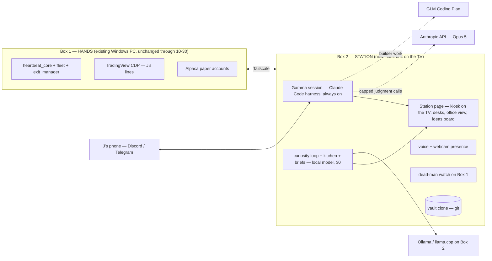

# GAMMA-STATION — Gamma's own box: the lift plan

> **Status: PLAN, nothing built.** J directive 2026-09-13 12:00 ET (Sunday): *"I want my own agent. I want Gamma to come to life. I'll give it something to live on … its own box, its own everything … this is the last month of the $200."* Written by Fable 5.1 as a judgment/spec doc; execution is Sonnet-tier per model routing. Config freeze (→ 2026-10-30) is untouched: nothing here edits the trading path before Phase 4.
> **Revoke:** delete this doc (`git revert`); no code, task, or config changed by writing it.
> **Folds:** brain tiers stay in [`BRAIN-SOVEREIGNTY.md`](BRAIN-SOVEREIGNTY.md); presence lineage stays in [`GAMMA-WORKER.md`](GAMMA-WORKER.md); the Muse/Grok Bot reference stays in [`AGENT-ORCHESTRATION.md`](../doctrine/AGENT-ORCHESTRATION.md). This doc owns **where Gamma lives, what it costs, and the order of the move.**

---

## 0. Verdict

- **Give Gamma its own always-on Linux box on the TV. Keep the Claude Code harness as the runtime; swap the brain to a cost ladder; keep the deterministic engine where it is through the freeze.** The new box is the **mind + face + off-box watchdog first**, the **hands after 10-30**.
- **Monthly: $200 → ~$60** (Claude Pro $20 + GLM Coding Plan Lite ~$18 + a capped Anthropic API judgment line ~$20). **Capex ~$1.8–2.2K once** for a 128GB local-inference box, or **$0** with any spare PC and a cloud-only brain.
- **Why this is not the fifth failed "presence" fix.** The four prior fixes (voice briefs 07-22, standups + wants 08-08, Gamma App 08-08, Discord allowlist 09-12) all changed the *message*. This changes three *mechanisms*: (1) the thinking layer stops living inside a session J has to open; (2) the surface becomes ambient and physical (a TV, a voice, a camera) instead of a file or a channel; (3) the loop runs on $0-marginal tokens, so "hungry" stops being a budget decision.
- **The honest caveat:** judgment quality drops when Fable/Opus is rationed to a capped API line. Model-routing doctrine already says the top tier is judgment-only, so the cap is the design, not a compromise — but it must be measured (§6).

---

## 1. Root cause — why Gamma feels like a chatbot after a year (one sentence each, all sourced)

| Symptom J named | Mechanism | Evidence |
|---|---|---|
| "Gamma doesn't think on its own" | The thinking layer exists only inside a Claude session J opens; the always-on parts are deterministic scripts plus free-tier workers that fabricate. | OP-31 "Claude-when-awake = the driver"; 12/690 manager reports claimed artifacts that never existed (`AGENT-ORCHESTRATION-2026-08-19.md`) |
| "I have to tell it everything" | Every autonomous surface is PULL; the one PUSH channel spoke log-spew and got muted. | 4 of 6 J-intents PULL_ONLY; 150 outbox rows/day, 141 @mentions on 09-11; J muted #gamma 07-08 |
| "It doesn't bring anything to the table" | It did — and nobody could see it: the tickers lane has traded 7 non-SPY names daily since 09-04, TradeAutopsy emits hypotheses nightly, the futures MES mirror hit `armable:true` and sat unnoticed. | `feedback_six_day_earn_your_keep_mandate_2026_09_12`, `project_desk_model_and_cockpit_2026_08_20` |
| "Thousands of lines that mean nothing to me" | Briefs are deterministic templates by doctrine (fabrication safety), so they read as a machine; the rest is machine output in 6,777 md files. | OP-33a; MAP.md ("~479 human-written") |
| "$200 a month for a chatbot" | On a metered brain every exploration was a budget decision: conductor burn measured $149.57/day notional on 07-25, then capped at $30/day, then fires parked. | `conductor-budget.json`; FUTURE-IMPROVEMENTS #27(b) "needs J: wallet action" |
| "It dies when my PC dies" | 186 tasks are LogonType=Interactive on J's daily driver; box death = naked positions for 55 min on 09-04. | `project_machine_crash_interactive_tasks_unmanaged_positions_2026_09_04` |

The plan below addresses each row by mechanism, not by adding a report.

---

## 2. J's vision → concrete component → what already exists

| J's words | Component | Exists today? |
|---|---|---|
| "another system hooked up to my TV" | **Station box** — Linux mini PC, HDMI to the TV, no discrete GPU needed | ❌ |
| "24/7 always-on agent" | **Persistent Gamma session** — Claude Code harness headless under systemd, heartbeat + cron | ⚠️ Task Scheduler fires that die with the box |
| "control the TV" | **Kiosk page** — Chromium `--kiosk` on the TV showing the Station page | ⚠️ cockpit HTML + Gamma App exist, both PULL |
| "camera in the TV / FaceTime" | **USB webcam on the box** (TVs almost never have a usable camera for an HDMI source) → presence detection + voice; animated face v1, photoreal v2 | ⚠️ `gamma-voicebot/` (Discord voice ↔ OpenAI Realtime), Kokoro local TTS |
| "see subagents = employees working" | **Office view** — live activity stream from the harness (subagent starts/stops, tool calls) rendered per desk | ⚠️ desks in cockpit; SDK-stream design 06-21 never built |
| "tailscale into my box" | **Tailscale mesh** — Box 1 (hands) ↔ Box 2 (Station) ↔ phone; no inbound ports | ❌ |
| "not paying $200" | **Brain ladder** (§3) — local $0 → GLM plan → capped Anthropic API | ⚠️ tiers written; Ollama serves the Anthropic Messages API (verified 07-08); GLM endpoint untested |
| "Gamma should brainstorm — swing SPY Tue→Thu, other stocks, funded-account bots" | **Curiosity loop + ideas board** (§5 Phase 3) on $0 tokens, visible on the TV | ⚠️ TradeAutopsy hypotheses, prospector, `gamma-wants.json` — all invisible |
| "always trying to trade" | Already true: SPY 0DTE (5 arms), tickers (3 accts), crypto twin, futures, weekly — **invisible on HOME** | ✅ machinery / ❌ visibility |

---

## 3. What the landscape says (researched 2026-09-13; sources in §10)

- **Grok Bot Galaxy, Sept 15–17 (SpaceXAI).** Three humans (Palmer, Tan, Sadanani) livestream building a company from a blank slate with Grok Bots: day 1 engineering/PM/founders, day 2 sales/support, day 3 marketing/post-sales. It is a showcase of *persistent cloud-computer agents at role desks with a human founder*. Nothing to buy; the format is worth stealing for the TV office view. Grok Bot's finance use is research desks, not order execution.
- **Meta Muse (09-08).** Personal agent on a "Muse Secure VM" with its own browser; chat-thread UI; proactive and long-running; free tier plus $20/$100. **No video call.** It is the *rented* version of what J wants. Station is the owned version.
- **GLM-5.3 (Z.ai, 08-14; MIT weights ~08-28).** Honest numbers: Z.ai Code Bench Max **34.5 vs Fable 5 39.5**; Terminal-Bench 3.0 **28.3 vs GPT-5.6 Sol 34.6**; Artificial Analysis index **GLM 5.2 = 53 vs GPT-6 Astra = 61**; GPT-6 Astra is priced $10/$50 per M (same as Fable 5.1). **Verdict: GLM is not beating the frontier on independent scores; it is ~85–90% of it at roughly a tenth of the price** — which is exactly the workhorse tier, not the judgment tier. GLM Coding Plan Lite ~$18/mo exposes an Anthropic-compatible endpoint; Claude Code runs on it with two env vars (the same trick the rig verified with Ollama on 07-08).
- **OpenClaw (v2026.7.1 stable, 250K+ stars).** The open-source always-on personal agent: heartbeat daemon, cron, WhatsApp/Discord/Telegram, Ollama, NVIDIA NemoClaw sandbox. Same shape as Claude Code + Channels, weaker per-tool gating, and a February security-scar history. **Don't re-platform** (same verdict as Hermes, 06-21); borrow the heartbeat/cron idiom only.
- **Claude Code Channels (03-20 preview) + Remote Control.** Telegram/Discord/iMessage into a running session; the phone app can drive a local session; Anthropic's own guidance for always-on is *"run it on a dedicated machine."* That is the Station pattern, described by the vendor. Needs Pro or Max; the rig's own Discord bridge does not.
- **Claude Managed Agents (scheduled deployments).** The cloud-rented alternative. Skip: J wants owned, and a cloud sandbox cannot reach TradingView Desktop or J's drawn lines.
- **Hardware (2026 numbers).** Strix Halo 128GB mini PC ~$1.7–2.2K: 30B-A3B MoE 70–100 tok/s, gpt-oss-120b 31–55 tok/s, dense 70B ~5 tok/s. Mac mini M4 Pro 64GB ~$2K: 273 GB/s, dense 30B Q4 ~12–18 tok/s. Mac Studio M4 Max 128GB $3.7K: 546 GB/s. **TradingView Desktop ships an official Linux .deb** (Ubuntu 20.04/22.04/24.04; run under X11/XWayland). Current box for reference: RTX 5080 16GB + 32GB RAM — qwen3.6:35b crashes on ~4K prompts, which is the failed capability eval the hardware ladder (§8 of BRAIN-SOVEREIGNTY) requires before spending.
- **Face.** LiveKit Agents (Apache-2) is the standard voice/video loop; HeyGen open-sourced LiveAvatar demos in June; self-hosted lip-sync (MuseTalk-class) works but is GPU-hungry. v1 = voice + animated presence; photoreal face = v2, costed separately.
- **Funded accounts (J's example).** Apex, Topstep and MyFundedFutures allow automation with rules (no HFT/arb; TopstepX blocks fully automated *funded* accounts as of 07-2026). This is the kind of card the curiosity loop should surface with evidence — not a decision today.

---

## 4. Target architecture

**Brain ladder (updates BRAIN-SOVEREIGNTY §2; tiers unchanged, the Tier-3 vehicle changes):**

| Tier | Runs on | Cost | Workloads |
|---|---|---|---|
| 0 Reflex | deterministic Python (Box 1 now, Box 2 after 10-30) | $0 | engine, risk_gate, exits, beacon, briefs' fact blocks |
| 1 Instinct | **Box 2 local** — gpt-oss-120b / Qwen3-30B-A3B / GLM-4.7-Flash class | $0 | curiosity loop, summaries, kitchen cooks, log triage, voice brain, memory consolidation |
| 2 Workhorse | **GLM Coding Plan** via `ANTHROPIC_BASE_URL` per process (never a router) | ~$18/mo | builder sessions, doc updates, skill/validator authoring, conductor fires |
| 3 Judgment | **Anthropic API, Opus 5** (`claude-opus-5`, $5/$25 per M) behind a hard monthly cap | ≤$20–30/mo | weekly audit, ship/kill adjudication, constraint-provenance audits |
| J | **Claude Pro $20** — J's own Fable/Opus sessions + Channels/Remote Control eligibility | $20/mo | J talks to Fable when he wants judgment; never routed, never gatewayed |

**Rules carried forward:** J's interactive tools hit Anthropic directly, no shared gateway (twice-scarred; `feedback_interactive_surfaces_never_gatewayed_2026_07_14`). No LLM on the live tick. Briefs narrate deterministic facts only (OP-33a) — but the narrator is now allowed an opinion line ("I want to test X because Y") sourced from the ideas board, which is what a colleague sounds like.

---

## 5. Cost — the only table that changes J's decision

| Line | Today | Target | Worst case |
|---|---|---|---|
| Claude subscription | Max 20x **$200** | Pro **$20** | Pro $20 |
| Workhorse brain | (inside Max) | GLM Coding Plan Lite **~$18** | GLM Pro ~$72 if quota binds |
| Judgment line | (inside Max) | Anthropic API **≤$20** cap | $30 cap |
| Loop / research | free-tier + local 5080 | **$0** (Box 2 local) | $0 |
| Electricity (Box 2) | — | **~$5–10** | $10 |
| **Monthly total** | **$200** | **~$65** | **~$130** |
| Capex | — | **$1.8–2.2K** (128GB unified-memory box) or **$0** (spare PC, cloud-only) | Mac Studio 128GB $3.7K (not recommended) |

Plainly: **the local box is not required to hit the monthly number.** GLM Pro at $72 can carry the loop with no GPU. Buy the 128GB box for *independence* (free cloud lanes have been de-tagged to paid three times: Kimi/DeepSeek/MiniMax, Groq) and for a loop that never has to ask whether an idea is worth the tokens. Payback on savings alone is ~3 years; the reason to buy is the "hungry" property, not the arithmetic.

---

## 6. Phases — each with a done-check and a revoke line

**Phase 0 — survive Max ending (this week, before the 09-18 renewal). No box needed.**
1. Inventory every `claude` fire in `SCHEDULED-TASKS.md` (27 registry mentions; conductor family = 93.3% of automation burn). Each one gets a fate: **re-point** to GLM/local via its own launch env (the `setup/launch_claude_local.ps1` pattern — per-fire, never global), **park**, or **delete**.
2. Downgrade Max → Pro on J's account (J's click). Create one Anthropic API key with a $30/mo spend cap for the judgment line; store it in the gitignored secrets home only.
3. Blackout drill (BRAIN-SOVEREIGNTY §7): run one full day with `ANTHROPIC_*` for automation pointed at GLM/local and confirm the engine, briefs and EOD still land. **Done-check:** `core-decisions.jsonl` has no RTH gap >3 min and the EOD brief fires, with zero Max-billed automation calls that day. **Revoke:** re-point the env back.

**Phase 1 — the box exists (week the hardware arrives).**
Ubuntu 24.04 LTS · Tailscale · Ollama (or llama.cpp-vulkan for Strix Halo) · Node + Bun + Claude Code · clone the vault · Chromium kiosk on the TV showing HOME/cockpit · one systemd unit for the Gamma session with the conductor loop · read-only reach into Box 1 state over Tailscale. **Done-check:** the TV shows a HOME that updates without J touching anything for 24 h, and `gamma_status` runs from Box 2. **Revoke:** power the box off; Box 1 is unchanged.

**Phase 2 — the face (next week).**
USB webcam → presence detection (J walks in → one spoken line + the day's number, from the existing brief pipeline) · voice loop (local Whisper + Kokoro, reusing `GAMMA-VOICE.md`'s spoken register; the OpenAI Realtime voice bot stays as the paid fallback) · Station page office view fed by the harness activity stream (subagents = desks) · ideas board panel. **Done-check:** J gets a brief without opening anything, and can ask "what did you learn today" by voice and get a ≤2-sentence answer. **Revoke:** unplug the webcam / stop the voice unit.

**Phase 3 — the hungry loop (week 3+).**
A standing job on Box 2's local model, every few hours: read yesterday's fills/autopsies/hypothesis-queue + the goal ladder + a bounded web scan (algo-trading practice, funded-account rules, new instruments) → emit **one ranked idea card** with evidence, a proposed *shadow* test, and a cost line, into the ideas board on the TV and the EOD brief's "I want" line. Weekly, the capped Opus judgment pass ranks/kills the board. The arm path is the existing one: shadow → real-fills → scorecard → arm. **J's three examples become cards 1–3:** non-0DTE SPY swing lane (Tue→Thu/Fri), other names (already trading — surface it), funded-account bots (evidence in §3). **Done-check:** 5 consecutive days with a new card J did not prompt. **Revoke:** disable the job.

**Phase 4 — move the hands (after 2026-10-30, freeze end, only if Phases 1–3 held).**
Port the engine to Box 2 (Python is portable; the Windows runner/hidden-chain/WMI layer is not and gets **deleted**, not ported): ~6 systemd units + one scheduler replace 186 Task Scheduler entries. TradingView Desktop (Linux .deb) on the TV with J's lines; CDP on 9222 stays the read path. Box 1 retires from trading duty. **Done-check:** a full RTH day traded from Box 2 with Box 1 powered off, broker-verified. **Revoke:** Box 1's task set is still registered and can be re-enabled in one command.

---

## 7. Risks and honest caveats

- **Judgment drop.** GLM/local will make worse calls than Fable on audits and root-cause. Mitigation is structural: judgment is a capped Opus 5 line, and every model promotion goes through the existing scorecard (`shadow_model_eval`, ≥85% over ≥15 days), never vibes.
- **The Windows→Linux port is real work** — but it is the subtraction J asked for (the 09-11 audit: 195 registered tasks, 20 scripts touching one state file). Phase 4 is scoped as delete-and-replace, not translate.
- **Broker keys on the box.** Paper keys only, forever, until the go-live gate says otherwise; Tailscale only, zero inbound ports; web-scan content is data, never instructions (the fabrication gate `worker_output_verify.py` extends to it). OpenClaw's February exposure wave is the cautionary tale.
- **Presence has failed four times.** All four were PULL surfaces or a templated PUSH. A TV in the room is ambient; a voice is interruptive; a camera greeting is initiated by Gamma. If this fails too, the next diagnosis is J's attention economy, not machinery — and the doctrine to build *less* still stands.
- **Sentience theater rule stays (08-08).** The face shows real work; the "I want" line is sourced from a real card with a cost; a losing day is a losing day.
- **Channels needs Pro/Max**; if J ever drops Pro, the rig's own Discord bridge already covers the phone path.
- **Two boxes for a while.** That is the dead-box protection the 09-04 crash showed was missing (Box 2 watches Box 1). It is a feature of the transition, not a cost.

---

## 8. Kills — what this plan does not do

- No OpenClaw or Hermes re-platform (Hermes: [`_attic/HERMES-AGENT-FIT-ASSESSMENT-2026-06-21.md`](../_attic/HERMES-AGENT-FIT-ASSESSMENT-2026-06-21.md); OpenClaw: §3). The edge rides on any runtime; the harness is the strongest per-tool-gated one.
- No claude-code-router under any tool J touches (scars 07-14 and 08-23). Per-process env vars only.
- No new Discord producers; the bridge allowlist (≤3 messages/day) stands.
- No LLM on the live tick; no live keys on the Station.
- No Managed Agents / rented VM: owned, not rented, by J's stated want.
- No photoreal avatar in v1; no new dashboards beyond the one Station page, which *replaces* the cockpit window on the TV rather than adding to it.

---

## 9. The three forks J owns (OP-0 #4 — no doctrine default; my pick stated on each)

1. **Box.** *Pick: Strix Halo 128GB Linux mini PC* (Framework Desktop / GMKtec EVO-X2 / Beelink GTR9 Pro / HP Z2 Mini G1a). Alternative: Mac mini M4 Pro 64GB if J wants macOS (TradingView and Claude Code native, quieter, less memory). Zero-capex alternative: any spare PC + GLM Pro.
2. **Subscription.** *Pick: Max → Pro at 09-18.* Alternative: no Claude subscription at all (API-only); loses Channels/Remote Control and J's own Fable sessions.
3. **Face v1.** *Pick: voice + animated presence + webcam greeting.* Alternative: photoreal talking head from day one (LiveAvatar/MuseTalk class) — GPU-hungry, adds a week, adds nothing to the trading loop.

Everything else in this doc is sanctioned, reversible, paper-only work and ships without asking (OP-0).

---

## 10. Sources (2026-09-13)

- Grok Bot Galaxy: [x.ai/galaxy](https://x.ai/galaxy) · [TeslaNorth](https://teslanorth.com/2026/09/10/xai-grok-bot-galaxy-event/) · [BeInCrypto](https://beincrypto.com/grok-bot-livestream-72-hour-startup/)
- Meta Muse: [about.fb.com](https://about.fb.com/news/2026/09/introducing-muse-personal-ai-agent/) · [TechCrunch](https://techcrunch.com/2026/09/08/meta-debuts-its-muse-ai-agent-will-consumers-trust-it/) · [MarkTechPost](https://www.marktechpost.com/2026/09/08/meta-introduces-muse-a-personal-ai-agent-that-runs-on-its-own-dedicated-secure-cloud-computer/)
- GLM-5.3 vs frontier: [Eden AI benchmark write-up](https://www.edenai.co/post/glm-5-3-benchmark-vs-gpt-5-6-sol-claude-fable-5-gemini-3-1-pro) · [Artificial Analysis: GPT-6 Astra](https://artificialanalysis.ai/articles/benchmarking-gpt-6-astra) · [OrcaRouter: Astra vs GLM 5.2](https://www.orcarouter.ai/blog/gpt-6-astra-vs-glm-5-2)
- GLM Coding Plan: [Layer3 Labs guide](https://www.layer3labs.io/guides/glm-coding-plan-explained) · [Truescho](https://truescho.com/en/blog/glm-coding-plan-zai-2026)
- OpenClaw: [DigitalOcean](https://www.digitalocean.com/resources/articles/what-is-openclaw) · [NVIDIA NemoClaw](https://developer.nvidia.com/blog/build-a-secure-always-on-local-ai-agent-with-nvidia-nemoclaw-and-openclaw/) · [docs.openclaw.ai](https://docs.openclaw.ai/start/openclaw)
- Claude Code Channels / Remote Control: [claudefa.st guide](https://claudefa.st/blog/guide/development/claude-code-channels) · [Towards AI](https://pub.towardsai.net/claude-code-channels-message-your-ai-coding-agent-from-telegram-and-discord-2026-5f263ccc4b9c)
- Claude plans: [IntuitionLabs](https://intuitionlabs.ai/articles/claude-pricing-plans-api-costs) · [CloudZero](https://www.cloudzero.com/blog/claude-code-pricing/); API rates from the `claude-api` skill table (cached 2026-06-24)
- Hardware: [DataHardware: Strix Halo tok/s](https://datahardware.ai/blog/strix-halo-tokens-per-second-2026) · [TerminalBytes mini-PC guide](https://terminalbytes.com/best-mini-pc-for-local-llm-2026/) · [Like2Byte: Mac mini M4 Pro 64GB](https://like2byte.com/mac-mini-m4-pro-64gb-30b-llm-benchmarks/)
- TradingView on Linux: [TradingView support](https://www.tradingview.com/support/solutions/43000728898-how-to-install-and-update-desktop-app-on-linux/) · [TradingView blog: Debian package](https://www.tradingview.com/blog/en/tradingview-desktop-in-debian-package-for-linux-45244)
- Face: [LiveKit](https://github.com/livekit/livekit) · [HeyGen LiveAvatar open-source demos](https://www.explainx.ai/blog/heygen-liveavatar-gpt-live-1-open-source-demos-2026) · [ai-avatar-system (MuseTalk)](https://github.com/PunithVT/ai-avatar-system)
- Funded accounts: [PropFirmPlus: algo rules 2026](https://propfirmplus.com/algo-trading-on-futures-prop-firms-whats-actually-allowed-in-2026/) · [ClearEdge: Topstep vs Apex](https://clearedge.trading/post/topstep-vs-apex-automated-trading-rules-bot-comparison)

## Changelog

- 2026-09-13 — created (Fable 5.1, J-directed). Supersedes FUTURE-IMPROVEMENTS #27(b) "Tier-2 pilot needs J wallet action": J's decision to end Max is the wallet action.
