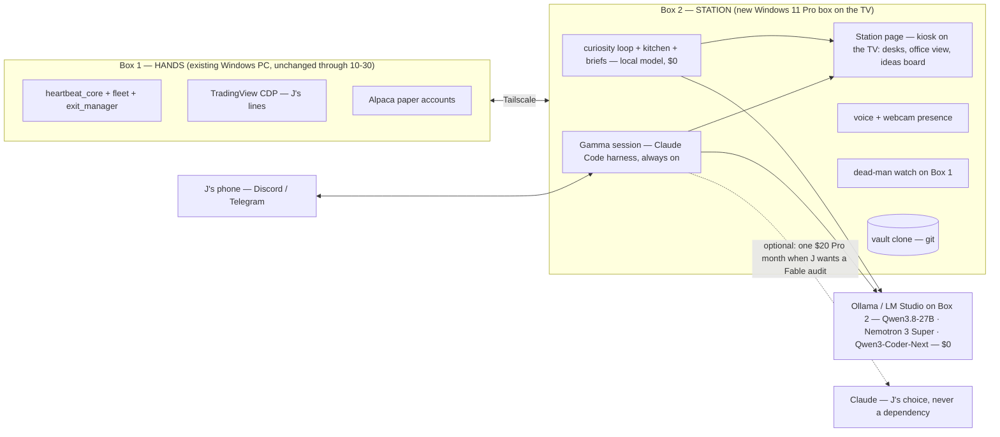

# GAMMA-STATION — Gamma's own box: the lift plan

> **Status: PLAN, nothing built.** J directive 2026-09-13 12:00 ET (Sunday): *"I want my own agent. I want Gamma to come to life. I'll give it something to live on … its own box, its own everything … this is the last month of the $200."* Written by Fable 5.1 as a judgment/spec doc; execution is Sonnet-tier per model routing. Config freeze (→ 2026-10-30) is untouched: nothing here edits the trading path before Phase 4.
> **Revoke:** delete this doc (`git revert`); no code, task, or config changed by writing it.
> **Folds:** brain tiers stay in [`BRAIN-SOVEREIGNTY.md`](BRAIN-SOVEREIGNTY.md); presence lineage stays in [`GAMMA-WORKER.md`](GAMMA-WORKER.md); the Muse/Grok Bot reference stays in [`AGENT-ORCHESTRATION.md`](../doctrine/AGENT-ORCHESTRATION.md). This doc owns **where Gamma lives, what it costs, and the order of the move.**
> **Update 2026-09-13 12:45 ET (J):** **Windows, not Linux** ("easy for me to use"); **$0 per month after the purchase** is the target ("who knows if they will increase LLM costs and price people out — I want to build my own"); candidate box = Minisforum N5 MAX AI NAS 128GB ($3,599 on sale). J also asked for the mechanism: *how do people get models to be always on and go do stuff on their own* — §11. Sections 0, 2, 3b, 4, 4b, 5, 6, 7, 9 updated; any Linux reference left in §3 is landscape, not plan.
> **Update 2026-09-13 12:59 ET (J):** *"I want to run smart models, not crappy ones. Do more research on the models. I'm fine not getting the server — I just need like the GTR9 but also 196GB maybe."* NAS dropped. The 192GB Windows box exists (Minisforum MS-S1 MAX-P495, Ryzen AI Max+ Pro 495). §3b and §4b rewritten from a fresh model/hardware pass; the planner is now **Qwen3.8-27B**, not gpt-oss-120b.

---

## 0. Verdict

- **Give Gamma its own always-on Windows 11 Pro box on the TV. Keep the Claude Code harness as the runtime; run every brain locally on the box ($0 per month); keep the deterministic engine where it is through the freeze.** The new box is the **mind + face + off-box watchdog first**, the **hands after 10-30**.
- **Monthly: $200 → $0 + power (~$5–10).** Every tier runs on the box; nothing in the always-on path bills per token. The only optional line is a single $20 Claude Pro month whenever J wants a Fable audit. **Capex once: $1,985** (Beelink GTR9 Pro 128GB, Windows 11 Pro pre-installed) — buy now. The **192GB Windows box J asked about is real** (Minisforum MS-S1 MAX-P495, ~€7,000, first units ~Sept 2026) and buys roughly one model class more (§3b/§4b) — not worth 3.8× the price today. Payback on the GTR9 Pro against $200/mo: ~10 months.
- **Why this is not the fifth failed "presence" fix.** The four prior fixes (voice briefs 07-22, standups + wants 08-08, Gamma App 08-08, Discord allowlist 09-12) all changed the *message*. This changes three *mechanisms*: (1) the thinking layer stops living inside a session J has to open; (2) the surface becomes ambient and physical (a TV, a voice, a camera) instead of a file or a channel; (3) the loop runs on $0-marginal tokens, so "hungry" stops being a budget decision.
- **The honest caveat:** the best local planner, Qwen3.8-27B, benchmarks at **Claude Opus 4.6-class on coding and agentic work** (SWE-bench Pro 61.7 vs Opus 4.6 Max 53.4) and **below Fable on hard reasoning** (HLE 30.8 vs 40.0). It does not touch the trading path: arm / kill / go-live are decided by deterministic gates and scorecards, never by the model. The gap lands on the quality of *proposals*, and a $20 Pro month buys a Fable pass whenever J wants one. It still gets measured (§4b, §7).

---

## 1. Root cause — why Gamma feels like a chatbot after a year (one sentence each, all sourced)

| Symptom J named | Mechanism | Evidence |
|---|---|---|
| "Gamma doesn't think on its own" | The thinking layer exists only inside a Claude session J opens; the always-on parts are deterministic scripts plus free-tier workers that fabricate. | OP-31 "Claude-when-awake = the driver"; 12/690 manager reports claimed artifacts that never existed (`AGENT-ORCHESTRATION-2026-08-19.md`) |
| "I have to tell it everything" | Every autonomous surface is PULL; the one PUSH channel spoke log-spew and got muted. | 4 of 6 J-intents PULL_ONLY; 150 outbox rows/day, 141 @mentions on 09-11; J muted #gamma 07-08 |
| "It doesn't bring anything to the table" | It did — and nobody could see it: the tickers lane has traded 7 non-SPY names daily since 09-04, TradeAutopsy emits hypotheses nightly, the futures MES mirror hit `armable:true` and sat unnoticed. | `feedback_six_day_earn_your_keep_mandate_2026_09_12`, `project_desk_model_and_cockpit_2026_08_20` |
| "Thousands of lines that mean nothing to me" | Briefs are deterministic templates by doctrine (fabrication safety), so they read as a machine; the rest is machine output in 6,777 md files. | OP-33a; MAP.md ("~479 human-written") |
| "$200 a month for a chatbot" | On a metered brain every exploration was a budget decision: conductor burn measured $149.57/day notional on 07-25, then capped at $30/day, then fires parked. | `conductor-budget.json`; FUTURE-IMPROVEMENTS #27(b) "needs J: wallet action" |
| "It dies when my PC dies" | 186 tasks are LogonType=Interactive on J's daily driver; box death = naked positions for 55 min on 09-04. | `project_machine_crash_interactive_tasks_unmanaged_positions_2026_09_04` |

The plan below addresses each row by mechanism, not by adding a report.

---

## 2. J's vision → concrete component → what already exists

| J's words | Component | Exists today? |
|---|---|---|
| "another system hooked up to my TV" | **Station box** — Windows 11 Pro Strix Halo mini PC, 128GB unified memory, HDMI to the TV, no discrete GPU | ❌ |
| "24/7 always-on agent" | **Persistent Gamma session** — Claude Code harness headless under systemd, heartbeat + cron | ⚠️ Task Scheduler fires that die with the box |
| "control the TV" | **Kiosk page** — Chromium `--kiosk` on the TV showing the Station page | ⚠️ cockpit HTML + Gamma App exist, both PULL |
| "camera in the TV / FaceTime" | **USB webcam on the box** (TVs almost never have a usable camera for an HDMI source) → presence detection + voice; animated face v1, photoreal v2 | ⚠️ `gamma-voicebot/` (Discord voice ↔ OpenAI Realtime), Kokoro local TTS |
| "see subagents = employees working" | **Office view** — live activity stream from the harness (subagent starts/stops, tool calls) rendered per desk | ⚠️ desks in cockpit; SDK-stream design 06-21 never built |
| "tailscale into my box" | **Tailscale mesh** — Box 1 (hands) ↔ Box 2 (Station) ↔ phone; no inbound ports | ❌ |
| "not paying $200" / "spend nothing monthly" | **All-local brain** (§4b) — every tier on the box, $0 per token | ⚠️ tiers written; Ollama serves the Anthropic Messages API (verified 07-08); the 128GB roster is unbenched |
| "Gamma should brainstorm — swing SPY Tue→Thu, other stocks, funded-account bots" | **Curiosity loop + ideas board** (§5 Phase 3) on $0 tokens, visible on the TV | ⚠️ TradeAutopsy hypotheses, prospector, `gamma-wants.json` — all invisible |
| "always trying to trade" | Already true: SPY 0DTE (5 arms), tickers (3 accts), crypto twin, futures, weekly — **invisible on HOME** | ✅ machinery / ❌ visibility |

---

## 3. What the landscape says (researched 2026-09-13; sources in §10)

- **Grok Bot Galaxy, Sept 15–17 (SpaceXAI).** Three humans (Palmer, Tan, Sadanani) livestream building a company from a blank slate with Grok Bots: day 1 engineering/PM/founders, day 2 sales/support, day 3 marketing/post-sales. It is a showcase of *persistent cloud-computer agents at role desks with a human founder*. Nothing to buy; the format is worth stealing for the TV office view. Grok Bot's finance use is research desks, not order execution.
- **Meta Muse (09-08).** Personal agent on a "Muse Secure VM" with its own browser; chat-thread UI; proactive and long-running; free tier plus $20/$100. **No video call.** It is the *rented* version of what J wants. Station is the owned version.
- **GLM-5.3 (Z.ai, 08-14; MIT weights ~08-28).** Honest numbers: Z.ai Code Bench Max **34.5 vs Fable 5 39.5**; Terminal-Bench 3.0 **28.3 vs GPT-5.6 Sol 34.6**; Artificial Analysis index **GLM 5.2 = 53 vs GPT-6 Astra = 61**; GPT-6 Astra is priced $10/$50 per M (same as Fable 5.1). **Verdict: GLM is not beating the frontier on independent scores; it is ~85–90% of it at roughly a tenth of the price** — which is exactly the workhorse tier, not the judgment tier. GLM Coding Plan Lite ~$18/mo exposes an Anthropic-compatible endpoint; Claude Code runs on it with two env vars (the same trick the rig verified with Ollama on 07-08).
- **OpenClaw (v2026.7.1 stable, 250K+ stars).** The open-source always-on personal agent: heartbeat daemon, cron, WhatsApp/Discord/Telegram, Ollama, NVIDIA NemoClaw sandbox. Same shape as Claude Code + Channels, weaker per-tool gating, and a February security-scar history. **Don't re-platform** (same verdict as Hermes, 06-21); borrow the heartbeat/cron idiom only.
- **Claude Code Channels (03-20 preview) + Remote Control.** Telegram/Discord/iMessage into a running session; the phone app can drive a local session; Anthropic's own guidance for always-on is *"run it on a dedicated machine."* That is the Station pattern, described by the vendor. Needs Pro or Max; the rig's own Discord bridge does not.
- **Claude Managed Agents (scheduled deployments).** The cloud-rented alternative. Skip: J wants owned, and a cloud sandbox cannot reach TradingView Desktop or J's drawn lines.
- **Hardware (2026 numbers).** Strix Halo 128GB mini PC ~$1.7–2.2K: 30B-A3B MoE 70–100 tok/s, gpt-oss-120b 31–55 tok/s, dense 70B ~5 tok/s. Mac mini M4 Pro 64GB ~$2K: 273 GB/s, dense 30B Q4 ~12–18 tok/s. Mac Studio M4 Max 128GB $3.7K: 546 GB/s. **TradingView Desktop ships an official Linux .deb** (Ubuntu 20.04/22.04/24.04; run under X11/XWayland). Current box for reference: RTX 5080 16GB + 32GB RAM — qwen3.6:35b crashes on ~4K prompts, which is the failed capability eval the hardware ladder (§8 of BRAIN-SOVEREIGNTY) requires before spending.
- **Face.** LiveKit Agents (Apache-2) is the standard voice/video loop; HeyGen open-sourced LiveAvatar demos in June; self-hosted lip-sync (MuseTalk-class) works but is GPU-hungry. v1 = voice + animated presence; photoreal face = v2, costed separately.
- **Funded accounts (J's example).** Apex, Topstep and MyFundedFutures allow automation with rules (no HFT/arb; TopstepX blocks fully automated *funded* accounts as of 07-2026). This is the kind of card the curiosity loop should surface with evidence — not a decision today.

---

## 3b. Hardware — the memory ladder, and the 192GB box J means (verified 2026-09-13)

J: *"I'm fine not getting the server, I just need like the GTR9 but also 196GB maybe."* The 192GB Windows box exists. NAS dropped.

| Rung | Box | Memory / bandwidth | Price | OS | What it unlocks (§4b) |
|---|---|---|---|---|---|
| **128GB** | **Beelink GTR9 Pro** (Ryzen AI Max+ 395) | 128GB LPDDR5X-8000, ~256 GB/s; ~96–110GB usable for models | **$1,985** | Windows 11 Pro pre-installed | **Qwen3.8-27B (the planner) + Nemotron 3 Super + a coder**, Qwen3.5-122B, Gemma 4 31B, gpt-oss-120b. GLM-5.3-Flash only at 2-bit (109GB) — not recommended. |
| **192GB** | **Minisforum MS-S1 MAX-P495** (Ryzen AI Max+ Pro 495 "Gorgon Halo", Radeon 8065S 40 CU) | 192GB LPDDR5X-8533, up to 160GB VRAM-allocatable | **~€7,000 (~$7,600)** per press; store says "price reveal coming soon"; sales expected Sept 2026 | Windows 11 Pro | adds **GLM-5.3-Flash at 3-bit** (Q3_K_XL 147.5GB) and **DeepSeek V4 Flash at 3-bit** (~103–131GB; its Q4 at ~175GB does not fit the 160GB window), MiniMax M2.7 at Q4. Two units clustered → Qwen3.5-397B at 16 tok/s (vendor claim). |
| **512GB** | **Mac Studio M5 Ultra** | up to 512GB unified, **1.2 TB/s** (≈4.5× Strix Halo) | M5 Ultra from $5,499; the 512GB build lands late October, price TBD | macOS | GLM-5.3 (744B) at Q4 (~420GB), DeepSeek V4 Pro and Kimi K2.6 at low bits — the real open-weight top tier, 4–5× faster per token than any Strix Halo. Not Windows; the PowerShell layer would not lift-and-shift. |
| cluster | 4× MS-S1 or 8× GPUs | — | $30K+ | — | Qwen3.8 Max / Kimi K3 at honest precision. Out of scope. |

**Verdict: buy the GTR9 Pro now.** The 192GB rung is a first-generation product at 3.8× the price for roughly **+2 points** of open-model intelligence (GLM-5.3-Flash 66.0 vs Qwen3.8-27B 64.5 on the BenchLM open-weight index — and the Flash gives some of that back at 3-bit). Revisit when Beelink/GMKtec ship 192GB Gorgon Halo boxes (~$3K expected). The true top tier at home is a Mac Studio M5 Ultra 512GB, not a Windows mini PC — J's call if it ever matters. 64GB stays a false economy.

---

## 4. Target architecture

**Brain ladder (updates BRAIN-SOVEREIGNTY §2; tiers unchanged, every vehicle is now local):**

| Tier | Runs on | Cost | Workloads |
|---|---|---|---|
| 0 Reflex | deterministic Python (Box 1 now, Box 2 after 10-30) | $0 | engine, risk_gate, exits, beacon, briefs' fact blocks |
| 1 Instinct | **Box 2 local — Qwen3.6-35B-A3B** (benched on this rig 07-08) | $0 | vetoes, summaries, log triage, voice brain, memory consolidation |
| 2 Workhorse | **Box 2 local — Qwen3-Coder-Next 80B-A3B / Nemotron 3 Super 120B-A12B (1M context)** | $0 | builder sessions, doc updates, skill/validator authoring, conductor fires |
| 3 Judgment | **Box 2 local — Qwen3.8-27B (Opus 4.6-class on coding/agentic, 262K context)** + the deterministic scorecards that actually decide | $0 | weekly audit drafts, idea ranking, constraint-provenance audits |
| J | **none required** — a $20 Claude Pro month when J wants a Fable audit | $0–20 | J talks to Fable when he chooses; never routed, never gatewayed |

**Rules carried forward:** J's interactive tools hit Anthropic directly, no shared gateway (twice-scarred; `feedback_interactive_surfaces_never_gatewayed_2026_07_14`). No LLM on the live tick. Briefs narrate deterministic facts only (OP-33a) — but the narrator is now allowed an opinion line ("I want to test X because Y") sourced from the ideas board, which is what a colleague sounds like.

## 4b. What runs on it — the smart tier, not the crappy one (researched 2026-09-13)

J: *"I want to run smart models, I don't want crappy ones."* The bar used here: top ten on an independent open-weight index, or Claude-class on the benchmarks this rig lives on (agentic coding, tool use, long context).

**The open-weight top tier, September 2026** (BenchLM open-weight index; cluster-only models marked):

| Rank | Model | Score | Size / license | Fits… |
|---|---|---|---|---|
| 1 | Qwen3.8 Max | 71.6 | 2.4T-A95B, Apache-2 | cluster only |
| 2 | GLM-5.3 | 68.4 | 744B-A40B, MIT | 512GB Mac at Q4; cluster |
| 3 | GLM-5.2 | 68.1 | 744B-A40B, MIT | same |
| 4 | **GLM-5.3-Flash** | **66.0** | 320B-A18B, MIT, 1M ctx, multimodal | **192GB at 3-bit**, 256GB at 4-bit |
| 5–7 | Kimi K2.7 Code / K2.6 | 65.5 / 65.4 | 1T-A32B | cluster; 512GB Mac at Q3 |
| **8** | **Qwen3.8-27B** | **64.5** | **27B dense + vision, Apache-2, 262K ctx (1M extensible)** | **any 128GB box — ~30GB at 8-bit** |
| 11 | MiniMax M3 | 61.6 | — | — |
| 21 | Qwen3.8-Flash-Next | 56.8 | — | 256GB Mac (26 tok/s reported) |
| 22 | Qwen3.5-122B-A10B | 56.4 | 122B-A10B | 128GB at Q4 (~68GB) |
| — | DeepSeek V4 Flash | (not in that table) | 284B-A13B, MIT; SWE-bench Verified 79.0 | 192GB at 3-bit |
| — | Nemotron 3 Super | AA index 36 (gpt-oss-120b 33, Qwen3.5-122B 42) | 120.6B-A12.7B, 1M ctx, open data | 128GB at Q4 (~65GB) |

**Why Qwen3.8-27B is the planner.** Eighth-best open model in the world and the best by a mile per gigabyte. Its model card puts it at **Claude Opus 4.6-class** on the work this rig needs: SWE-bench Pro **61.7 vs Opus 4.6 Max 53.4**; LiveCodeBench v6 **90.3 vs 88.8**; Terminal-Bench 2.1 **73.0 vs 78.2**; GPQA Diamond 89.2 vs 91.3; HLE 30.8 vs 40.0 (that is the "not Fable" gap); OSWorld-Verified **84.3** — computer use, which matters on a box that drives TradingView on a TV. On a Ryzen AI Max+ 395: **24.5 tok/s** at AMD's day-0 build; **30–36 tok/s** with ROCm FP4 + multi-token-prediction speculation (Linux tuning); Windows LM Studio (Vulkan) lands around the low 20s.

**The roster on the 128GB Windows box (all $0 per token):**

| Role | Model | Memory | Speed on Strix Halo | Why |
|---|---|---|---|---|
| Planner / audits / judgment | **Qwen3.8-27B** (8-bit) | ~30GB | 20–36 tok/s | the numbers above |
| Long-context worker / agentic reasoning | **Nemotron 3 Super 120B-A12B** (Q4) | ~65GB | ~40–60 tok/s (12.7B active) | 1M context; AA 36 vs gpt-oss-120b 33; open training data; on Ollama |
| Builder / coding tools | **Qwen3-Coder-Next 80B-A3B** (Q4), or the planner itself | ~45GB | 60–100 tok/s | 3B active → fast tool loops |
| Fast worker / veto / summaries | **Qwen3.6-35B-A3B** or **Gemma 4 26B-A4B** | ~23GB / ~16GB | 70–100 tok/s | benched 07-08 on the 5080: 78 tok/s, veto battery correct both directions |
| Ears / mouth | Whisper + Kokoro-82M | <2GB | real time | already in the rig (`gamma_speak.py`) |
| Eyes | OpenCV presence detector | ~0 | real time | no model needed |

Planner + Nemotron + fast worker ≈ 118GB, so the box holds two of the three at once and swaps the third (Ollama unloads idle models). **Demoted from the earlier draft:** gpt-oss-120b (Aug 2025, AA 33) — Qwen3.8-27B is smarter at a quarter of the memory.

**What 192GB would add:** GLM-5.3-Flash at Q3_K_XL (147.5GB) — at full precision Terminal-Bench 2.1 **84.3 vs Opus 4.8 85.0**, DeepSWE 63.4 vs 58.0, AutomationBench 48.8 vs 41.0, HLE-with-tools 55.3 vs 57.9 (3-bit gives some back; today it runs only on Unsloth's llama.cpp fork) — and DeepSeek V4 Flash at 3-bit (SWE-bench Verified 79.0 at full precision). Roughly +2 index points over the 27B planner for ~+€5,000.

**Caveats that stay true:** every model enters a role through `shadow_model_eval` (≥85% over ≥15 days), never vibes; the Claude Code harness's ~44K-token session prompt costs ~1–2 minutes of prompt processing per cold session on this hardware (fine for a background agent; `--bare` for chat); a dense 27B is bandwidth-bound, so the 1.2 TB/s Mac would run the same planner ~4× faster. The roster is re-checked quarterly by the scout ($0).

---

## 5. Cost — the only table that changes J's decision

| Line | Today | After the purchase |
|---|---|---|
| Claude subscription | Max 20x **$200** | **$0** (optional: one Pro month, $20, when J wants a Fable audit) |
| Workhorse + judgment brains | inside Max | **$0** — local on Box 2 |
| Loop / kitchen / briefs / research | free tier + the 5080 | **$0** — local on Box 2, unlimited |
| Electricity, Box 2 | — | **~$5–10** (10–15W idle, ~140W under load) |
| Already paying, unchanged | TradingView plan, internet | same |
| **Monthly** | **$200** | **$0 + ~$5–10 power** |
| Capex, once | — | **$1,985** GTR9 Pro 128GB (+ ~$50 webcam) · 192GB MS-S1 MAX-P495 ~€7,000 when it ships · Mac Studio M5 Ultra 512GB (late Oct, macOS) for the very top tier |

Payback against the $200/mo being cancelled: GTR9 Pro in ~10 months; the 192GB box in ~3 years. After that the marginal cost of an idea, a backtest, or an overnight research crawl is electricity — which is what makes "hungry" affordable and what a metered brain can never give.

---

## 6. Phases — each with a done-check and a revoke line

**Phase 0 — survive Max ending (this week, before the 09-18 renewal). No box needed.**
1. Inventory every `claude` fire in `SCHEDULED-TASKS.md` (27 registry mentions; conductor family = 93.3% of automation burn). Each one gets a fate: **re-point** to local Ollama on the 5080 (the `setup/launch_claude_local.ps1` pattern — per-fire, never global; qwen3:14b floor until the Station exists), **park**, or **delete**.
2. Let Max lapse (J's click). No replacement subscription and no API key are required; Pro is a month-at-a-time option for Fable audits.
3. Blackout drill (BRAIN-SOVEREIGNTY §7): run one full day with `ANTHROPIC_*` for automation pointed at local and confirm the engine, briefs and EOD still land. **Done-check:** `core-decisions.jsonl` has no RTH gap >3 min and the EOD brief fires, with zero Max-billed automation calls that day. **Revoke:** re-point the env back.

**Phase 1 — the box exists (week the hardware arrives).**
Windows 11 Pro · auto-logon into a dedicated `gamma` account (the TV needs a live desktop for TradingView and the kiosk) · Tailscale · Ollama for Windows (or LM Studio) with the §4b roster pulled · Node + Claude Code · clone the vault · Edge `--kiosk` on the TV showing HOME/cockpit · the Gamma session as a Windows service (WinSW/NSSM) or a Task Scheduler task set to *run whether user is logged on or not* — never a hidden-window chain · Windows Update active hours set so reboots never land in RTH · read-only reach into Box 1 state over Tailscale. **Done-check:** the TV shows a HOME that updates without J touching anything for 24 h, and `gamma_status` runs from Box 2. **Revoke:** power the box off; Box 1 is unchanged.

**Phase 2 — the face (next week).**
USB webcam → presence detection (J walks in → one spoken line + the day's number, from the existing brief pipeline) · voice loop (local Whisper + Kokoro, reusing `GAMMA-VOICE.md`'s spoken register; the OpenAI Realtime voice bot stays as the paid fallback) · Station page office view fed by the harness activity stream (subagents = desks) · ideas board panel. **Done-check:** J gets a brief without opening anything, and can ask "what did you learn today" by voice and get a ≤2-sentence answer. **Revoke:** unplug the webcam / stop the voice unit.

**Phase 3 — the hungry loop (week 3+).**
A standing job on Box 2's local model, every few hours: read yesterday's fills/autopsies/hypothesis-queue + the goal ladder + a bounded web scan (algo-trading practice, funded-account rules, new instruments) → emit **one ranked idea card** with evidence, a proposed *shadow* test, and a cost line, into the ideas board on the TV and the EOD brief's "I want" line. Weekly, the capped Opus judgment pass ranks/kills the board. The arm path is the existing one: shadow → real-fills → scorecard → arm. **J's three examples become cards 1–3:** non-0DTE SPY swing lane (Tue→Thu/Fri), other names (already trading — surface it), funded-account bots (evidence in §3). **Done-check:** 5 consecutive days with a new card J did not prompt. **Revoke:** disable the job.

**Phase 4 — move the hands (after 2026-10-30, freeze end, only if Phases 1–3 held).**
Lift-and-shift, same OS: the engine, its scripts and its Task Scheduler entries move to Box 2 as-is over one weekend (Python and PowerShell run unchanged), then **subtract** — keep the trading-critical tasks (LaunchTV/TvWatchdog, Premarket, HeartbeatCore, DeadMansSwitch, EodFlatten, the briefs) under one supervisor and delete the rest of the ~186. TradingView Desktop for Windows on the TV with J's lines; CDP on 9222 stays the read path. Box 1 retires from trading duty. **Done-check:** a full RTH day traded from Box 2 with Box 1 powered off, broker-verified. **Revoke:** Box 1's task set is still registered and can be re-enabled in one command.

---

## 7. Risks and honest caveats

- **Judgment drop.** gpt-oss-120b will make worse calls than Fable on audits and root-cause. Mitigation is structural: arm / kill / go-live are deterministic gates; every model promotion goes through the existing scorecard (`shadow_model_eval`, ≥85% over ≥15 days), never vibes; and a $20 Pro month buys a Fable audit whenever J wants one.
- **Windows on the Station must not inherit the Windows scars.** The current rig's pain (console pop-ups, the `wmic` removal, LogonType=Interactive tasks, the 5-minute python reaper) came from an ad-hoc runner layer, not from Windows. The Station starts clean: services or *run-whether-logged-on* tasks for headless work, auto-logon only for the TV session, Update active hours outside RTH, and the reaper never installed. The 09-11 subtraction (195 registered tasks) happens at Phase 4 by deleting, not translating.
- **Broker keys on the box.** Paper keys only, forever, until the go-live gate says otherwise; Tailscale only, zero inbound ports; web-scan content is data, never instructions (the fabrication gate `worker_output_verify.py` extends to it). OpenClaw's February exposure wave is the cautionary tale.
- **Presence has failed four times.** All four were PULL surfaces or a templated PUSH. A TV in the room is ambient; a voice is interruptive; a camera greeting is initiated by Gamma. If this fails too, the next diagnosis is J's attention economy, not machinery — and the doctrine to build *less* still stands.
- **Sentience theater rule stays (08-08).** The face shows real work; the "I want" line is sourced from a real card with a cost; a losing day is a losing day.
- **Claude Code Channels needs Pro/Max.** With no subscription, the phone path is the rig's own Discord bridge (already built) plus Tailscale + Remote Desktop into the box.
- **Two boxes for a while.** That is the dead-box protection the 09-04 crash showed was missing (Box 2 watches Box 1). It is a feature of the transition, not a cost.

---

## 8. Kills — what this plan does not do

- No OpenClaw or Hermes re-platform (Hermes: [`_attic/HERMES-AGENT-FIT-ASSESSMENT-2026-06-21.md`](../_attic/HERMES-AGENT-FIT-ASSESSMENT-2026-06-21.md); OpenClaw: §3). The edge rides on any runtime; the harness is the strongest per-tool-gated one.
- No claude-code-router under any tool J touches (scars 07-14 and 08-23). Per-process env vars only.
- No new Discord producers; the bridge allowlist (≤3 messages/day) stands.
- No LLM on the live tick; no live keys on the Station.
- No Managed Agents / rented VM: owned, not rented, by J's stated want.
- No metered brain anywhere in the always-on path: nothing that runs unattended bills per token.
- No photoreal avatar in v1; no new dashboards beyond the one Station page, which *replaces* the cockpit window on the TV rather than adding to it.

---

## 9. The three forks J owns (OP-0 #4 — no doctrine default; my pick stated on each)

1. **Box.** *Pick: Beelink GTR9 Pro 128GB, $1,985, Windows 11 Pro pre-installed — buy now.* The 192GB J asked about exists (Minisforum MS-S1 MAX-P495, Windows 11 Pro, ~€7,000, first units ~Sept 2026): it adds GLM-5.3-Flash at 3-bit and DeepSeek V4 Flash at 3-bit, ~+2 index points over the planner the 128GB box already runs. Revisit when a ~$3K 192GB Gorgon Halo box ships. NAS dropped (J). OS settled: Windows 11 Pro (J). Not 64GB.
2. **Subscription.** *Settled by J: none.* Max lapses; a $20 Pro month is bought only in a month J wants a Fable audit. Cost of that choice: no Claude Code Channels / Remote Control — the Discord bridge and Tailscale cover the phone.
3. **Face v1.** *Pick: voice + animated presence + webcam greeting.* Alternative: photoreal talking head from day one (LiveAvatar/MuseTalk class) — GPU-hungry, adds a week, adds nothing to the trading loop.

Everything else in this doc is sanctioned, reversible, paper-only work and ships without asking (OP-0).

---

## 10. Sources (2026-09-13)

- Grok Bot Galaxy: [x.ai/galaxy](https://x.ai/galaxy) · [TeslaNorth](https://teslanorth.com/2026/09/10/xai-grok-bot-galaxy-event/) · [BeInCrypto](https://beincrypto.com/grok-bot-livestream-72-hour-startup/)
- Meta Muse: [about.fb.com](https://about.fb.com/news/2026/09/introducing-muse-personal-ai-agent/) · [TechCrunch](https://techcrunch.com/2026/09/08/meta-debuts-its-muse-ai-agent-will-consumers-trust-it/) · [MarkTechPost](https://www.marktechpost.com/2026/09/08/meta-introduces-muse-a-personal-ai-agent-that-runs-on-its-own-dedicated-secure-cloud-computer/)
- GLM-5.3 vs frontier: [Eden AI benchmark write-up](https://www.edenai.co/post/glm-5-3-benchmark-vs-gpt-5-6-sol-claude-fable-5-gemini-3-1-pro) · [Artificial Analysis: GPT-6 Astra](https://artificialanalysis.ai/articles/benchmarking-gpt-6-astra) · [OrcaRouter: Astra vs GLM 5.2](https://www.orcarouter.ai/blog/gpt-6-astra-vs-glm-5-2)
- GLM Coding Plan: [Layer3 Labs guide](https://www.layer3labs.io/guides/glm-coding-plan-explained) · [Truescho](https://truescho.com/en/blog/glm-coding-plan-zai-2026)
- OpenClaw: [DigitalOcean](https://www.digitalocean.com/resources/articles/what-is-openclaw) · [NVIDIA NemoClaw](https://developer.nvidia.com/blog/build-a-secure-always-on-local-ai-agent-with-nvidia-nemoclaw-and-openclaw/) · [docs.openclaw.ai](https://docs.openclaw.ai/start/openclaw)
- Claude Code Channels / Remote Control: [claudefa.st guide](https://claudefa.st/blog/guide/development/claude-code-channels) · [Towards AI](https://pub.towardsai.net/claude-code-channels-message-your-ai-coding-agent-from-telegram-and-discord-2026-5f263ccc4b9c)
- Claude plans: [IntuitionLabs](https://intuitionlabs.ai/articles/claude-pricing-plans-api-costs) · [CloudZero](https://www.cloudzero.com/blog/claude-code-pricing/); API rates from the `claude-api` skill table (cached 2026-06-24)
- Hardware: [DataHardware: Strix Halo tok/s](https://datahardware.ai/blog/strix-halo-tokens-per-second-2026) · [TerminalBytes mini-PC guide](https://terminalbytes.com/best-mini-pc-for-local-llm-2026/) · [Like2Byte: Mac mini M4 Pro 64GB](https://like2byte.com/mac-mini-m4-pro-64gb-30b-llm-benchmarks/)
- TradingView on Linux: [TradingView support](https://www.tradingview.com/support/solutions/43000728898-how-to-install-and-update-desktop-app-on-linux/) · [TradingView blog: Debian package](https://www.tradingview.com/blog/en/tradingview-desktop-in-debian-package-for-linux-45244)
- Face: [LiveKit](https://github.com/livekit/livekit) · [HeyGen LiveAvatar open-source demos](https://www.explainx.ai/blog/heygen-liveavatar-gpt-live-1-open-source-demos-2026) · [ai-avatar-system (MuseTalk)](https://github.com/PunithVT/ai-avatar-system)
- Hardware, Windows: [ServeTheHome: N5 MAX review](https://www.servethehome.com/minisforum-n5-max-review-with-amd-ryzen-ai-max-395/) · [Minisforum N5 MAX store page](https://store.minisforum.com/products/minisforum-n5-max-ai-nas) · [TechRadar: Beelink GTR9 Pro $1,985](https://www.techradar.com/pro/a-mac-studio-windows-workstation-clone-just-went-on-preorder-with-amds-ai-395-beelink-gtr9-pro-costs-usd1985-has-two-10-gbe-ports-and-128gb-ram) · [Micro Center: GMKtec EVO-X2 128GB](https://www.microcenter.com/product/695875/gmktec-evo-x2-ai-mini-pc) · [Codersera: Strix Halo local LLM setup on Windows](https://codersera.com/blog/amd-strix-halo-ryzen-ai-max-local-llm-setup-2026/) · [gpt-oss-120b on Strix Halo](https://akehir.com/blog/strix-halo-kubernetes-llm-gpt-oss)
- Models (rev 3): [Qwen3.8-27B model card](https://huggingface.co/Qwen/Qwen3.8-27B) · [BenchLM open-weight leaderboard](https://benchlm.ai/best/open-source) · [GLM-5.3-Flash local guide, Unsloth GGUF sizes](https://atomic.chat/blog/guides/how-to-run-glm-5-3-flash-locally) · [DeepSeek V4 Flash local requirements](https://atomic.chat/blog/guides/how-to-run-deepseek-v4-flash-locally) · [Artificial Analysis: Nemotron 3 Super](https://artificialanalysis.ai/articles/nvidia-nemotron-3-super-the-new-leader-in-open-efficient-intelligence) · [Artificial Analysis: Gemma 4](https://artificialanalysis.ai/articles/gemma-4-everything-you-need-to-know) · [AMD: Qwen 3.8 27B on Ryzen AI Max, day 0](https://www.amd.com/en/blogs/2026/run-qwen-3-8-27b-on-amd-ryzen-ai-max-and-radeon-graphics-cards-day-0.html) · [q38rocm: 30–36 tok/s on Strix Halo](https://github.com/julianmb/q38rocm)
- Hardware (rev 3): [Minisforum MS-S1 MAX-P495](https://store.minisforum.com/products/minisforum-ms-s1-max-p495-ai-workstation) · [guru3d: 192GB MS-S1](https://www.guru3d.com/story/minisforum-mss1-maxp495-packs-192-gb-unified-memory-into-a-compact-ai-workstation/) · [gagadget: ~€7,000](https://gagadget.com/en/724768-minisforum-ms-s1-max-p495-192gb-of-ram-and-a-eur7000-bet-against-cloud-ai/) · [Apple: Mac Studio M5 Max / M5 Ultra](https://www.apple.com/newsroom/2026/08/apple-introduces-new-mac-studio-with-m5-max-and-m5-ultra/)
- Funded accounts: [PropFirmPlus: algo rules 2026](https://propfirmplus.com/algo-trading-on-futures-prop-firms-whats-actually-allowed-in-2026/) · [ClearEdge: Topstep vs Apex](https://clearedge.trading/post/topstep-vs-apex-automated-trading-rules-bot-comparison)

---

## 11. How an always-on agent actually works — the mechanism, in plain terms

> J (2026-09-13): *"I still don't understand how people are getting models to be always on and, like, go out and do stuff on their own. That's the goal of this."*

1. **A model is a function.** Text in, text out. It has no clock, no memory, no hands. Left alone it does nothing — ever.
2. **An agent is a program wrapped around the model** (the harness: Claude Code, OpenClaw, Grok Bot, Muse are all this). It runs a loop: goal + tools go in → the model writes a tool call ("run this command", "read that file", "search this", "place this order") → the program executes it → the result goes back in → repeat until the model says done.
3. **"Always on" is a scheduler.** Something starts that loop on a timer or an event: every 30 minutes; at 08:30 ET; when a fill lands; when J walks into the room. Between runs the agent *is its files* — goals, memory, ledgers. The next run reads them and continues. Muse "keeps working when your laptop is closed" because a rented computer runs that timer for you.
4. **"Does stuff on its own" means the loop's input is a standing goal list plus its own memory, not a human prompt.** "Every morning: read yesterday's fills, the ideas board and the news; propose one experiment; if an experiment cleared its shadow test, arm it in paper." The initiative lives in the standing instruction and the scheduler. The model supplies judgment each time it wakes.
5. **This rig already has all four parts** — Task Scheduler (the timer), `heartbeat_core` (a deterministic loop every minute), `conductor.md` (an LLM loop fired ~3×/night), the goal ladder + memory files. What was missing: the LLM loop ran on a metered brain (so it was rationed), on J's PC (so it died with it), and its output landed in files nobody opens.
6. **On the Station the same loop runs every N minutes on a local model, on a box that never turns off, and writes to a TV.** That is the whole change.

**A day in the Station's life (ET):** 05:30 scout reads news → 08:15 the morning brief is spoken when the webcam sees J → 08:30 premarket levels + bias → 09:30–15:55 engine ticks every minute (Box 1 through the freeze, Box 2 after) → 16:05 autopsies, chop meter, shadow scoring → 16:20 EOD brief: P&L per account, what I learned, what I want to try → 17:00–05:00 kitchen: backtests and idea cards on local compute while the crypto twin trades 24/7 → weekly: self-review + ranked ideas board; J answers cards by voice or Discord.

**What it could do with its own home (concrete, no theater):** trade paper 24/7 across lanes and manage exits from a box that survives J's PC; autopsy every trade and propose one experiment a day, then run the shadow test itself; queue its own backtests for J's examples (a Tue→Thu SPY swing lane, other names, funded-account bots) on free compute; greet J and brief him without being asked; watch Box 1 and flag RED; run dojo replays on the TV; show its "employees" (the planner, the builder, the auditor) as desks while they work.

## Changelog

- 2026-09-13 — created (Fable 5.1, J-directed). Supersedes FUTURE-IMPROVEMENTS #27(b) "Tier-2 pilot needs J wallet action": J's decision to end Max is the wallet action.
- 2026-09-13 12:45 ET — J: Windows not Linux; $0/month after purchase; N5 MAX candidate; explain the always-on mechanism. §3b, §4b, §11 added; §0/§2/§4/§5/§6/§7/§9 revised (all-local brain, GTR9 Pro vs N5 MAX, Windows lift-and-shift).
- 2026-09-13 12:59 ET — J: smart models only, NAS dropped, "GTR9 but 192GB". Fresh model pass: planner = Qwen3.8-27B (BenchLM open #8, 64.5; SWE-bench Pro 61.7 vs Opus 4.6 Max 53.4); gpt-oss-120b demoted; 192GB = MS-S1 MAX-P495 (~€7,000) adds GLM-5.3-Flash Q3 / DeepSeek V4 Flash Q3 for ~+2 points → GTR9 Pro now, revisit 192GB at ~$3K; top tier at home = Mac Studio M5 Ultra 512GB (macOS).
