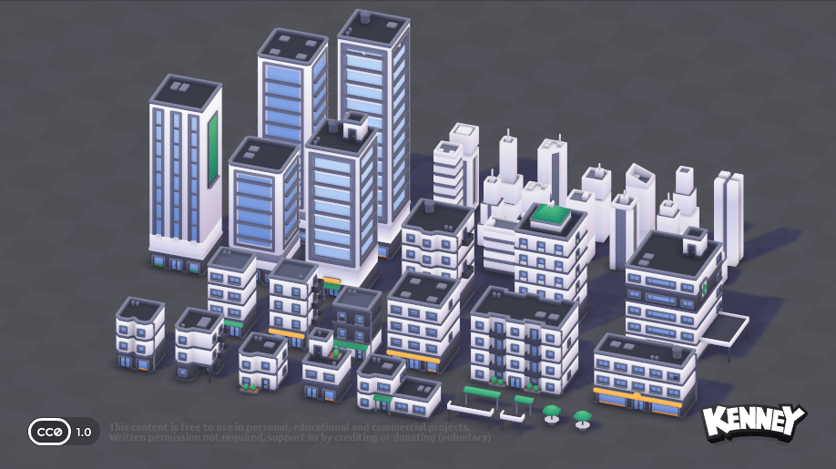
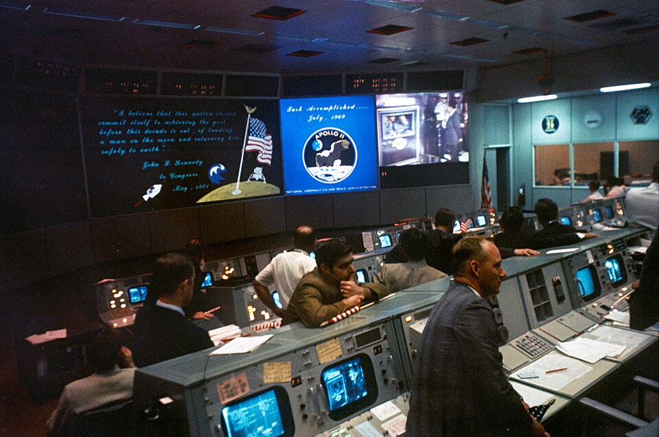
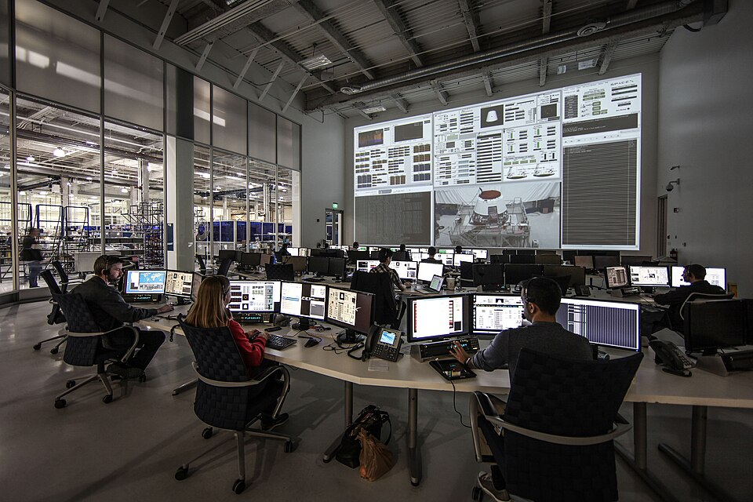

# HQ Look References — three visual directions for J to pick (2026-09-16)

Trigger: J, "it still needs a lot of design work to look good" — HQ has a committed
space-station-on-a-planet LAYOUT ([`ENVIRONMENT-PLAN.md`](../../dashboard/components/hq/ENVIRONMENT-PLAN.md))
but no picked ART DIRECTION. Per standing design rule (Claude doesn't make taste calls;
design starts at external references), this doc gives three real, cited reference images
and does NOT recommend one. Current state captured in
`automation/state/station/captures/hubprops-hub-0041.png` /
`hubprops-topdown-0041.png` for comparison. Images for all three options are saved
alongside this doc in `hq-look-refs/`.

Existing facts that bound every option: react-three-fiber, Kenney/KayKit/Quaternius CC0
kits (flat-shaded low-poly geometry — this does not change regardless of pick), HDRI night
sky, a holographic SPY chart J already likes ("the chart is dope" — stays the centerpiece
in all three), current palette (`dashboard/components/hq/palette.ts`) is already
Tron/Blade-Runner cool: `space #03040a`, `hubCore #7ad9ff`, `warmAccent #ffb020`. Draw-call
budget ~600–1100. Must read at a 45u overview AND close-up presets. Motion = real events
only (no idle ambient wandering).

---

## Option A — "Diorama toy-box" (bright, high-key, chunky)

**Reference:** Kenney "City Kit (Commercial)" official asset-page hero render —
`kenney.nl/assets/city-kit-commercial`. License: Kenney assets are CC0 (public domain);
this is the exact kit family (Kenney) already used for our own props, so this reference
doubles as a compatibility check, not just a mood board. Comparable commercial games in
this bucket: Two Point Hospital, Evil Genius 2 (bright, toy-diorama management sims —
their own screenshots aren't CC-licensed for redistribution, so cite by name and look them
up directly rather than embedding).

1. **Palette:** `#eef3f7` (near-white base), `#7fc7e8` (sky cyan-blue), `#ffcf6b` (warm
   accent trim) — a full high-key repaint, NOT compatible with current `palette.ts` cool
   dark space set.
2. **Lighting:** flat, even daylight key, soft ambient occlusion in the crevices, almost no
   directional shadow drama, no night mode as-conceived (would need an artificial "night
   ops" override to keep the HDRI night-sky concept at all).
3. **Materials:** flat-shaded, saturated, chunky black or dark-navy OUTLINES on every
   silhouette (toon-outline shader), zero bloom, minimal post (maybe a light vignette).
4. **Camera:** higher elevation (~35-40° above horizon), narrower FOV (~35°) for the "doll's
   house" compression Two Point Hospital uses, closer default distance than a space-station
   establishing shot.
5. **Signage/UI-in-world:** thick rounded sans-serif nameplates, bright color-coded floor
   zones, icon-heavy (no space-ops terminal aesthetic).
6. **Cost to us:** HIGH. Throws away the entire "space base at night" concept J already
   approved 2026-09-14 (would need to re-litigate that decision), throws away the current
   palette.ts dark-space token set, needs a new outline shader pass. Geometry (Kenney kits)
   mostly survives; almost everything else is a rebuild.

---

## Option B — "Dark ops-room / mission control" (closest to what we have today)

**Reference:** NASA Mission Operations Control Room, Apollo 11, July 24 1969 (Manned
Spacecraft Center, Houston) — Wikimedia Commons,
`commons.wikimedia.org/wiki/File:Mission_Operations_Control_Room_at_the_conclusion_of_Apollo_11.jpg`.
License: US public domain (NASA-produced work, uncopyrighted). Comparable game/film
touchstones for the exact mood: Blade Runner interiors, Tron: Legacy control rooms,
"Deliver Us The Moon" ops-room level (cite by name; not redistributed here).

1. **Palette:** keep current — `#03040a` (void/room base), `#7ad9ff` (screen/cyan
   emissive), `#ffb020` (warm accent, alert/console glow) — this option is closest to
   ZERO palette change.
2. **Lighting:** low-key, room mostly dark, illumination comes FROM the screens/consoles
   (emissive materials as the primary light source), a single soft overhead fill so faces/
   geometry aren't pure silhouette, optional rim light on character shoulders/edges from
   screen glow. Day/night: this look barely changes by time of day since the "sky" outside
   is already a night HDRI — internally it's always "dim room, bright screens."
3. **Materials:** flat-shaded low-poly stays, NO toon outline (reads more "real control
   room" without cartoon edges), light bloom on emissive screen/console surfaces, subtle
   vignette, optional volumetric light cones from any downlights over the desk clusters.
4. **Camera:** lower elevation than a toy-diorama (~20-25°), moderate FOV (~45-50°, more
   "standing in the room" than "looking into a dollhouse"), overview distance similar to
   today's 45u default.
5. **Signage/UI-in-world:** monochrome/cyan monospace readouts on in-world screens,
   sparse physical signage (control rooms are not covered in floor labels) — rely on
   click-to-focus panels rather than world-space nameplates for identification.
6. **Cost to us:** LOW. This is a lighting/post-processing/materials pass on the existing
   scene, not a re-theme: keep `palette.ts` as-is, keep the space-base-on-a-planet layout
   and HDRI, keep geometry. Work = tune emissive intensities on screens/consoles, add
   bloom + a soft overhead fill, verify readability at 45u overview (screens must stay
   legible as bright dots at distance, not blown out).

---

## Option C — "Clean sci-fi showroom" (Apple / SpaceX mission-control whites)

**Reference:** SpaceX Mission Control, Hawthorne, CA, Jan 31 2013 — Wikimedia Commons,
`commons.wikimedia.org/wiki/File:SpaceX_Mission_Control_in_Hawthorne,_CA.jpg`. License:
CC0 1.0 (dedicated to public domain by the uploader). Comparable touchstones: Apple retail/
product photography, "Startup Company" (game) ops UI, general modern NASA JSC control-room
photography (`nasa.gov` image galleries).

1. **Palette:** `#f4f6f8` (matte white walls/desks), `#8fd6ff` (cool cyan screen glow —
   the ONE hue this shares with current `palette.ts`), `#1c1f26` (dark seating/equipment
   accents for contrast) — partial overlap with current palette (cyan survives), white
   base does not.
2. **Lighting:** bright, even, mostly-white room lighting (not screen-lit like Option B) —
   overhead practical lights simulated, screens are a secondary accent not the primary
   light source, minimal shadow drama, would look identical day or night since it reads as
   an interior-lit room regardless of the outside HDRI.
3. **Materials:** matte (no shine/reflection pass needed — cheap), flat-shaded low-poly
   stays, no toon outline, no bloom needed (nothing is meant to glow hard), maybe a very
   light AO only.
4. **Camera:** similar to Option B (~20-25° elevation, ~45° FOV) but the room reads fine
   even brighter/flatter-lit, so overview legibility is less lighting-dependent.
5. **Signage/UI-in-world:** clean sans-serif (SF Pro / Apple-style) labels, minimal count,
   strong typographic hierarchy over icon density, large single-focus displays rather than
   many small screens.
6. **Cost to us:** MEDIUM. Needs a full room-base repaint (walls/floor go from near-black
   to white/light-grey — `PALETTE.floor`/`PALETTE.space`/`PALETTE.deskDark` all change),
   loses the "space base at night" moodiness J liked in the chart ("the chart is dope"
   partly because it POPS against dark — a white room may wash that contrast out and needs
   checking), but keeps geometry, HDRI-as-backdrop, and cyan as a surviving palette anchor.

---

## Side-by-side vs J's stated wants

| Want | A — Diorama toy-box | B — Dark ops-room | C — Clean showroom |
|---|---|---|---|
| Readable screens at 45u overview | Weak — bright flat scene competes with screen glow, nothing pops | **Strong** — screens are the only bright things in a dark room, natural contrast | Medium — screens must out-contrast a bright white room, needs punchier screen colors |
| "People actually working" legible | Good — toon style reads poses/silhouettes clearly at a glance | Medium — dim room can hide silhouette detail unless rim-lit well | Good — bright even light shows poses/animation clearly |
| Chart as centerpiece ("the chart is dope") | Weakest — chart's glow loses its pop against an already-bright scene | **Strongest** — chart glow against dark room is the exact contrast that made J like it already | Medium — needs the chart to be the brightest thing in a bright room, harder to guarantee pop |
| Lag-free on J's box (cheapest per frame) | Medium — outline shader pass adds a post-process | **Cheapest** — no outline shader, modest bloom only on a few emissive surfaces, no AO overhaul | Cheap-ish — no bloom needed, but AO/soft-shadow pass to sell "matte white" adds some cost; roughly tied with B |

J flagged HQ made his machine lag while gaming — **B and C are the two lighter options**;
A is the heaviest because a toon-outline post-process pass runs on every frame regardless
of scene brightness.

---

## What does NOT change with the pick

- Layout: table+chart position, monitor-corner sightline, radial aisle, desk positions —
  all locked in by `ENVIRONMENT-PLAN.md` section A/B/D, independent of art direction.
- The audit / walk-graph / event-gated motion system (huddle pairs, GREEN/IDLE/RED state
  transitions) — pure logic, no visual dependency.
- World-space labels' DATA (persona names, lane health) — only their typographic/color
  styling changes per option.
- The holographic SPY chart's DATA and position — only its glow intensity/bloom tuning
  changes per option.

## What each pick unlocks (next build worker's task list)

- **Pick A:** (1) full palette.ts repaint to high-key hex set, (2) add toon-outline
  post-process pass, (3) re-evaluate whether the night-HDRI-planet concept survives or
  needs a "daytime base" reframe — this is a J taste call, flag it before building.
  (4) redesign all world-space signage to rounded/bright style.
- **Pick B:** (1) raise emissive intensity + add bloom on screens/consoles/HoloChart only,
  (2) add one soft overhead fill light so characters aren't silhouettes, (3) optional
  volumetric light cones over desk clusters, (4) verify 45u-overview screen legibility
  after bloom tuning (OP-33 — capture before/after screenshots). No palette.ts hex changes
  needed.
- **Pick C:** (1) repaint `PALETTE.floor`/`PALETTE.space`/`PALETTE.deskDark` to
  white/light-grey values, (2) keep `hubCore`/`hubRing` cyan as the one surviving accent,
  (3) add a light AO pass for matte-material depth, (4) re-check chart contrast/pop against
  the new bright background before calling it done — this is the one real risk in this
  option and needs a screenshot comparison against today's dark version.

---

## How to choose in 30 seconds

| A | B | C |
|---|---|---|
|  |  |  |
| Bright toy diorama, chunky outlines, biggest rebuild, heaviest on frame cost. | Dark ops-room, screens are the only light — closest to what's already built, cheapest, keeps the chart's pop. | Clean white showroom, Apple/SpaceX feel, medium rebuild, chart-pop risk needs checking. |

**Reply A / B / C** and the next Sonnet worker builds that direction's task list above.
