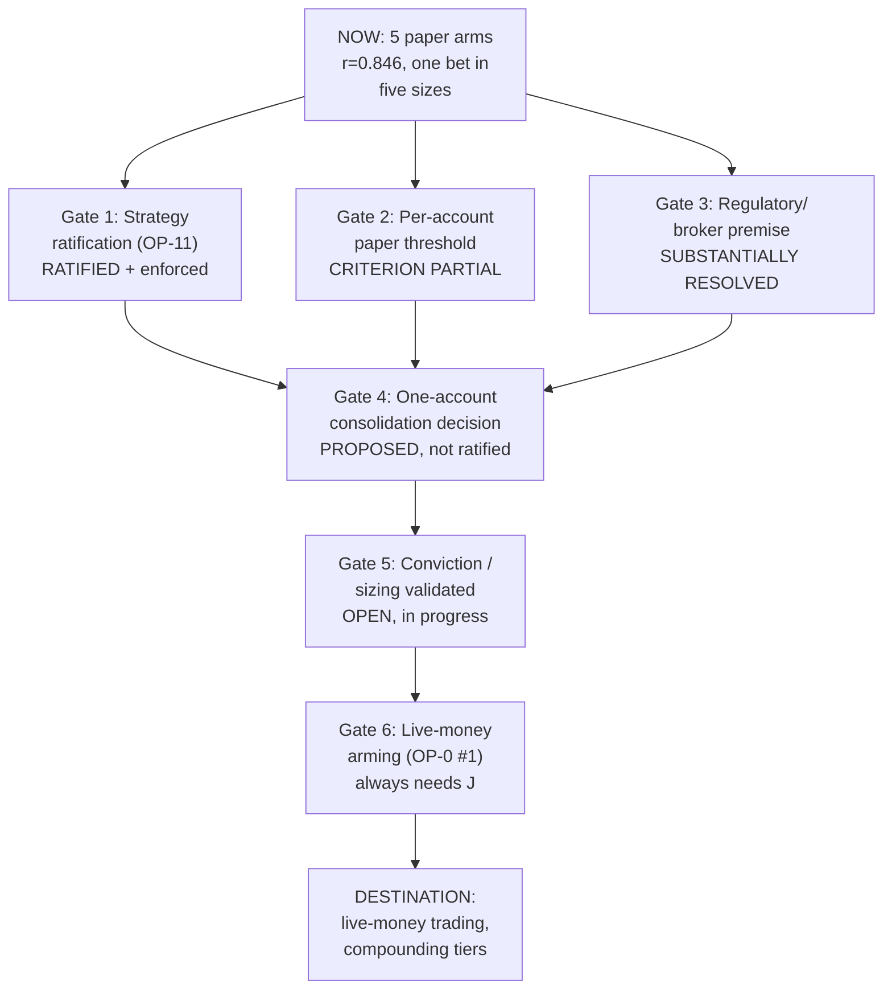

# THE ROADMAP — Project Gamma, one canonical statement

> **This is the ONE place the roadmap lives.** Every other doc that used to restate a
> destination, threshold, or milestone now points here instead. Written 2026-08-18 ~18:40 ET
> per J's directive: *"there is no single statement of the roadmap... make sure everything is
> properly aligned to future proof ourselves."* Consolidation audit, not a strategy change —
> **nothing in this document arms anything, edits params, or changes rule semantics.**
>
> **How to read this doc:** every claim is tagged **RATIFIED** (in force now, code/doctrine
> agrees), **PROPOSED** (written, awaiting J, not yet acted on), or **OPEN QUESTION** (no
> answer exists yet — stated as a question, not invented). Every number carries its source and
> date. Where a gate's pass/fail criterion isn't actually wired to code, this doc says
> **"criterion undefined"** rather than inventing one.
>
> **Mid-session update, same evening:** a sibling audit (`PDT-CODE-ALIGNMENT-AUDIT-2026-08-18.md`,
> commit `b89a03e4`) landed independently while this document was being written and materially
> sharpened §3 Gate 3, §5a, and two of §7's open questions — folded in on discovery rather than
> left to go stale on day one. This is itself a working example of §"OVERLAP" doctrine: parallel
> sessions compound instead of colliding when the later one reads before it writes.

---

> **2026-09-01 audit update (Gamma-decides; revoke = `git revert`).** The full ultracode audit
> [`FABLE-FULL-AUDIT-2026-09-01.md`](../../analysis/deep-research/FABLE-FULL-AUDIT-2026-09-01.md)
> changed three things this roadmap must carry: (1) **one governing clock** — the frozen-config
> window opened 2026-09-01; the first arming *decision* is at the TIGHT-LADDER close **2026-10-30**
> (≥40 scored days); the 09-29 gate re-run is a checkpoint, not an arming date — "arm in early
> October" was arithmetically unreachable under the gate as coded (safe-2 needed +$166/day for 19
> straight sessions vs an actual −$7/day). (2) **What GREEN means for arming** — go-live gate
> criterion 5 (the designated prod-shadow profile, **safe-3**, scored on the frozen window net of
> the A1 cost model, all three views) plus criteria 2–4 green; criterion 1 (pooled lifetime per-arm
> PF) stays as lifetime-robustness disclosure. CLAUDE.md:65 text edit lands Saturday 09-05 (Rule 9).
> (3) **Base case:** no real money in 2026 unless the 40-day window clears; "before 2027" is alive,
> not the default. Gate 4's first-live account is **safe-3**, not safe-2 (safe-2 retires at window
> close per the 08-29 consolidation handoff). Gate 6 gains hard prerequisites the gate itself does
> not check: dead-man's switch drilled, early-close calendar awareness (2026-11-27 / 12-24 close
> 13:00 ET), broker-sweep-aware time stop (Alpaca liquidates expiring ITM longs from 15:30 ET),
> real OPRA data tier, a phone-reachable HALT, a whole-engine null study, an after-tax target.
> **Execution order for every session until 10-30:** [`OPUS-WORK-ORDER-2026-09.md`](OPUS-WORK-ORDER-2026-09.md)
> (phases, review/audit/test list, drills, the freeze-to-10-30 decision, J's items).
> **Checkpoint packets (2026-09-05):** the two dates above now have a mechanical read, GENERATED
> nightly (never hand-written) by `setup/scripts/checkpoint_packet.py` from the frozen preregs:
> [`CHECKPOINT-2026-09-29.md`](CHECKPOINT-2026-09-29.md) (kill-type reductions only) and
> [`CHECKPOINT-2026-10-30.md`](CHECKPOINT-2026-10-30.md) (the full checkpoint, expansions included).

## 1. The destination

**SPY 0DTE directional options, trading real money, sized off a compounding equity curve —
reached only through gates that have already cleared with evidence, never by decree.**

The concrete form of "success" is defined narrowly and deliberately (`markdown/doctrine/FOCUS-DOCTRINE.md`,
J-directed 2026-07-22, recorrected 2026-08-09 — **RATIFIED, currently in force**):

- **$100–200/day is the target, evaluated PER ACCOUNT, never as a combined book number.** One
  clean +30%-premium level trade pays one account's day. A strong arm's number must never mask
  a weak arm's miss (J's correction, 2026-08-09 — see `feedback_daily_target_per_account_2026_08_09.md`
  in session memory). Summed across whatever accounts are active, the book-wide figure is a
  secondary rollup, reported *after* the per-account read, never instead of it.
- **Scaling comes from compounding the tier, not from more trades per day at the same tier**
  (FOCUS-DOCTRINE §1). Equity climbs in stages; the strategy doesn't change shape to chase a
  bigger number at the same account size.
- **The research lane stays bounded to level interaction** (rejection, reclaim, S/R flip+retest,
  range ping-pong) — FOCUS-DOCTRINE §2. This roadmap doesn't relitigate that; it's cited here
  because "the destination" includes *how* Gamma is allowed to get there, not just the dollar
  figure.

**This paper-trading program's entire purpose is to earn the right to trade real money.**
Nothing here is live. OP-0 #1 (`CLAUDE.md`) means arming live money is the one category of
decision that always needs J — this doc does not, and cannot, change that.

---

## 2. Current position — every number sourced and dated

| Fact | Value | Source | Verified |
|---|---|---|---|
| Safe-2 equity | **$5,266.38** | `mcp__alpaca__get_account_info` (account `PA3POKNV46VG`), live pull this session | 2026-08-18, fresh this session (also matches `CLAUDE.md:57`, commit `ac9e84a7`) |
| Bold-2 equity | **$5,048.40** | `mcp__alpaca_aggressive__get_account_info` (account `PA3WEBXJU67N`), live pull this session | 2026-08-18, fresh this session (also matches `CLAUDE.md:58`) |
| Account shape | **Margin-shaped, NOT cash** — `multiplier="4"` on both, confirmed by this session's live pull and by `PDT-ACCOUNT-TYPE-DECISION-2026-08-06.md` | Alpaca live account read | 2026-08-06 and 2026-08-18, consistent |
| Rule version | Safe v15.3 (ratified live 2026-06-01) · Bold v15.2 | `CLAUDE.md:30` | current |
| Trading mode | **PAPER only.** No live-money account exists. | `automation/state/fleet/accounts.json` (`live` field null/absent on both core arms); OP-0 #1 | current |
| Active real-fills arms | 5 — safe-2, bold-2 (core), safe-3, risky-1, risky-3 (fleet) | `automation/state/fleet/accounts.json` grid | current, since 2026-06-25 grid rebuild |
| Fleet correlation | **r = 0.846 (r² = 0.716), 95.7% sign agreement, 139 matched trade pairs — every one of 15 pairwise daily correlations positive.** The 5-arm book is "one bet in five sizes," not five diversified strategies. | `analysis/deep-research/LEVER-CORRELATION-2026-08-06.md` — 47/47 assertions independently re-derived by a second code path (`lever_correlation_verify_2026_08_06.py`) | 2026-08-06; 2026-08-16 forward-check confirmed the correlation persists |
| PDT config (live, both core arms) | `pdt_gate_mode: "cash_settlement"` | `automation/state/params.json:10`, `automation/state/aggressive/params.json:4` | current on disk, 2026-08-18 |

---

## 3. The gates between here and the destination

These are not strictly sequential — some run in parallel — but this is the dependency order.
Each row states what the gate needs as **evidence**, not what would be convenient.

| # | Gate | Status | What it requires as evidence | Current state |
|---|---|---|---|---|
| 1 | **Strategy ratification** (which edges are even allowed to trade) | **RATIFIED, actively enforced** | OOS positive AND WF ≥ 0.70 AND sub-window stable AND anchor-no-regression AND evidence_n (`CLAUDE.md` OP-11 says ≥15, **advisory**; `accounts.json#promotion_gate.min_clean_trades` says **30**, appears to be what's actually consumed — see Contradiction #2) | Live and enforced across dozens of `backtest/autoresearch/validate_*.py` scripts (e.g. `validate_level_family.py:477`: *"Gates: deduped n>=20 AND WR>=45% AND exp>0 AND real-fills exp>0 AND anchor-no-regression"*) |
| 2 | **Per-account paper-to-live threshold** | **INSTRUMENT BUILT 2026-08-18 — 3/4 conditions computed per arm; 4th (rule breaks) structurally unattributable** | `CLAUDE.md:65`: ≥20 trades, WR≥45%, positive expectancy, ≤2 rule breaks, **per account independently** | `setup/scripts/live_readiness.py` (guard `backtest/tests/test_live_readiness.py`, 19/19 passing, RED-proofed by temporarily flipping the n_trades and expectancy comparisons and confirming the guard failed) computes n_trades/win_rate/expectancy per arm from `fills_fifo.mine_real_arm_fills` (real closed round trips) and writes `analysis/recommendations/live-readiness.json` every run, always deriving the arm roster fresh from `accounts.json` rather than hardcoding it. **Live run 2026-08-18 (real ledger, all 5 active arms):** n_trades clears everywhere (26-79 closed real round trips), but win_rate and expectancy both fail hard on every arm — 21.3%-26.9% WR (need ≥45%) and -$2.15 to -$18.92/trade (need positive). Those two failures alone already disqualify every arm today, independent of rule breaks. **The 4th condition is a separate, still-open gap, not just an unwired one:** `rule-breaks.jsonl` carries no arm/account attribution field (single row on disk, confirmed by direct inspection), so the instrument reports it UNKNOWN rather than guessing — which is why its own overall-verdict label reads UNKNOWN, not FAIL, for arms whose win-rate/expectancy numbers alone already fail. |
| 3 | **Regulatory / broker premise resolved** | **SUBSTANTIALLY RESOLVED tonight** (was OPEN QUESTION earlier this session — updated after a parallel sibling audit landed mid-session, see below) | Confirm which PDT regime actually applies to Safe-2/Bold-2 specifically; confirm the cash-vs-margin premise the code runs on | **Decisive evidence found:** a fresh 2026-08-18 live broker read found `pattern_day_trader`/`daytrade_count` **entirely ABSENT** (not null) from both core accounts' payload, replaced by `intraday_adjustments` — high-confidence proof both accounts run Alpaca's NEW post-2026-06-04 regime, not the legacy grace-window. Full detail + 16-item code trace: `analysis/deep-research/PDT-CODE-ALIGNMENT-AUDIT-2026-08-18.md` (commit `b89a03e4`, landed the same evening as this roadmap). Doc-only fixes already shipped there: `risk_gate.py`, `settlement_ledger.py`, `pdt_tracker.py` docstrings + `markdown/0dte/risk-rules.md` Rule 7 section corrected. **What's still open:** `CLAUDE.md` Rule 7's own text (deliberately not touched by either audit — needs J, Rule 9). |
| 4 | **One-account consolidation decision** | **PROPOSED — not ratified** | J's explicit go-ahead; `ONE-ACCOUNT-TRANSITION-2026-08-18.md` explicitly self-labels "PLANNING / DOCUMENTATION ONLY... Live arming needs J (OP-0 #1)" | Recommendation on the table: ONE live account (the product) + the paper fleet continues as the laboratory. Directly reframes `CLAUDE.md:64`'s "both accounts grow" language — see Contradiction #1. |
| 5 | **Conviction / sizing gates validated** | **OPEN, in progress** | Per `ONE-ACCOUNT-TRANSITION-2026-08-18.md` §6: (a) conviction v0 or v2 demonstrates measurable separation (blocked trades worse than allowed trades) over enough paired rows post-fix; (b) `min_contracts_equity_scaled` re-arms ONLY on that validated gate; (c) strike question settled by the strike matrix, not intuition; (d) this document's regulatory picture confirmed | Conviction v2 shipped 2026-08-18 (shadow). Its own doc is explicit: v2 fixes *blindness* (can now see the paying lane) but its *discrimination* power (the quality bar) is UNPROVEN — "do not read v2 as 'conviction fixed.'" |
| 6 | **Live-money arming** | **Always needs J (OP-0 #1)** | No criterion beyond "the gates above have cleared" is defined anywhere in the repo | **Criterion undefined beyond J's judgment call.** This is by design (OP-0 #1) — not a gap to fix, a line that should never be automated. |

---

## 4. RATIFIED vs PROPOSED vs OPEN QUESTION — the compressed view

| Statement | Status |
|---|---|
| $100–200/day per account is the success bar | **RATIFIED** (FOCUS-DOCTRINE, J 2026-07-22 / recorrected 2026-08-09) |
| Strategy ratify gate (OOS+WF+sub-window+anchor) | **RATIFIED**, enforced in code |
| Per-account paper→live threshold (20 trades/45% WR/+exp/≤2 breaks) | **RATIFIED as doctrine; NOW COMPUTED per arm** (`setup/scripts/live_readiness.py`, 2026-08-18) — win_rate + expectancy fail on all 5 arms today, rule-break attribution still unresolved (Gate 2 above) |
| "Both accounts grow $5K→$10K→$25K+" | **STALE FRAME — see §5.** Not false, but no longer the sharpest statement of the destination given the r=0.846 finding. |
| ONE live account + paper fleet as laboratory | **PROPOSED**, 2026-08-18, awaiting J |
| $25K as a hard milestone | **REFRAMED, not deleted — see §5.** It was a regulatory floor; that floor no longer exists at the FINRA level. |
| `pdt_gate_mode=cash_settlement` on both core arms | **LIVE IN CODE, confirmed J-directed** (2026-08-09) capital-discipline choice — its old doc-justification (false "cash account" premise) was corrected same evening as this roadmap, `b89a03e4` |
| Conviction v2 "fixes" ranking | **FALSE — explicitly disclaimed by its own doc.** It fixes visibility, not discrimination. |
| Live-money arming criteria | **OPEN QUESTION** — undefined beyond "J decides," which is intentional |
| Weekly-options second lane (GLD/QQQ pilot → NVDA/TSLA/AAPL; new `weekly-1` paper arm) | **PROPOSED→BUILDING, J-directed 2026-08-18.** Explicitly edge-search, not scaling (SPY book failed live-readiness that day). Canonical: `WEEKLY-OPTIONS-PROGRAM.md`; research: `analysis/deep-research/OPTIONS-SHOP-EXPANSION-2026-08-18.md`. Supersedes-in-part CROSS-TICKER-BRAINSTORM-2026-07-10. Paper-only; live arming stays OP-0 #1. |

---

## 5. What changed and why

### 5a. The $25K milestone — reframed, not deleted

**Where it came from.** `CLAUDE.md:64` reads *"Goal: Both accounts grow → $5K → $10K → $25K+."*
`CLAUDE.md:44` (Rule 7) reads *"PDT awareness. Under $25K: 3 day-trades per rolling 5 business
days (margin) or respect settlement (cash)."* Read together, $25K was never picked as an
arbitrary "big number" — it is the classic FINRA pattern-day-trader (PDT) equity floor: below
it, a margin account restricted to 3–4 day-trades per rolling 5 business days.

**What changed.** `markdown/trading-knowledge/REGULATORY-BROKER-LANDSCAPE-2026-08-18.md`
(commissioned by J tonight, primary sources fetched and quoted directly) confirms: **FINRA
eliminated the $25,000 PDT floor and the day-trade-count trigger for margin accounts**, via
Rule 4210 amendment SR-FINRA-2025-017, SEC-approved 2026-04-14, **effective 2026-06-04**
— replaced by a continuous "intraday margin deficit" (IML) solvency check instead of a fixed
dollar wall. 0DTE options are explicitly named in FINRA's own rulemaking record as a gap the
old rule missed and the new one covers.

**So is $25K dead as a number? No — but its MEANING changed, and this is the reframe:**

- **$25K is no longer a regulatory wall Gamma must climb to unlock day-trading.** That
  specific mechanical reason for the milestone is gone as of 2026-06-04.
- **$25K remains a legitimate milestone for an entirely different reason: it is simply the
  next compounding step after $10K**, same as $5K→$10K was a step, not a regulatory unlock.
  Keeping it in the roadmap is honest **only if it's labeled as an equity-growth waypoint, not
  a rule the account is chasing permission from.**
- **The floor is not cleanly gone for Gamma specifically.** Three live caveats, all sourced in
  the regulatory doc:
  1. FINRA gives member firms up to **18 months to fully implement, through 2027-10-20**, and
     Alpaca's own Customer Agreement (Section 32, quoted directly in the regulatory doc)
     **reserves the right to keep legacy PDT on specific accounts during that window** — this
     was never independently confirmed against Safe-2 (`PA3POKNV46VG`) or Bold-2
     (`PA3WEBXJU67N`) specifically.
  2. **Alpaca sells no true cash-account product at all** ("We do not offer cash accounts. All
     accounts are set up as margin accounts" — Alpaca support page, fetched directly
     2026-08-18). This directly conflicts with the `pdt_gate_mode=cash_settlement` premise
     currently live on both core arms (§2 above, Contradiction #3 below).
  3. `PDT-ACCOUNT-TYPE-DECISION-2026-08-06.md` independently found, from a live broker read
     twelve days before the regulatory doc: Alpaca PAPER reports **no PDT telemetry at all**
     (`pattern_day_trader`/`daytrade_count` both `null` on every arm) and demonstrably does not
     enforce day-trade counts in practice — consistent with, but not proof of, the new regime.

**Net effect on this roadmap:** $25K stays as a compounding waypoint ($5K → $10K → $25K+),
**relabeled** from "the wall PDT makes us climb" to "the next tier once $10K is reached" —
and Rule 7's PDT framing is flagged as needing J's explicit review (§7, Open Question), because
rewriting one of the 10 rules is not a docs-consolidation act (Rule 9: rules change on weekends,
in writing, with documented reason) — this document surfaces it, it does not resolve it.

**A sibling audit that landed the same evening** (`PDT-CODE-ALIGNMENT-AUDIT-2026-08-18.md`,
16-item code trace) found $25K is actually **three unrelated things wearing the same number**,
which sharpens the reframe further:
1. The old PDT regulatory floor (Rule 7, `CLAUDE.md`) — obsolete per FINRA 2026-06-04, above.
2. An equity-tier band in `backtest/lib/cap_admission.py`/`setup/scripts/pre_order_gate.py` —
   **dead code**, not imported by either live order path (`heartbeat_core.py`, `fleet_executor.py`).
3. **A LIVE $25K boundary that is neither of the above:** `automation/state/params.json`'s
   `v15_max_premium_pct_of_account` leverage-cap ladder — real, executing, per-order sizing math
   ("prevents 315%-leverage situations," per its own doc field) — genuinely coincidental with the
   growth-milestone number, not PDT-derived, and correctly left unchanged by that audit.
So "$25K" in this repo was never one fact drifting stale — it was three separate facts that
happen to share a number, only one of which (the PDT floor) the regulatory repeal actually
touches. The growth-milestone reading (this section) and the live leverage-cap reading (fact 3)
both survive; only the PDT-floor reading (fact 1) needed reframing.

### 5b. "Both accounts grow" vs the one-account proposal

**Where it came from.** `markdown/0dte/dual-account-design.md` (ratified 2026-05-14) built the
premise: *"At $1K–$25K, what risk profile — tight stops/early TP vs wide stops/late TP —
produces better compounding?"* Two accounts, same signal, different expression, paired
observations. `CLAUDE.md:64` still frames the goal as "Both accounts grow."

**What changed.** The fleet grew from 2 accounts to 5 arms (2026-06-25 grid rebuild), and
`LEVER-CORRELATION-2026-08-06.md` (§2 above) measured what that fleet actually produces:
**r=0.846, 95.7% sign agreement.** The arms do not behave as 5 independent bets — they behave
as one directional call, scaled 5 ways. `ONE-ACCOUNT-TRANSITION-2026-08-18.md` draws the
direct conclusion tonight: *"Today read as '+$162 across two arms.' On one account it is simply:
one signal → 8 contracts of 768P → +$162."*

**The proposal on the table (PROPOSED, not ratified):** ONE live account (the product) +
the paper fleet continues running beside it (the laboratory) — same shared signal, different
gates, zero capital at risk in the lab. This is explicitly J's own reasoning in that document
("I prefer to do one, but just thinking out loud"), written up with the supporting evidence,
**not yet an instruction to execute.**

**This is a genuine, live conflict with `CLAUDE.md:64`'s current wording**, which this document
resolves by pointer (§6, CLAUDE.md fold) rather than by silently picking a side — the choice
between "grow both accounts" and "consolidate to one" is J's, not a docs-audit's, to make.

---

## 6. Contradictions found — both sides cited

| # | Contradiction | Side A | Side B | Resolution here |
|---|---|---|---|---|
| 1 | Both-accounts-grow vs one-account proposal | `CLAUDE.md:64` — *"Both accounts grow → $5K → $10K → $25K+. Dual-account experiment answers which risk profile compounds better."* | `markdown/planning/ONE-ACCOUNT-TRANSITION-2026-08-18.md:15-22` — the fleet is r=0.846 correlated, "one bet in five sizes," so the dual-account experiment's original question is already answered (they don't diverge) | Presented as PROPOSED vs RATIFIED in §4. **CLAUDE.md:64 itself is NOT YET folded** — queued in §8, blocked by another session's in-flight uncommitted edit at audit time; CLAUDE.md:64 still reads its original wording until a future session applies the fold |
| 2 | Strategy-ratify evidence_n: 15 vs 30 | `CLAUDE.md` OP-11 — *"evidence_n ≥ 15 is advisory"* | `automation/state/fleet/accounts.json#promotion_gate.min_clean_trades` = **30**, with no "advisory" qualifier — reads as the actual number code would check | Flagged as Open Question §7; not resolved here — do not assume which one governs without reading the consuming code path fresh |
| 3 | `cash_settlement` premise vs broker reality | `automation/state/params.json:10` / `automation/state/aggressive/params.json:4` — `pdt_gate_mode: "cash_settlement"`, live on both core arms today | `markdown/trading-knowledge/REGULATORY-BROKER-LANDSCAPE-2026-08-18.md:98` — *"No, we do not offer cash accounts. All accounts are set up as margin accounts"* (Alpaca, quoted directly); `PDT-ACCOUNT-TYPE-DECISION-2026-08-06.md:16` — live broker read shows `multiplier=4` (margin-shaped) on every arm | **Substantially resolved** by `analysis/deep-research/PDT-CODE-ALIGNMENT-AUDIT-2026-08-18.md` (commit `b89a03e4`, same evening): the mode is not accidental drift — safe-2 adopted it 2026-07-14, bold-2 2026-08-09 by explicit J directive ("I always use cash accounts... that's how much we have until it settles"). It's a deliberate capital-discipline throttle with a now-corrected doc justification, not a bug. Docstrings fixed in `risk_gate.py`/`settlement_ledger.py`/`pdt_tracker.py`; params files intentionally not touched (out of scope for both audits) |
| 4 | $25K: regulatory wall vs compounding waypoint | `CLAUDE.md:44` (Rule 7) — frames $25K as the PDT unlock threshold | `markdown/trading-knowledge/REGULATORY-BROKER-LANDSCAPE-2026-08-18.md` — FINRA eliminated that floor 2026-06-04 (with the phase-in caveats above) | Reframed in §5a (+ the three-meanings finding); Rule 7 itself is NOT edited by this audit (rule changes need J, in writing, per Rule 9) — flagged §7. A second, independent audit tonight reached the identical "NEEDS-J, do not edit" conclusion on Rule 7 (`PDT-CODE-ALIGNMENT-AUDIT-2026-08-18.md` finding #7) |
| 5 | Account identifiers stale in 3 places | `CLAUDE.md:57-58` (current, fixed tonight, commit `ac9e84a7`) — `PA3POKNV46VG` / `PA3WEBXJU67N` | `markdown/specs/ARCHITECTURE.md:196` still cites `PA3DHPT7KIQE` / `PA33W2KUAT40` ("Date of Last Update: 2026-07-11"); `markdown/0dte/dual-account-design.md:11` still cites the same two dead identifiers | ARCHITECTURE.md corrected as part of this audit (§8); dual-account-design.md gets a pointer note, not a full rewrite (out of scope — it's a frozen 2026-05-14 design record) |
| 6 | Superseded strike-tier ladder repeated as current | `CLAUDE.md:30` — *"live truth (fills-verified 2026-07-11): core Safe trades ATM... params.json's ladder is vestigial"* | `markdown/specs/ARCHITECTURE.md:197` still states the old ladder ("OTM-3 $1K / OTM-2 $2-10K / OTM-1 $10-25K / ITM-2 $25K+") as current strategy | Corrected as part of this audit (§8) |
| 7 | Daily P&L target: per-account vs book-wide | — checked for this explicitly, per the task brief — | `CLAUDE.md:66`, `FOCUS-DOCTRINE.md:13-19`, and `.claude/agents/treasurer.md` **all already frame per-account-first, book-wide-secondary**, consistent with J's 2026-08-09 correction | **No live contradiction found.** Stated here so the check is on record, not because a fix was needed. |
| 8 | "THE ROADMAP" mislabeled | `markdown/doctrine/FABLE-HANDOFF.md:44` — section literally titled *"THE ROADMAP,"* dated 2026-07-02, an execution queue (RISKY-ARM GATE TIERS, COOLDOWN A/B, etc.) 47 days stale as of this audit | This document | FABLE-HANDOFF.md §4 retitled with a pointer here (§8); its historical content is left intact as a frozen record, not deleted |
| 9 | "Live threshold" gate looks automated but mostly isn't | `CLAUDE.md:65` states it as a flat 4-condition bar | No script found that computes all 4 conditions at account scope (Gate 2, §3) — only `treasurer.md`'s narrative M/4 tracking | Documented honestly in Gate 2 rather than asserting it's enforced when the evidence doesn't show that. **UPDATE 2026-08-18:** `setup/scripts/live_readiness.py` now computes 3 of the 4 conditions per arm; see Gate 2 above for what it found and why the 4th stays UNKNOWN by design rather than guessed |

---

## 7. Open questions for J — no invented answers

1. **PDT regime for Safe-2/Bold-2 specifically — ANSWERED tonight, worth J's eyes anyway.**
   `PDT-CODE-ALIGNMENT-AUDIT-2026-08-18.md` found `pattern_day_trader`/`daytrade_count` entirely
   ABSENT from both accounts' live payload — high-confidence proof they're on the new regime,
   not the legacy grace-window. Not independently re-run by this document's own session; relayed
   from the sibling audit's direct field read. Re-verify once, in writing, before it becomes
   load-bearing for real money.
2. **`pdt_gate_mode=cash_settlement` — confirmed intentional, not drifted.** J directed this
   parity move explicitly (bold-2, 2026-08-09) as a capital-discipline choice independent of the
   account's actual regulatory type. The only remaining loose end is cosmetic: the code comments
   that used to justify it with a false "these are cash accounts" claim are now fixed
   (`b89a03e4`). No decision needed here — recorded so the next session doesn't re-open it.
3. **Rule 7's PDT text.** Now describes a floor that no longer binds at the FINRA level (with
   the phase-in caveats above). This audit does not touch the 10 rules — that needs J, in
   writing, per Rule 9. Left exactly as-is pending that review.
4. **Strategy-ratify evidence_n: 15 (advisory, CLAUDE.md) vs 30 (accounts.json, no "advisory"
   qualifier).** Same gate, two numbers. Which one actually gates a ship decision today wasn't
   traced to a single consuming code path in this audit — flagged rather than guessed.
5. **The one-account proposal itself.** `ONE-ACCOUNT-TRANSITION-2026-08-18.md` is a
   recommendation, not a decision. This roadmap reflects it as PROPOSED. It becomes RATIFIED
   only when J says so, at which point this section (and `CLAUDE.md`'s account-context table)
   both need a same-day update.
6. **Account-level "Live threshold" — ANSWERED 2026-08-18: instrument built, not dropped.**
   `setup/scripts/live_readiness.py` now computes n_trades/win_rate/expectancy per arm from
   real closed round trips (`fills_fifo.mine_real_arm_fills`), guard-tested at the exact
   boundaries CLAUDE.md states (19/20 trades, 44.9/45.0% WR, expectancy exactly $0.00, 2/3
   rule breaks — `backtest/tests/test_live_readiness.py`, 19/19 passing, RED-proofed).
   **What remains open:** rule breaks ≤2 could NOT be wired against `journal/mistakes.md` as
   this section originally proposed — that file is human prose, not structured data (verified
   directly) — and the actual machine-readable ledger (`automation/state/rule-breaks.jsonl`)
   carries no arm/account attribution field at all (one row on disk, 2026-05-18, book-level
   only). The instrument reports this 4th condition UNKNOWN rather than guessing, so no arm's
   overall verdict can read PASS until either that ledger grows real attribution or a human
   (Treasurer) makes the call explicitly. Moot today regardless: win_rate and expectancy
   already fail hard on every arm (see Gate 2, §3).

---

## 8. What this document folded — pointers replacing restatement

Per `markdown/infra/DOC-ARCHITECTURE.md`'s fold protocol (OP-22: compound, don't accumulate).
Nothing below lost information — dated/frozen records keep their content; only the *current
destination/gate* framing was replaced with a pointer to this file.

| Doc | What changed |
|---|---|
| `CLAUDE.md` (lines 64-65) | **NOT YET APPLIED.** Another session had an uncommitted in-flight edit on `CLAUDE.md` (line 67, a Risky-2→Bold-2 naming fix, non-overlapping content) at the moment this audit reached it — left untouched per the never-clobber-a-lane rule. The intended fold (queued, ready to apply once `CLAUDE.md` is clean): replace lines 64-65's "Goal"/"Live threshold" prose with a pointer here + the one-line $25K reframe. Draft wording: *"**Goal + gates:** compounding equity tiers toward live-money trading. $25K is REFRAMED as of 2026-08-18 — it was PDT-derived, not a fixed target (FINRA repealed the $25K/margin PDT floor 2026-06-04; Alpaca's own phase-in status for these accounts is unconfirmed). Canonical destination, current position, ordered gates, and RATIFIED/PROPOSED/OPEN status for the one-account question: `markdown/planning/ROADMAP.md`."* |
| `markdown/doctrine/FABLE-HANDOFF.md` §4 | Retitled to mark it a **2026-07-02 historical snapshot**, not the live roadmap; pointer added to this file. Fable's original content is untouched below the new note. |
| `markdown/specs/ARCHITECTURE.md` §9 | "Roadmap (current)" replaced with a pointer here (the infra work-items that were listed there are tactical backlog, not destination/gates — cross-referenced to `FUTURE-IMPROVEMENTS.md` instead) |
| `markdown/specs/ARCHITECTURE.md` §10 | Stale account identifiers (`PA3DHPT7KIQE`/`PA33W2KUAT40`) and the superseded OTM-ladder sentence corrected to match `CLAUDE.md`'s current truth; "Date of Last Update" bumped |
| `markdown/0dte/dual-account-design.md` | Pointer note added under the existing staleness banner, directing to this file's §5b for the current state of the "which risk profile compounds better" question. Content otherwise untouched — it's a frozen 2026-05-14 design record, not a duplicate to delete. |
| `markdown/README.md` | This file added to the `planning/` row's living-doc list |

**Not folded, and why:**
- `markdown/planning/FUTURE-IMPROVEMENTS.md` — a tactical engineering backlog (TODOs with
  triggers/scope/estimates), not a destination/milestone statement. Cited here as a source,
  left as-is.
- `automation/overnight/STATUS.md`, `automation/overnight/queue.md` — live, actively-written
  operational logs with uncommitted changes at audit time; per this audit's own instructions,
  left untouched and reported rather than edited.
- `MAP.md` / `HOME.md` / `SHADOW.md` — generated surfaces (`setup/scripts/obsidian_vault_sync.py`).
  Never hand-edited. They will pick up this file's existence on their next regeneration via
  `markdown/README.md`'s index.
- `markdown/planning/AUTONOMY-ROADMAP.md`, `LIVE-PATH-WORKPACKAGE.md` — large (107KB/313KB)
  dated-snapshot archives already self-described as "folded from dated one-offs... superseded
  snapshots frozen verbatim in the appendix." They are engineering-phase histories (Phase
  0/1/2/3 build sequencing), not statements of the trading destination/milestone roadmap this
  document consolidates. Out of this audit's scope; flagged here only so the next session
  doesn't assume they were missed.

---

## 9. Source index

| Claim | File | Verified |
|---|---|---|
| Safe-2 / Bold-2 equity | Live `mcp__alpaca__*` / `mcp__alpaca_aggressive__*` pulls | 2026-08-18, this session |
| Fleet correlation r=0.846 | `analysis/deep-research/LEVER-CORRELATION-2026-08-06.md` + `.json` | 2026-08-06, 47/47 assertions re-verified; 2026-08-16 forward-check |
| PDT/$25K regulatory finding | `markdown/trading-knowledge/REGULATORY-BROKER-LANDSCAPE-2026-08-18.md` | 2026-08-18, primary sources fetched directly (FINRA, SEC, Alpaca contract text) |
| Broker account-type facts | `analysis/deep-research/PDT-ACCOUNT-TYPE-DECISION-2026-08-06.md` | 2026-08-06, live broker reads |
| PDT code/doc alignment (16-item trace, $25K's 3 meanings) | `analysis/deep-research/PDT-CODE-ALIGNMENT-AUDIT-2026-08-18.md` | 2026-08-18, sibling audit, commit `b89a03e4` — landed the same evening as this roadmap and folded in here on discovery |
| One-account proposal | `markdown/planning/ONE-ACCOUNT-TRANSITION-2026-08-18.md` | 2026-08-18, J-directed, PROPOSED status explicit in the doc itself |
| Strategy ratify gate in force | `backtest/autoresearch/validate_level_family.py`, `validate_breakout_family.py`, and ~15 sibling scripts | grepped live 2026-08-18 |
| Daily target per-account | `markdown/doctrine/FOCUS-DOCTRINE.md` | J-directed 2026-07-22, recorrected 2026-08-09 |

---

[[CLAUDE|CLAUDE.md]] · [[markdown/README|doc index]] · [[markdown/planning/ONE-ACCOUNT-TRANSITION-2026-08-18|one-account proposal]] · [[markdown/trading-knowledge/REGULATORY-BROKER-LANDSCAPE-2026-08-18|regulatory landscape]]
