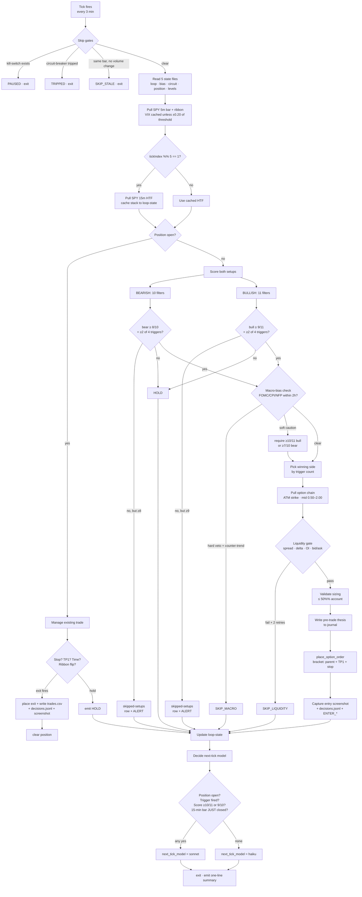

# Diagrams — How Gamma Decides

> Visual reference for the heartbeat decision tree, the filter scorecard, and
> the daily-recap card specification.
>
> Source-of-truth references — keep in sync with these:
> - `automation/prompts/heartbeat.md` (scoring rules)
> - `backtest/lib/filters.py` (mirrored implementation)
> - `strategy/playbook.md` (setup definitions)
> - `strategy/chart-anatomy.md` (numerical thresholds)

---

## 1. Trade-flow — what every heartbeat tick does

A heartbeat tick fires every 3 minutes, 09:30–15:50 ET. Default Haiku model,
escalates to Sonnet on the conditions in the bottom branch. Each tick is
self-contained — it reads 5 state files, decides, writes one line, exits.



The "5 state files" the tick reads are the only inputs. No CLAUDE.md, no
playbook re-read, no doctrine on every tick — that's the cost discipline that
keeps the daily burn under the Max 5x plan.

---

## 2. Confirmations — what we look for and how we count

Each side has a checklist. Filters 1-4 are environmental (almost always pass on
a clean session). Filters 5-10 are the structural evidence. The score is just
"how many passed."

### BEARISH_REJECTION_RIDE_THE_RIBBON · score / 10

| # | Filter | What passes | Source |
|---|---|---|---|
| 1 | Time | now ≥ 09:35 ET (skip first 5 min) | `params.no_trade_first_minutes` |
| 2 | News clear | now ∉ any `today-bias.news_calendar.no_trade_window[]` | `macro-calendar.json` |
| 3 | Budget | daily_loss_remaining > per-trade risk cap | `circuit-breaker.json` |
| 4 | Day-trades | `day_trades_remaining ≥ 1` | `today-bias.day_trades_remaining` |
| 5 | Ribbon stack | Fast < Pivot < Slow (BEAR) | live `data_get_study_values` |
| 6 | Spread | Slow − Fast ≥ 30¢ | live ribbon |
| 7 | Vol divergence | NOT (red breakdown bar followed by green ≥ vol) | last 3 bars |
| 8 | VIX | VIX > 17.30 AND rising (+0.05 deadband) | TVC:VIX cache |
| 9 | Seller pressure | last bar: close < open AND vol ≥ 1.3 × 20-bar SMA | last bar |
| 10 | Triggers + HTF | ≥ 2 of 4 triggers fired AND HTF 15m not BULL (BULL = −1 modifier) | mixed |

**Filter 10 trigger sources (need ≥ 2 of these 4):**

| Trigger | Definition |
|---|---|
| level_reject | `bar.high > level AND bar.close < level` (single bar) |
| ribbon_flip | 5m ribbon transitioned to BEAR within last 1-3 bars |
| multi_day_confluence | rejected level matches a Carry/Reference level OR a `broken_to_resistance` level within ±$0.30 |
| sequence_rejection | level has `bounce_history[]` ≥ 3 entries with strictly DECREASING `high_reached` AND last close < level (e.g. 736.12 → 735.61 → 735.41) |

### BULLISH_RECLAIM_RIDE_THE_RIBBON · score / 11

| # | Filter | What passes |
|---|---|---|
| 1 | Time | now ≥ 09:35 ET |
| 2 | News clear | now ∉ no_trade_window |
| 3 | Budget | daily_loss_remaining > per-trade risk cap |
| 4 | Day-trades | day_trades_remaining ≥ 1 |
| 5 | Ribbon stack | Fast > Pivot > Slow (BULL) |
| 6 | Spread | Fast − Slow ≥ 30¢ |
| 7 | Vol divergence | NOT (green breakout bar followed by red ≥ vol) |
| 8 | VIX low | VIX < 17.20 OR vix_falling |
| 9 | VIX hard | VIX < 22.00 (HARD — never enter bull above this) |
| 10 | Buyer pressure | last bar: close > open AND vol ≥ 1.3 × 20-bar SMA |
| 11 | Triggers + HTF | ≥ 2 of 4 triggers fired AND HTF 15m not BEAR (BEAR = −1 modifier) |

**Filter 11 triggers** mirror bearish: level_reclaim, ribbon_flip (to BULL),
multi_day_confluence at support, sequence_reclaim (3+ progressively HIGHER lows
at a `broken_to_support` level).

### Decision matrix — what the score earns

```
Score          BEAR (n/10)        BULL (n/11)        Outcome
─────────────  ─────────────────  ─────────────────  ─────────────────────────
≤ 7            HOLD               HOLD               nothing logged
8 / 9          HOLD_DEV           HOLD_DEV           skipped-setups + ALERT
8 (bear) /     ≥ 2 triggers       ≥ 2 triggers       ENTER_BEAR / ENTER_BULL
  9 (bull)
10 / 10        ≥ 2 triggers       ≥ 2 triggers       ENTER_*  + Sonnet next tick
10 / 11        veto only on       veto only on       ENTER_*  (highest conviction)
               macro hard-tier    macro hard-tier
```

Macro hard-veto (FOMC/CPI/NFP within 2h, counter-trend to today's bias) blocks
ENTER even at 11/11. That's deliberate — pre-event is where the system gets
fooled by single-bar conditions, exactly like the 5/7 12:30 trade.

### Visual progress bar (dashboard rendering hint)

The dashboard already shows score bars. Suggested visual contract:

```
BEAR  ████████░░  8/10   blocked: VIX (8) · seller_pressure (9)
BULL  ███░░░░░░░░ 3/11   blocked: ribbon (5) · spread (6) · seller (10) · htf (11)

triggers fired: level_reject · sequence_rejection
htf_15m: BEAR · spread 151¢
```

A near-miss alert appears when bear ≥ 8 OR bull ≥ 9 with no entry firing — see
`heartbeat.md` "Near-miss alert" block for the dashboard-dialogue write.

---

## 3. Daily Recap Card — spec

Goal: a one-page visual summary that goes in the journal at 16:30 ET so we can
flip back through any day at a glance. Should answer in under 5 seconds:
*what happened, did we behave, was it on the edge map, and what did we learn?*

### Card layout (1200 × 1500 px, render to PNG at 16:30 ET)

```
┌─────────────────────────────────────────────────────────────┐
│  GAMMA · 2026-05-08 (FRI)         equity $1,xxx  +x.x%      │  HEADER
│  bias: bullish · IV regime MID · macro: clean               │
├─────────────────────────────────────────────────────────────┤
│  ┌──────────────────────────┐  ┌──────────────────────────┐ │
│  │  P&L curve (intraday)    │  │  Trade card · 1 of 1     │ │
│  │   ┌─────╮                │  │  10:42 BEAR_REJ 735.40   │ │  PRIMARY
│  │   │ +75 ╰────╮           │  │  3× 734P @ 0.84 → 1.20   │ │  ROW
│  │   │          ╰──╮        │  │  hold 18 min · +43% prem │ │
│  │   │             ╰──── BE │  │  exit: ribbon flip       │ │
│  │   └─────────────── 9:30  │  │  GRADE: GOOD · 4/5       │ │
│  └──────────────────────────┘  └──────────────────────────┘ │
├─────────────────────────────────────────────────────────────┤
│  HYPOTHESES                              SCORECARD          │
│  ✓ 735.40 holds resistance        +1   bear max  9/10  10:38 │  EVIDENCE
│  ✗ ribbon expands by 11:00        −1   bull max  6/11  11:24 │  ROW
│  ◐ VIX > 17.30 by close         half   ticks fired   78/127 │
│                                        skipped (n-m) 3       │
├─────────────────────────────────────────────────────────────┤
│  KEY LEVELS                            SETUPS DEVELOPED     │
│  735.40 ▼ rejected 3×       broken    bearish (entered)     │  CHART
│  733.55 △ held 1×           ok        bullish_dev (skipped) │  ROW
│  729.75 ▽ broken at 11:14   broken                          │
│                                                             │
├─────────────────────────────────────────────────────────────┤
│  PROCESS                              LESSON                │
│  rule breaks: 0                       "When sequence_reject  │  TAIL
│  followed_rules: 1/1 trades            fires + HTF agrees,   │  ROW
│  on-time:       all 6 tasks            entry within 2 bars  │
│                                        beats waiting." ★    │
└─────────────────────────────────────────────────────────────┘
```

### Data sources

Every cell is computed at 16:30 ET from existing state files — no manual entry.

| Cell | Source |
|---|---|
| equity / P&L curve | `equity-curve.json` |
| bias / IV / macro | `today-bias.json` |
| trade cards | filter `trades.csv` to today |
| trade GRADE | `trade_grade` column (S1.1 5-point rubric) |
| hypotheses | `hypothesis-grades.jsonl` filtered to today |
| max scores / ticks | scan `decisions.jsonl` filtered to today |
| skipped count | `skipped-setups.csv` filtered to today |
| key levels | `key-levels.json` snapshot at EOD |
| level outcomes | computed from `bounce_history[]` + role flips |
| rule breaks | grep `mistakes.md` for today's date |
| on-time tasks | parse `automation/state/logs/*-{date}.log` for tick boundaries |
| lesson | `daily-review-{date}.json` field `lesson_one_line` (NEW — add to daily-review prompt) |

### Render strategy

Two options, ordered by effort:

**Option A — HTML/CSS card rendered with headless Chromium → PNG.** Existing
`dashboard/` has Tailwind + React. Add a `/api/recap?date=YYYY-MM-DD` route
that fetches the same `automation/state/*` files but filtered to a date, and a
`/recap/[date]` page that renders the card layout. EOD-summary task hits the
URL and uses `mcp__tradingview__capture_screenshot` (or a small Playwright
script) to save the PNG to `journal/recaps/{date}.png`. Same data pipeline as
the dashboard, costs ~$0 LLM tokens. **Recommended.**

**Option B — server-side SVG → PNG with `vega-lite` or `pillow`.** Pure Python,
no browser dependency. Faster, but more work to lay out the bento boxes
identically. Save for later if the dashboard becomes laggy.

### Animation / scrollback

Save each `journal/recaps/{date}.png`. Add a `dashboard/app/recaps/page.tsx`
showing a horizontally-scrollable strip of these cards — date in header, hover
shows full P&L line, click expands to the day's full journal entry. That's the
"flip through the season" view.

### What goes on a card vs. what stays in the journal

The card answers *what happened*. The journal still owns *why* — pre-trade
thesis, mid-day notes, post-trade reflection prose. The card never replaces
the journal entry; it summarizes it.

### One-time prompt change required

Add to `automation/prompts/daily-review.md`:

```
Step N. Write a one-line lesson to daily-review-{date}.json#lesson_one_line.
Format: a complete sentence ≤ 120 chars, ★-worthy if ratifiable as a
permanent rule. Examples:
  ★ "Sequence_rejection + HTF agreement + entry within 2 bars beats waiting."
    "Counter-trend long into pre-FOMC tape is structurally negative-EV."
    "When VIX is in the 17.20-17.30 deadband, neither side has filter-8 lift."
```

The card pulls this directly. If the lesson fails the specificity bar, the
card shows "(no signature lesson today)" instead of inventing one.

---

## 4. Where these diagrams live

- This document — canonical reference for diagrams + spec.
- The Mermaid blocks render in any Markdown viewer with mermaid support
  (GitHub, VS Code with extension, dashboard's MD renderer).
- The score visual is a static reference; live scores are on the dashboard
  CLAUDE REASONING panel.
- The recap card is **not built yet** — see Section 3 for the implementation
  plan when J wants to schedule it.
